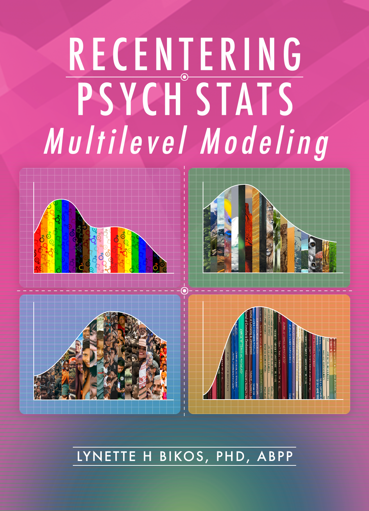
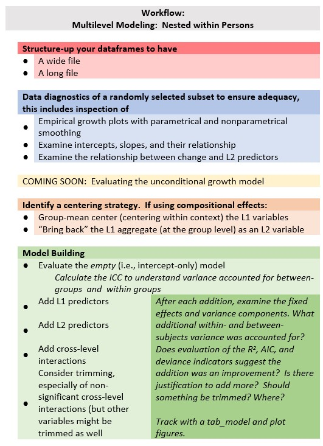

--- 
title: "ReCentering Psych Stats: Multilevel/Hierarchical Linear Modeling"
author: "Lynette H. Bikos, PhD, ABPP"
date: "`r format (Sys.Date(), '%d %b %Y')`" 
site: bookdown::bookdown_site
documentclass: book
fontsize: 11pt
geometry: margin=1in
highlight: tango
urlcolor: blue #without this the links in the PDF do not show
citation-style: apa-single-spaced.csl #if you want APA style
bibliography: STATSnMETH.bib #This is my own bibtex file from my Zotero account. If this file is not in the project folder there will be an error and the book will not build.
link-citations: yes
url: https://lhbikos.github.io/MultilevelModeling/ #a link to the GitHub pages where it is rendered
cover-image: images/ReC_mlevel_bkcvr.png #link to the image for the book shows up in previews
description: |
  "Multilevel/Hierarchical Linear Modeling" is a mini-volume in the ReCentering Psych Stats series. Although intended to expand, current lessons review models that are nested within groups and nested within persons. A chapter is devoted to the preliminary exploration of longitudinal growth and another explores calendrical time.
github-repo: lhbikos/extRas
---

# BOOK COVER {-}



This open education resource is available in the following formats:

* Formatted as an [html book](https://lhbikos.github.io/MultilevelModeling/) via GitHub Pages available in the [docs](https://github.com/lhbikos/MultilevelModeling/tree/main/docs) folder at the GitHub repository
* As a [PDF](https://github.com/lhbikos/MultilevelModeling/blob/main/docs/ReC_MultMod.pdf) 
* As an [ebook](https://github.com/lhbikos/MultilevelModeling/blob/main/docs/ReC_MultMod.epub) 
* As a [Word](https://github.com/lhbikos/MultilevelModeling/blob/main/docs/ReC_MultMod.docx) d

All materials used in creating this OER are available at its [GitHub repo](https://github.com/lhbikos/MultilevelModeling).


# PREFACE {-}

**If you are viewing this document, you should know that this is a book-in-progress.  Early drafts are released for the purpose teaching my classes and gaining formative feedback from a host of stakeholders. The document was last updated on `r format (Sys.Date(), '%d %b %Y')`**.  Emerging volumes on other statistics are posted on the [ReCentering Psych Stats](https://lhbikos.github.io/BikosRVT/ReCenter.html) page at my research team's website. 

[Screencasted Lecture Link](https://spu.hosted.panopto.com/Panopto/Pages/Viewer.aspx?id=c932455e-ef06-444a-bdca-acf7012d759a)

To *center* a variable in regression means to set its value at zero and interpret all other values in relation to this reference point. Regarding race and gender, researchers often center male and White at zero. Further, it is typical that research vignettes in statistics textbooks are similarly seated in a White, Western (frequently U.S.), heteronormative, framework. The purpose of this project is to create a set of open educational resources (OER) appropriate for doctoral and post-doctoral training that contribute to a socially responsive pedagogy -- that is, it contributes to justice, equity, diversity, and inclusion. 

Statistics training in doctoral programs are frequently taught with fee-for-use programs (e.g., SPSS/AMOS, SAS, MPlus) that may not be readily available to the post-doctoral professional. In recent years, there has been an increase and improvement in R packages (e.g., *psych*, *lavaan*) used for in analyses common to psychological research. Correspondingly, many graduate programs are transitioning to statistics training in R (free and open source).  This is a challenge for post-doctoral psychologists who were trained with other software. This OER will offer statistics training with R and be freely available (specifically in a GitHub respository and posted through GitHub Pages) under a Creative Commons Attribution - Non Commercial - Share Alike license [CC BY-NC-SA 4.0]. 

Training models for doctoral programs in HSP are commonly scholar-practitioner, scientist-practitioner, or clinical-scientist.  An emerging model, the *scientist-practitioner-advocacy* training model incorporates social justice advocacy so that graduates are equipped to recognize and address the sociocultural context of oppression and unjust distribution of resources and opportunities [@mallinckrodt_scientist-practitioner-advocate_2014]. In statistics textbooks, the use of research vignettes engages the learner around a tangible scenario for identifying independent variables, dependent variables, covariates, and potential mechanisms of change. Many students recall examples in Field's  [-@field_discovering_2012] popular statistics text:  Viagra to teach one-way ANOVA, beer goggles for two-way ANOVA, and bushtucker for repeated measures.  What if the research vignettes were more socially responsive? 

In this OER, research vignettes will be from recently published articles where: 

* the author’s identity is from a group where scholarship is historically marginalized (e.g., BIPOC, LGBTQ+, LMIC[low-middle income countries]), 
* the research is responsive to issues of justice, equity, inclusion, diversity, 
* the lesson’s statistic is used in the article, and 
* there is sufficient information in the article to simulate the data for the chapter example(s) and practice problem(s); or it is publicly available.  

In training for multicultural competence, the saying, "A fish doesn't know that it's wet" is often used to convey the notion that we are often unaware of our own cultural characteristics. In recent months and years, there has been an increased awakening to the institutional and systemic racism that our systems are perpetuating. Queuing from the water metaphor, I am hopeful that a text that is recentered in the ways I have described can contribute to *changing the water* in higher education and in the profession of psychology.


## Copyright with Open Access {-}
<a rel="license" href="http://creativecommons.org/licenses/by-nc-sa/4.0/"></a>

This book is published under a a <a rel="license" href="http://creativecommons.org/licenses/by-nc-sa/4.0/">Creative Commons Attribution-NonCommercial-ShareAlike 4.0 International License</a>. This means that this book can be reused, remixed, retained, revised and redistributed (including commercially) as long as appropriate credit is given to the authors. If you remix, or modify the original version of this open textbook, you must redistribute all versions of this open textbook under the same license - CC BY-SA.

A [GitHub open-source repository](https://github.com/lhbikos/MultilevelModeling) contains all of the text and source code for the book, including data and images. 

# ACKNOWLEDGEMENTS {-}

As a doctoral student at the University of Kansas (1992-2005), I learned that "a foreign language" was a graduation requirement. *Please note that as one who studies the intersections of global, vocational, and sustainable psychology, I regret that I do not have language skills beyond English.* This could have been met with credit from high school my rural, mid-Missouri high school did not offer such classes. This requirement would have typically been met with courses taken during an undergraduate program -- but my non-teaching degree in the University of Missouri's School of Education was exempt from this. The requirement could have also been met with a computer language (fortran, C++) -- I did not have any of those either. There was a tiny footnote on my doctoral degree plan that indicated that a 2-credit course, "SPSS for Windows" would substitute for the language requirement.  Given that it was taught by my one of my favorite professors, I readily signed up. As it turns out, Samuel B. Green, PhD, was using the course to draft chapters in the textbook [@green_using_2014] that has been so helpful for so many. Unfortunately, Drs. Green (1947 - 2018) and Salkind (2947 - 2017) are no longer with us. I have worn out numerous versions of their text. Another favorite text of mine was Dr. Barbara Byrne's [-@byrne_structural_2016], "Structural Equation Modeling with AMOS." I loved the way she worked through each problem and paired it with a published journal article, so that the user could see how the statistical evaluation fit within the larger project/article. I took my tea-stained text with me to a workshop she taught at APA and was proud of the signature she added to it (a little catfur might have fallen out).  Dr. Byrne created SEM texts for a number of statistical programs (e.g., LISREL, EQS, MPlus). As I was learning R, I wrote Dr. Byrne, asking if she had an edition teaching SEM/CFA with R. She promptly wrote back, saying that she did not have the bandwidth to learn a new statistics package.  We lost Dr. Byrne in December 2020. I am so grateful to these role models for their contributions to my statistical training.  I am also grateful for the doctoral students who have taken my courses and are continuing to provide input for how to improve the materials.

The inspiration for training materials that re*center statistics and research methods came from the [Academics for Black Survival and Wellness Initiative](https://www.academics4blacklives.com/). This project, co-founded by Della V. Mosley, Ph.D., and Pearis L. Bellamy, M.S., made clear the necessity and urgency for change in higher education and the profession of psychology. 

At very practical levels, I am indebted to SPU's Library, and more specifically, SPU's Education, Technology, and Media Department.  Assistant Dean for Instructional Design and Emerging Technologies, R. John Robertson, MSc, MCS, has offered unlimited consultation, support, and connection. Senior Instructional Designer in Graphics & Illustrations, Dominic Wilkinson, designed the logo and bookcover.  Psychology and Scholarly Communications Librarian, Kristin Hoffman, MLIS, has provided consultation on topics ranging from OERS to citations. I am alo indebted to Associate Vice President, Teaching and Learning at Kwantlen Polytechnic University, Rajiv Jhangiani, PhD. Dr. Jhangiani's text [-@jhangiani_research_2019] was the first OER I ever used and I was grateful for his encouraging conversation.

Financial support for this project has been provided the following:

*  *Call to Action on Equity, Inclusion, Diversity, Justice, and Social Responsivity Request for Proposals* grant from the Association of Psychology Postdoctoral and Internship Centers (2021-2022). 
*  *Diversity Seed Grant*, Office of Inclusive Excellence and Advisory Council for Diversity and Reconciliation (ACDR), Seattle Pacific University.
*  *ETM Open Textbook & OER Development Funding*, Office of Education, Technology, & Media, Seattle Pacific University.  


```{r include=FALSE}
# automatically create a bib database for R packages
knitr::write_bib(c(
  .packages(), 'bookdown', 'knitr', 'rmarkdown'
), 'packages.bib')
```

<!--chapter:end:index.Rmd-->

---
output:
  word_document: default
  html_document: default
---
# Introduction {#ReCintro}

[Screencasted Lecture Link](https://spu.hosted.panopto.com/Panopto/Pages/Viewer.aspx?pid=cc9b7c0d-e5c3-4e4e-a469-acf7013ee761)

## What to expect in each chapter

This textbook is intended as *applied,* in that a primary goal is to help the scientist-practitioner-advocate use a variety of statistics in research problems and *writing them up* for a program evaluation, dissertation, or journal article. In support of that goal, I try to provide just enough conceptual information so that the researcher can select the appropriate statistic (i.e., distinguishing between when ANOVA is appropriate and when regression is appropriate) and assign variables to their proper role (e.g., covariate, moderator, mediator).

This conceptual approach does include occasional, step-by-step, *hand-calculations* (only we calculate them arithmetically in R) to provide a *visceral feeling* of what is happening within the statistical algorithm that may be invisible to the researcher.  Additionally, the conceptual review includes a review of the assumptions about the characteristics of the data and research design that are required for the statistic. Statistics can be daunting, so I have worked hard to establish a *workflow* through each analysis. When possible, I include a flowchart that is referenced frequently in each chapter and assists the the researcher keep track of their place in the many steps and choices that accompany even the simplest of analyses.

As with many statistics texts, each chapter includes a *research vignette.* Somewhat unique to this resource is that the vignettes are selected from recently published articles. Each vignette is chosen with the intent to meet as many of the following criteria as possible:

* the statistic that is the focus of the chapter was properly used in the article,
* the author’s identity is from a group where scholarship is historically marginalized (e.g., BIPOC, LGBTQ+, LMIC [low middle income countries]),
* the research has a justice, equity, inclusion, diversity, and social responsivity focus and will contribute positively to a social justice pedagogy, and 
* the data is available in a repository or there is sufficient  information in the article to simulate the data for the chapter example(s) and practice problem(s).  

In each chapter we employ *R* packages that will efficiently calculate the statistic and the dashboard of metrics (e.g., effect sizes, confidence intervals) that are typically reported in psychological science.

## Strategies for Accessing and Using this OER

There are a number of ways you can access this resource. You may wish to try several strategies and then select which works best for you.  I demonstrate these in the screencast that accompanies this chapter.

1. Simply follow along in the .html formatted document that is available on via GitHub Pages, and then
   * open a fresh .rmd file of your own, copying (or retyping) the script  and running it 
2. Locate the original documents at the [GitHub repository](https://github.com/lhbikos/ReC_MultivModel) . You can
   * open them to simply take note of the "behind the scenes" script
   * copy/download individual documents that are of interest to you
   * fork a copy of the entire project to your own GitHub site and further download it (in its entirety) to your personal workspace. The [GitHub Desktop app](https://desktop.github.com/) makes this easy!
3. Listen to the accompanying lectures (I think sound best when the speed is 1.75). The lectures are being recorded in Panopto and should include the closed captioning.
4. Provide feedback to me!  If you fork a copy to your own GitHub repository, you can 
   * open up an editing tool and mark up the document with your edits,
   * start a discussion by leaving comments/questions, and then
   * sending them back to me by committing and saving.  I get an e-mail notiying me of this action.  I can then review (accepting or rejecting) them and, if a discussion is appropriate, reply back to you.

## If You are New to R

R can be oveRwhelming. Jumping right into advanced statistics might not be the easiest way to start. However, in these chapters, I provide complete code for every step of the process, starting with uploading the data. To help explain what R script is doing, I sometimes write it in the chapter text; sometimes leave hastagged-comments in the chunks; and, particularly in the accompanying screencasted lectures, try to take time to narrate what the R script is doing.  

I've found that, somewhere on the internet, there's almost always a solution to what I'm trying to do. I am frequently stuck and stumped and have spent hours searching the internet for even the tiniest of things.  When you watch my videos, you may notice that in my R studio, there is a "scRiptuRe" file. I takes notes on the solutions and scripts here -- using keywords that are meaningful to me so that when I need to repeat the task, I can hopefully search my own prior solutions and find a fix or a hint.

### Base R

The base program is free and is available here:  https://www.r-project.org/  

Because R is already on my machine (and because the instructions are sufficient), I will not walk through the instllation, but I will point out a few things.

* Follow the instructions for your operating system (Mac, Windows, Linux)
* The "cran" (I think "cranium") is the *Comprehensive R Archive Network.*  In order for R to run on your computer, you have to choose a location.  Because proximity is somewhat related to processing speed, select one that is geographically "close to you." 
* You will see the results of this download on your desktop (or elsewhere if you chose to not have it appear there) but you won't ever use R through this platform.

### R Studio

*R Studio* is the desktop application I work in R.  It's a separate download. Choose the free, desktop, option that is appropriate for your operating system:   https://www.rstudio.com/products/RStudio/

* Upper right window:  Includes several tabs; we frequently monitor the
  + Environment: it lists the *objects* that are available to you (e.g., dataframes)
* Lower right window: has a number of helpful tabs.
  + Files:  Displays the file structure in your computer's environment.  Make it a practice to (a) organize your work in small folders and (b) navigating to that small folder that is holding your project when you are working on it.
  + Packages:  Lists the packages that have been installed.  If you navigate to it, you can see if it is "on."  You can also access information about the package (e.g., available functions, examples of script used with the package) in this menu.  This information opens in the Help window.
  + Viewer and Plots are helpful, later, when we can simultaneously look at our output and still work on our script.
* Primary window
  + R Studio runs in the background(in the console).  Very occasionally, I can find useful troubleshooting information here.
  + More commonly, I open my R Markdown document so that it takes the whole screen and I work directly, right here.
* *R Markdown* is the way that many analysts write *script*, conduct analyses, and even write up results.  These are saved as .rmd files.
  + In R Studio, open an R Markdown document through File/New File/R Markdown
  + Specify the details of your document (title, author, desired ouput)
  + In a separate step, SAVE this document (File/Save] into a NEW FILE FOLDER that will contain anything else you need for your project (e.g., the data).
  + *Packages* are at the heart of working in R.  Installing and activating packages require writing script.

### R Hygiene

Many initial problems in R can be solved with good R hygiene. Here are some suggestions for basic practices.  It can be tempting to "skip this."  However, in the first few weeks of class, these are the solutions I am presenting to my students.

#### Everything is documented in the .rmd file

Although others do it differently, everything is in my .rmd file. That is, for uploading data and opening packages I write the code in my .rmd file.  Why?  Because when I read about what I did hours or years later, I have a permanent record of very critical things like (a) where my data is located, (b) what version I was using, and (c) what package was associated with the functions.

#### File organization

File organization is a critical key to this:

* Create a project file folder.
* Put the data file in it.
* Open an R Markdown file.
* Save it in the same file folder.
* When your data and .rmd files are in the same folder (not your desktop, but a shared folder), they can be connected.

#### Chunks

The R Markdown document is an incredible tool for integrating text, tables, and analyses.  This entire OER is written in R Markdown.  A central feature of this is "chunks."

The easiest way to insert a chunk is to use the INSERT/R command at the top of this editor box.  You can also insert a chunk with the keyboard shortcut:  CTRL/ALT/i

"Chunks" start and end with with those three tic marks and will show up in a shaded box, like this:

```{r title for the chunk contents}
#hashtags let me write comments to remind myself what I did
#here I am simply demonstrating arithmetic (but I would normally be running code)
2021 - 1966
```

Each chunk must open and close.  If one or more of your tic marks get deleted, your chunk won't be read as such and your script will not run.  The only thing in the chunks should be script for running R; you can hashtag-out script so it won't run.

Although unnecessary, you can add a brief title for the chunk in the opening row, after the "r."  These create something of a table of contents of all the chunks -- making it easier to find what you did.  You can access them in the "Chunks" tab at the bottom left of R Studio. If you wish to knit a document, you cannot have identical chunk titles.

You can put almost anything you want in the space outside of tics.  Syntax for simple formatting in the text areas (e.g,. using italics, making headings, bold, etc.) is found here:  https://rmarkdown.rstudio.com/authoring_basics.html


#### Packages

As scientist-practitioners (and not coders), we will rely on *packages* to do our work for us. At first you may feel overwhelmed about the large number of packages that are available. Soon, though, you will become accustomed to the ones most applicable to our work (e.g., psych, tidyverse, lavaan, apaTables).

Researchers treat packages differently. In these lectures, I list all the packages we will use in an opening chunk that asks R to check to see if the package is installed, and if not, installs it.  

```{r checking for packages}
if(!require(psych)){install.packages("psych")}
```

To make a package operable, you need to open it through the library.  This process must be repeated each time you restart R. I don't open the package (through the "library(package_name)") command until it is time to use it.  Especially for new users, I think it's important to connect the functions with the specific packages.

```{r opening psych, package, message=FALSE, warning=FALSE}
#install.packages ("psych")
library (psych)
```

If you type in your own "install.packages" code, hashtag it out once it's been installed.  It is problematic to continue to re-run this code .

#### Knitting

An incredible feature of R Markdown is its capacity to *knit* to HTML, powerpoint, or word. If you access the .rmd files for this OER, you can use annotate or revise them to suit your purposes.  If you redistribute them, though, please honor the Creative Commons Attribution-NonCommercial-ShareAlike 4.0 International License with a citation.

### tRoubleshooting in R maRkdown

Hiccups are normal.  Here are some ideas that I have found useful in getting unstuck.

* In an R script, you must have everything in order -- Every. Single. Time. 
  + All the packages have to be in your library and activated; if you restart R, you need to reload each package.
  + If you open an .rmd file and want a boxplot, you cannot just scroll down to that script.  You need to run any *prerequisite* script (like loading the package, importing data, putting the data in the global environment, etc.)
  + Do you feel lost?  clear your global environment (broom) and start at the top of the R script. Frequent, fresh starts are good.
* Your .rmd file and your data need to be stored in the same file folder.  These should be separate for separate projects, no matter how small.
* Type any warnings you get into a search engine.  Odds are, you'll get some decent hints in a manner of seconds.  Especially at first, these are common errors:
  + The package isn't loaded (if you restarted R, you need to reload your packages)
  + The .rmd file has been saved yet, or isn't saved in the same folder as the data
  + Errors of punctuation or spelling
* Restart R (it's quick -- not like restarting your computer)
* If you receive an error indicating that a function isn't working or recognized, and you have loaded the package, type the name of the package in front of the function with two colons (e.g., psych::describe(df). If multiple packages are loaded with functions that have the same name, R can get confused.

### stRategies for success

* Engage with R, but don't let it overwhelm you.
  + The *mechanical is also the conceptual*. Especially when it is *simpler*, do try to retype the script into your own .rmd file and run it. Track down the errors you are making and fix them.
  + If this stresses you out, move to simply copying the code into the .rmd file and running it.  If you continue to have errors, you may have violated one of the best practices above (Is the package loaded? Are the data and .rmd files in the same place? Is all the prerequisite script run?).
  + Still overwhelmed?  Keep moving forward by downloading a copy of the .rmd file that accompanies any given chapter and just "run it along" with the lecture. Spend your mental power trying to understand what each piece does. Then select a practice problem that is appropriate for your next level of growth. 
* Copy script that works elsewhere and replace it with your datafile, variables, etc.  
* The leaRning curve is steep, but not impossible.  Gladwell[-@gladwell_outliers_2008] reminds us that it takes about 10,000 hours to get GREAT at something (2,000 to get reasonably competent). Practice. Practice. Practice.
* Updates to R, R Studio, and the packages are NECESSARY, but can also be problematic.  It could very well be that updates cause programs/script to fail (e.g., "X has been deprecated for version X.XX").  Moreover, this very well could have happened between my distribution of these resources and your attempt to use it.  My personal practice is to update R, R Studio, and the packages a week or two before each academic term.
* Embrace your downward dog.  Also, walk away, then come back.
  

### Resources for getting staRted

R for Data Science:  https://r4ds.had.co.nz/

R Cookbook:  http://shop.oreilly.com/product/9780596809164.do

R Markdown homepage with tutorials:  https://rmarkdown.rstudio.com/index.html

R has cheatsheets for everything, here's one for R Markdown:  https://www.rstudio.com/wp-content/uploads/2015/02/rmarkdown-cheatsheet.pdf 

R Markdown Reference guide:  https://www.rstudio.com/wp-content/uploads/2015/03/rmarkdown-reference.pdf

Using R Markdown for writing reproducible scientific papers:  https://libscie.github.io/rmarkdown-workshop/handout.html 

LaTeX equation editor:  https://www.codecogs.com/latex/eqneditor.php


<!--chapter:end:01-Introduction.Rmd-->


# Nested Within Groups {#wGroups}

Lynette H. Bikos, PhD, ABPP, and Kiet D. Huynh, PhD

Co-Authors

[Screencasted Lecture Link](https://spu.hosted.panopto.com/Panopto/Pages/Viewer.aspx?pid=f24e4b50-1204-4412-a78f-ad2500198bb6) 
 
```{r setup, include=FALSE}
knitr::opts_chunk$set(echo = TRUE)
knitr::opts_chunk$set(comment = NA) #keeps out the hashtags in the knits
```

```{r eliminates scientific notation}
options(scipen=999)#eliminates scientific notation
```

This chapter provides an introduction to multilevel modeling (MLM). Known by a variety of names, MLM offers researchers the ability to manage data that is *nested* within groups (cross-sectional),  within persons (longitudinal), or both. MLM is complex and powerful. This chapter will provide an introduction and worked example of MLM when data is collected in groups (churches). At the risk of oversimplification, my goal is to make it as accessible as possible. To that end, the chapter and lecture will err on the side of application. If you are interested in the more technical details of this procedure, there are tremendous resources that far exceed my capacity and the purpose of this OER [e.g., @bryk_hierarchical_1992]. 

At the outset of this series of chapters on MLM, let me share with you why I get so excited about this statistical approach.  Remember ANOVA?  And its assumptions?  Among these were assumptions of *balanced designs* (i.e., equal cell sizes); *independence* (i.e., unless using repeated measures ANOVA, participants could not be related/connected in other ways); and to rule out confounds, *random assignment* to treatment conditions. Unless the data to be analyzed comes from an experiment, these are difficult conditions to meet. When we use a multilevel approach to analyze cross-sectional research where there is clear nesting in groups (e.g., teams, classrooms) we are no longer bound by these restrictive assumptions. Presuming there is an adequate sample [@bell_how_2014 suggested a minimum of 10 clusters with 5 members each],even the group size can vary. Of course there are other benefits and challenges that we will address throughout the series of chapters.

## Navigating this Lesson

There is about 1 hour and 30 minutes of lecture.  If you work through the materials with me it would be plan for an additional 2 hours.

While the majority of R objects and data you will need are created within the R script that sources the chapter, occasionally there are some that cannot be created from within the R framework. Additionally, sometimes links fail.  All original materials are provided at the [Github site](https://github.com/lhbikos/ReC_CPA) that hosts the book. More detailed guidelines for ways to access all these materials are provided in the OER's [introduction](#ReCintro)

### Learning Objectives

Learning objectives from this lecture include the following:

* Recognize when MLM is appropriate as an analytic strategy for a particular research design and set of data.
* Distinguish between L1 and L2 variables.
* Describe the compositional effects approach to centering variables and explain how it completely captures within- and between- group variance.
* Write R script to group-mean center, grand-mean center, and aggregate L1 variables for their L2 representation.
* Utilize a sequential and systematic approach to testing a series of multilevel models.
* Create corresponding figures and tables.
* Write up the results of a cross-sectional multilevel model in APA style.

### Planning for Practice

In this chapter we offer three suggestions for practice.  Each are graded in complexity. At a minimum, we recommend that you analyze a multilevel model that contains one level-1 (within-group) predictor, one level-2 (between groups) predictor, and their interaction.

* Rework the problem in the chapter by changing the random seed in the code that simulates the data.  This should provide very minor changes to the data, but the results will likely be very similar. 
* The research vignette analyzes a number of variables, simultaneously. We selected only two for the example.  Swap out one or more variables in the multilevel model and compare your solution to the one in the chapter (and/or one you mimicked in the journal article). If you wish to increase your probability of finding statistically significant effects, look for hints in Table 2 of the [@lefevor_homonegativity_2020] research article that sources the vignettes by selecting a variable(s) with a significant relationship with your DV.
* Conduct a multilevel model with data to which you have access. This could include data you simulate on your own or from a published article.

### Readings & Resources

In preparing this chapter, I drew heavily from the following resource(s). Other resources are cited (when possible, linked) in the text with complete citations in the reference list.

* Cohen, J., Cohen, P., West, S. G., & Aiken, L. S. (2003). *Applied multiple regression/correlation analysis for the behavioral sciences, 3rd ed.* Lawrence Erlbaum Associates Publishers
* Enders, C. K., & Tofighi, D. (2007). Centering predictor variables in cross-sectional multilevel models: A new look at an old issue. *Psychological Methods, 12*(2), 121-138. doi:10.1037/1082-989X.12.2.121
* McCoach, D. B., & Adelson, J. L. (2010). Dealing with dependence (Part I): Understanding the effects of clustered data. *Gifted Child Quarterly, 54*(2), 152–155. https://doi-org.ezproxy.spu.edu/10.1177/0016986210363076
* McCoach, D. B. (2010).  Dealing with dependence (Part II):  A gentle introduction to hierarchical linear modeling. *Gifted Child Quarterly, 54*(3), 252-256. doi: 10.1177/0016986210373475
* Lefevor, G. T., Paiz, J. Y., Stone, W.-M., Huynh, K. D., Virk, H. E., Sorrell, S. A., & Gage, S. E. (2020). Homonegativity and the Black church: Is congregational variation the missing link? *The Counseling Psychologist, 48*(6), 826–851. https://doi-org.ezproxy.spu.edu/10.1177/0011000020918558

### Packages

The script below will (a) check to see if the following packages are installed on your computer and, if not (b) install them.
```{r Install Packages for THIS SPECIFIC CHAPTER, message=FALSE, warning=FALSE}
#will install the package if not already installed
if(!require(lme4)){install.packages("lme4")}
if(!require(nlme)){install.packages("nlme")}
if(!require(sjstats)){install.packages("sjstats")}
if(!require(tidyverse)){install.packages("tidyverse")}
if(!require(psych)){install.packages("psych")}
if(!require(lmerTest)){install.packages("lmerTest")}
if(!require(robumeta)){install.packages("robumeta")}
if(!require(sjstats)){install.packages("sjstats")}
if(!require(PerformanceAnalytics)){install.packages("PerformanceAnalytics")}
```

## Multilevel Modeling:  Nested within Groups

### The dilemma of aggregation and disaggregation

It was the 1980s and researchers were studying group attitudes and were confused about how to analyze the data [@singer_applied_2003].They ran into difficulties with *aggregation* and asked, "Do we aggregate the data" by summing individuals within groups (i.e., giving everyone in the group the same score)?" Or, "Do we disaggregate the data" by ignoring group membership and analyzing the individual cases.

Problems with aggregation (using group means) include the following:

* Regression equations describe the relationship of means of predictors in individual clusters to the mean of the dependent variable in those clusters.
* There is a decrease in variability regarding the the ability to explain what is going on with the dependent variable.
* It can be misleading to generalize from the group level variable to the individual.  This is termed the *ecological fallacy* (also known as the *Robinson Effect*). 

Problems with disaggregation (using individual scores and ignoring the group influence) include:

* Results that ignore group level variables.
* There is often clustering among group members. 
* Clustering (i.e., group effects, dependency in the data) violates the assumption of independence for most ANOVA and regression statistics.
* We are more likely to make a  Type I error (i.e., declaring a statistically significant relationship when there is none) because
  * Alpha inflation
  * Standard error is based on N; standard errors are smaller than they should be.
  * Dependency in the data may reduce within group variance.

### Multilevel modeling: The definitional and conceptual

Multilevel modeling (MLM) has a host of names:

* Hierarchical linear modeling (but this also references a specific, fee-for-use, package)
* Mixed effects
* Linear mixed effects (LME -- you'll see this acronym in our R package and functions)
* Random coefficient regression (RCR)
* Random coefficient modeling (RCM)

By whatever name we call it, the *random coefficient regression model* is an alternative to ordinary least squares regression (OLS) that is structured to handle clustered data. Random coefficient regression differs from OLS regression in the assumptions made about the nature of the regression coefficients and the correlational structure of the individual observations.

Highlights of RC regression models, 

* individuals are clustered into groups 
  * and we can have multiple levels of measurement at the individual and group levels),
* the equations are mathematically different from OLS regression, 
* they can be applied cross-sectional and repeated measures designs. 

In this chapter our focus is on the cross-sectional, nested analyses.


“Levels” on these figures are important and represent the hierarchical structure of RCR.

* Level 1:  lowest level of aggregation, the individual, a micro-level
* Level 2: cluster or group level, the macro-level
* Levels 3 +:  higher-order clustering; beyond the scope of this class (and instructor).

As we work through this chapter we will be reviewing essential elements to MLM.  These include:

* Levels
* Fixed and random effects
* Variance components
* Centering to maximize interpretability and a complete accounting of variance
* Equations

Because these are complicated, it makes sense to me to start introduce the research vignette a little earlier than usual so that we have a concrete example for locating these concepts. First, though, let's look at how we manage an MLM analysis.

## Workflow


## Research Vignette

The research vignette comes from Lefevor et al.'s [-@lefevor_homonegativity_2020] article, "Homonegativity and the Black Church:  Is congregational variation the missing link?"  The article was published in *The Counseling Psychlogist*. I am so grateful to the authors who provided their R script. It was a terrific source of consultation as I planned the chapter.

Data is from congregants in 15 Black churches (with at least 200 members in each church) in a mid-sized city in the South. Congregational participation ranged from 2 to 28. The research design allows the analysts to identify individual level and contextual (i.e., congregational) level predictors of attitudes toward same-sex sexuality.

The research question asks, what individual-level and church-level predictors influence an indivdiual's attitudes toward same-sex sexuality (i.e., homonegativity).

Variables used in the study included:

* **Attitudes toward Same Sex Sexuality(ATSS/homonegativity)**:  The short form of the Attitudes Toward Lesbian Women and Gay Men Scale [@herek_assessing_1994] is 10 items on a 5-point likert scale of agreement. Sample items include, "Sex between two men is just plan wrong" and "Lesbians are sick." Higher scores represent more homonegative views.

* **Religiousness** Organizational religiousness was assessed through with the single-item organizational religious activity scale of the Duke University Religiousness Index [@koenig_duke_2010]. The item asks participants to report how often they attend church or other religious meetings on a 9-point Likert-type scale ranging from 0 (*never*) to 9 (*several times a week*). Higher scores indicate more frequent attendance.

* **Racial homogeneity** This was calculated by estimating the proportion of respondents from a single race prior to excluding those who did not meet the inclusion criteria (e.g., one criteria was that the participants self-identify as Black).

* **Age, Education, Gender**:  Along with other demographic and background variables, age, education, and gender were collected. Gender is dichotomous with 0 = woman and 1 = man.

In the article, Lefevor [-@lefevor_homonegativity_2020] and colleagues predict attitudes toward same-sex sexuality from a number of person-level (L1) and congregation-level (L2) predictors. Because this is an instructional article, we are choosing one each:  attendance (used as both L1 and L2) and homogeneity of the congregation (L2). Although the authors do not include cross-level (i.e., an interaction between L1 and L2 variables), we will test a cross-level interaction of attendance*homogeneity.

### Simulating the data from the journal article

Muldoon [-@muldoon_simulate_2018] has provided clear and intuitive instructions for simulating multilevel data. 

```{r calculating ranges from article, echo=FALSE, include = FALSE}
#Hidden from the HTML presentation of the OER, this is the calculation of the range of the variables used in the simulation.
# Range of gender
.29 - (.46*3)
.29 + (.46*3)
#Range of age
50.13 - (14.6*3)
50.13 + (14.6*3)
#Range of education
3.96 - (1.5*3)
3.96 + (1.5*3)
# Range of religious attendance (M +/- [3*SD])
7.75 - (.88*3)
7.75 + (.88*3)
# Range of racial homogeneity (M +/- [3*SD])
.91 - (.18*3)
.91 + (.18*3)
```

Simulating the data gives us some information about the nature of MLM.  You can see that we have identified:

* the number of churches
* the number of members from each church
  * Note:  in this simulation we have the benefit of non-missing data (unless we specify it)
* the b weights (and ranges) reported in the Lefevor et al. [-@lefevor_homonegativity_2020] article
* the mean and standard deviation of the dependent variable

Further down in the code, we feed R the regression equation.
```{r simulate raw data, results='hide'}
set.seed(200407)
n_church = 15
n_mbrs = 15
b0 = 3.43 #intercept for ATSS
b1 = .14 #b weight for L1 var gender
b2 = .00 #b weight or L1 var age
b3 = .02 #b weight for L1 var education
b4 = .10 #b weight for the L1 variable religious attendance
b5 = -.89 #b weight for the L2 variable, racial homogeneity
( Gender = runif(n_church*n_mbrs, -1.09, 1.67)) #calc L1 gender
( Age = runif(n_church*n_mbrs, 6.44, 93.93)) #calc L1 age
( Education = runif(n_church*n_mbrs, 0, 8.46)) #calc L1 education
( Attendance = runif(n_church*n_mbrs,5.11, 10.39)) #calc L1 attendance by grabbing  its M +/- 3SD
( Homogeneity = rep (runif(n_church, .37, 1.45), each = n_mbrs)) #calc L2 homogeneity by grabbing  its M +/- 3SD
mu = 3.39 
sds = .64 #this is the SD of the DV
sd = 1 #this is the observation-level random effect variance that we set at 1

( church = rep(LETTERS[1:n_church], each = n_mbrs) )
#( mbrs = numbers[1:(n_church*n_mbrs)] )
( churcheff = rnorm(n_church, 0, sds) )
( churcheff = rep(churcheff, each = n_mbrs) )
( mbrseff = rnorm(n_church*n_mbrs, 0, sd) )
( ATSS = b0 + b1*Gender + b2*Age + b3*Education + b4*Attendance + b5*Homogeneity + churcheff + mbrseff)
( dat = data.frame(church, churcheff, mbrseff, Gender, Age, Education, Attendance, Homogeneity, ATSS) )

library(dplyr)
dat <- dat %>% mutate(ID = row_number())
#moving the ID number to the first column; requires 
dat <- dat%>%select(ID, everything())

Lefevor2020 <- dat%>%
  select(ID, church, Gender, Age, Education, Attendance, Homogeneity, ATSS)
#rounded gender into dichotomous variable
Lefevor2020$Female0 <- round(Lefevor2020$Gender, 0)
Lefevor2020$Female0 <- as.integer(Lefevor2020$Gender)
Lefevor2020$Female0 <- plyr::mapvalues(Lefevor2020$Female0, from = c(-1, 0, 1), to = c(0, 0, 1))

#( dat$ATSS = with(dat, mu + churcheff + mbrseff ) )

```
Below is script that will allow you to export and reimport the dataset we just simulated. This may come in handy if you wish to start from the simulated data (and not wait for the simulation each time) and/or if you would like to use the dataset for further practice.

```{r Exporting and importing the Lefevor 2020 ef}
write.table(Lefevor2020, file="Lefevor2020.csv", sep=",", col.names=TRUE, row.names=FALSE)
Lefevor2020 <- read.csv ("Lefevor2020.csv", head = TRUE, sep = ",")
```

Because we are simulating data, we have the benefit of no missingness and relatively normal distributions. Because of these reasons we will skip the formal data preparation stage.  We will, though, take a look at our characteristics and bivariate relations of our three variables of interest.

## Working the Problem (and learning MLM)

### Data diagnostics

Multilevel modeling holds assumptions that will likely be familiar to use:

* linearity
* homogeneity of variance
* normal distribution of the model's residuals

Because I cover strategies for evaluating these assumptions in the [Data Dx](https://lhbikos.github.io/ReC_MultivModel/DataDx.html) chapter, I won't review them here.  Another helpful resource for reviewing assumptions related to MLM is provided in by [Michael Palmeri](https://ademos.people.uic.edu/Chapter18.html#6_assumptions).

We should, though take a look at the relations between the variables in our model in their *natural* form.  In this case *natural* refers to their scored, ready-to-be-analyzed (but not further centered).

```{r pairs panels of MLM variables}
library(psych)
psych::pairs.panels(Lefevor2020[c("ATSS", "Attendance", "Homogeneity")], stars = TRUE)
```
What do we observe in this preliminary, zero-ordered relationship?

* As racial homogeneity increases, homonegativity decreases. 
  * Curiously, there is a non-linear curve between those two variables -- but that seems to be "pulled" by an outlier(?) in the lower right quandrant of the ATSS/Homonegativity relationship.
* ATTS appears to be normally distributed
* Attendance has a flat distribution

We can learn more by examining descriptive statistics.

```{r}
psych::describe(Lefevor2020[c("ATSS", "Attendance", "Homogeneity")])
```

These descriptives allow us a glimpse of the means and standard deviations of our study variables.  Additionally, we can look at skew and kurtosis to see that our variables are within the normal ranges (i.e., below 3 for skew; below 8 for kurtosis [@kline_principles_2016]).

### Levels 

*Levels* are a critical component of MLM. In the context of MLM models of nesting within groups/clusters (e.g., cross-sectional MLM):

* Level 1 (L1) variables "belong to the person"
  * Age, race, attitudinal or behavioral assessment 
* Level 2 (L2) variables "belong to the group/cluster" 
  * Leader characteristic, economic indicator that is unique to the group/cluster
  * Aggregate/composite representation of L1 variables

In our tiny model from the Lefevor et al. [-@lefevor_homonegativity_2020] vignette:

* ATSS/homonegativity is our DV; it is an L1 observation because we are predicting individual's attitudes toward same-sex sexuality.
* Attendance is an L1 observation *when* we are using it as the individual's own church attendance.
* Attendance *will be * an L2 observation when we aggregate it an use it as a value to represent the church.
* Racial homogeneity is only entered as an L2 variable. It was collected at the individual level via self-identification of race and calculated to represent the proportion of Black individuals in the church. 

```{r}
head(Lefevor2020[c("church", "ATSS", "Attendance", "Homogeneity")], n = 30L)
```
In this display of the first 30 rows, we see the data for the first two churches (i.e., A and B).  The value is (potentially) different for each individual in each church for the two L1 variables:  *ATSS*, *Attendance.* In contrast, the value of the variable is constant for the L2 variable, *Homogeneity* for churches A and B. 

### Centering

Before we continue with modeling, we need to consider *centering*. That is, we transform our predictor variables to give the intercept parameters more useful interpretations. 

While there are some general practices, there are often arguments for different approaches:

* We usually focus centering on L1 predictors.
* We usually focus centering on continuously scaled variables.
* Dichotomous variables are considered to be centered, so long as there is a meaningful 0 (e.g., control group = 0; treatment group = 1), many do not further center.
  * Newsom [-@newsom_centering_2019], though, argues that if a binary variable is an L1 predictor, group mean centering produces intercepts weighted by the proportion of 1 to 0 values for each group; grand mean centering provides the sample weight adjustment to make the sample mean (each group's mean) proportionate to the population (full sample) 
* Dependent variables are generally not centered

we generally consider three centering strategies:

The **natural metric** is ideal if the variable has a meaningful zero point (e.g., drug dosage, time). It is more difficult when there is a non-zero metric.  When there are dichotomous variables, the natural metric works well (i.e., 0 = control group, 1 = treatment group).  The natural metric is an acceptable choice when the interest is only on the effects of L1 variables, rather than on the effects of group-level variables.

**Grand mean centering (GCM)** involves subtracting the mean from each case's score on the variable.  The intercept is interpreted as the expected value of the DV for a person/group that is compared with all individuals/groups.
 
* Intercepts are adjusted  group means (like an ANCOVA model)
* Variance in the intercepts represents between-group variance in the adjusted means (i.e., adjusted for L1 predictors)
* The effects of L1 predictors are partialed out (controlled for) of the between-group variance
* GCM is most useful when we are interested in
  * L2 predictors with L1 covariates
  * Interactions specified L2
* GCM is a good choice when the primary interest is on the effects of L2 variables, controlling for the L1 predictors.

**Group mean centering** or **Centering within Context (CWC)** involves subtracting the mean of the individual’s group from each score. The L1 intercept is interpreted as the expected mean on the DV for the person’s group. Group mean centering/CWC:

* Provides a measure of the IV that accounts for one’s relative standing within the group
* Removes between-group variability from the model (deviations rom the group means are now the predictors)
  * If we only use group mean centering (CWC), we lose information about between-group differences
* Assumes that relative standing within the group is an important factor
* Is most useful when we are interested in
  * Relations among L1 variables
  * Interactions among L1 variables
  * Interactions between L1 and L2 variables
* CWC is an acceptable choice when the interest is only on the effects of L1 variables, rather than on the effects of group-level variables because it provides unbiased estimates of the pooled within group effect of an individual variable.

In the case of making centering choices with our variables, we are must think about the *frog pond effect*.  That is, for the same size frog, the experience of being in a pond with big frogs may be different from being in a pond with small frogs.  When we consider our present research vignette, we might ask, 

* Does the effect of church attendance on ATSS depend only on the individual's own church attendance. Or,
* Does the overall church attendance ("size" of the pond) also related to ATSS?

**Compositional effects** [@enders_centering_2007] involves transforming the natural metric of the score into a group-mean centered (CWC) variable at L1 and a group mean **aggregate** at L2. Both the CWC/L1 and aggregate/L2 are entered into the MLM. 

* When the aggregate is added back in at L2, we get *direct* estimates of both the within- and between- group effects through group-mean centering
* We term it *compositional effects* because it represents the difference between the contextual-level effect and the person-level predictor.
* This is a great strategy when the interest is on distinguishing individual effects of variables (e.g., church attendance) from group-level effects of that same variable (e.g., overall church attendance).

Following the Lefevor and colleagues' [-@lefevor_homonegativity_2020] example, we will use the *compositional effects* approach with our data. The *group.center()* function in the R package, *robumeta* will group mean center (CWC) variables.  All we need to do is identify the clustering variable in our case, "church."

Similarly, *robumeta*'s *group.mean* function will aggregate variables at the group's mean.  

```{r centering, warning=FALSE}
library(robumeta)
Lefevor2020$AttendL1 <- as.numeric(group.center(Lefevor2020$Attendance, Lefevor2020$church))#centered within context (group mean centering)
Lefevor2020$AttendL2 <- as.numeric(group.mean(Lefevor2020$Attendance, Lefevor2020$church))#aggregated at group mean
```

```{r}
head(Lefevor2020[c("church", "ATSS", "Attendance", "AttendL1", "AttendL2", "Homogeneity")], n = 30L)
```

If we look again at the first two churches, we can see the 

* Natural metric (ATSS, Attendance) which differs for each person across all churches
  * This would be an L1 variable
* Group-mean centering (CWC; ATSSL2) which is identifiable because if you added up each of the values in each of the churches, the sum would be zero for each church
  * This would be an L1 variable
* Aggregate group mean (AttendL2) which is identifiable because the value is constant across each of the groups
  * This would be an L2 variable
* You might notice, I didn't mention the *homogeneity* variable.  This is because it was collected and entered as an L2 variable and needs no further centering/transformation. Similarly, we typically leave the dependent variable (*ATSS*) in the natural metric.

We can also see the effects of centering in our descriptives.
```{r}
psych::describe(Lefevor2020[c("ATSS", "Attendance", "AttendL1", "AttendL2", "Homogeneity")])
```
Note that the mean for the ATTSL1 and AttendL1 variables are now zero, while the aggregated group means are equal to the mean of the natural metric.

Looking at the descriptives for each church also helps clarify what we have done.

```{r}
psych::describeBy(ATSS + Attendance + AttendL1 + AttendL2 + Homogeneity ~ church, data = Lefevor2020)
```
Tables are produced for each church's data. Again, because of group-mean centering (CWC) the mean of the ATSSL1 and AttendL1 variables are 0.  The values of the ATSSL2 and AttendL1 variables equal the natural metric. These, though, are different for each of the churches.

Looking at the correlations between all forms of these variables can further help clarify why the *compositional effects* approach is useful.

```{r Multilevel r matrix}
#Multilevel level correlation matrix
apaTables::apa.cor.table(Lefevor2020[c(
"ATSS", "Attendance", "AttendL1", "AttendL2", "Homogeneity")], show.conf.interval = FALSE, landscape = TRUE, table.number = 1, filename="ML_CorMatrix.doc")
```

The AttendL2 (aggregated group means) we created correlates with the Attendance (natural metric) version.  However, it has ZERO correlation with the AttendL1 (group-mean centered, CWC) version. This means that it effectively and completely separates within- and between-subjects variance.  If we enter these both into the MLM prediction equation, we will completely capture the within- and between-subjects contributions of attendance.

The compositional effects approach to representing L1 variables also works well with longitudinal MLM.

### Model Building

Multilevel modelers often approach model building in a systematic and sequential manner. This approach was true for Lefevor and colleagues [-@lefevor_homonegativity_2020] who planned a four staged approach, but stopped after three because it appeared that adding the next term would not result in model improvement.  The four planned steps include:

* Examining an intercept-only model
* Adding the L1 variables
* Adding the L2 variables
* Adding cross-level interactions

#### Model 1:  The *empty* model

This preliminary model has several names: unconditional cell means model, one-way ANOVA with random effects, intercept-only model, and empty model.  Why?  The only variable in the model is the DV. That is, it is a model with no predictors.

As you can see in the script below, we are specifying its intercept (~1).  The "*(1 | church)*" portion of the code indicates there is a random intercept with a fixed mean. That is, the formula acknowledges that the ATSS means will differ across churches. This model will have no slope.  That is, each individual score is predicted solely from the mean. In another lecture, I talk about the transition from null hypothesis statistical testing to statistical modeling. In that lecture I reflected on Cumming's [-@cumming_new_2014] notion that "even the mean is a model" -- that it explains something and not others.  In this circumstance, the mean is a model!  What is, perhaps, unique about this model is that the code below allows the mean to vary across groups.

There are two packages (*lme4*, *nlme*) that are primarily used for MLM. We are providing the code for both because -- although the core features are identical -- they are slightly different.  The *lmerTest* package offers some handy follow-up tests that help us understand our results.  Finally, the *tab_model()* function from the *sjPlot* package will help create a table that is readily usable in an APA style journal article. 

```{r Mod1 Empty model}
library(lme4)
Mod1 <- lmer(ATSS ~1 + (1 | church), REML = FALSE, data = Lefevor2020)
summary(Mod1)
AIC(Mod1) # request AIC
BIC(Mod1) # request BIC

library(nlme)
ModB1 <- lme(ATSS ~ 1, random = ~ 1|church, method="ML", na.action = na.omit, data = Lefevor2020)
summary(ModB1)
anova(ModB1) # request F-tests for fixed effects

library(lmerTest)
ranova(Mod1) # request test of random effects
confint(Mod1) # request test of random effects (variance displayed as SD)

# Extract Variances to compute R^2
  var_table = as.data.frame(VarCorr(Mod1))
  Mod1_var_tot = var_table[1,'vcov'] + var_table[2,'vcov'] # var_table[1,'vcov'] = L1 var; var_table[2,'vcov'] = L2 var;  

library(sjPlot)
tab_model(Mod1, ModB1, p.style = "numeric", show.ci = FALSE, show.se = TRUE, show.df = FALSE, show.re.var = TRUE, show.aic = TRUE, show.dev = TRUE, use.viewer = TRUE, dv.labels = c("Mod1", "ModB1"))
#can swap this statement with the "file = "TabMod_Table"" to get Viewer output or the outfile that you can open in Word
#file = "TabMod_Table.doc"
```

It is customary to report MLM models side-by-side for comparison. In this first run, I have extracted the intercept-only models from both the *lmer()* and *nlme()* runs to show that the results are identical.  In subsequent runs, I will pull from the *lmer()* models.

The unconditional cell means model is equivalent to a one-factor random effects ANOVA of attitudes toward same-sex sexuality as the sole factor; the 15 churches become the 15 levels of the churches factor.

With the *plot_model()* function in *sjPlot*, we can plot the random effects.  For this intercept-only model, we see the mean and range of the ATSS variable
```{r}
library(sjPlot)
sjPlot::plot_model (Mod1, type="re")
```

Focusing on the information in viewer, we can first check to see if things look right.  We know we have 15 churches, each with 15 observations (225), so our data is reading correctly.

The top of the output includes our *fixed effects*. In this case, we have only the intercept, its standard error, and p value. We see that across all individuals in all churches, the mean (the grand mean) of ATSS is 3.32 (this is consistent with the *M* we saw in descriptives). The values of fixed effects do not vary between L2 units. The *tab_model* viewer is very customizable; we can ask for different features.

The section of *random effects* is different from OLS. Random effects include *variance components*; these are reported here.

$\sigma^{2}$ is within-church variance; the pooled scatter of each individual's response around the church's mean.
$\tau _{00}$ is between-church variance; the scatter of each church's data around the grand mean.
The *intraclass correlation coefficient* (ICC) describes the proportion of variance that lies *between* churches. It is the essential piece of data that we need from this model.  Because the total variation in *Y* is just the sum of the within- and between- church variance components, we could have calculated this value from $\sigma^{2}$ and $\tau _{00}$.  Yet, it is handy that the *lmer()* function does it or us.

```{r manual calculation of the ICC}
.27/(1.13+.27)
```
The ICC value of 0.19 means that 19% of the total variation in attitudes toward same-sex sexuality is attributable to differences between churches. The balance... 

```{r manual calculation of within-church variation}
1.00 - .19
```
...(81%) is attributable to within-church variation (or differences in people).

We will monitor these variance components to see if the terms we have added reduce the variance. They can provide some sort of guide as to whether the remaining/unaccounted for variance is within-groups (where an L1 variable could help) or between-groups (where an L2 variable might be indicated). As they approach zero, it could be there is nothing left to explain.

**Marginal** $R^2$ provides the variance provided only by the fixed effects.

**Conditional** $R^2$ provides the variance provided by both the fixed and random effects (i.e., the mean random effect variances). Thus, the conditional $R^2$ is appropriate or mixed models with random slopes or nested random effects. Already, without any predictors in the model, we have accounted for 19% of the variance.  How is this possible?  Our empty model did include the clustering/nesting in churches.  This is a random effect.

The **deviance statistic** compares log-likelihood statistics for two models at a time:  (a) the current model and (b) a saturated model (e.g., a more general model that fits the sample data perfectly).  Deviance quantifies *how much worse* the current model is  in comparison to the best possible model.  The deviance is identical to the residual sums of squares used in regression.  While you cannot directly interpret any particular deviance statistic, you can compare *nested* models; the smaller value "wins."  The deviance statistic has a number of conditions. After we evaluate several models, we can formally test to if the decrease in deviance statistic is statistically significant.

The *AIC* is another fit index. The AIC (Akaike Information Criteria) allows the comparison of the relative *goodness of fit* of models that are not nested.  That is, they can involve different sets of parameters. Like the deviance statistic, the AIC is based on the log-likelihood statistic.  Instead of using the LL itself, the AIC penalizes (e.g., decreases) the LL based on the number of parameters.  Why?  Adding parameters (even if they have no effect) *will* increase the LL statistic and decrease the deviance statistic.  *As long as two models are fit to the identical same set of data*, the AICs can be compared.  The model with the smaller information critera "wins."  There are no established criteria for determining how large the difference is for it to matter.


#### Model 2:  Adding the L1 predictor

When we add the L1 predictor(s), we add them in their group-mean centered (CWC) form. In our specific research question, we are asking, "What effect does an individual's church attendance (relative to the attendance of others at the same church) have on an individual's attitudes toward same-sex sexuality (homonegativity)?

We update our script by:

* Renaming the object (I'm changing from Mod1 to Mod2), including all the places it is used.
* Adding the L1 variable into the *lmer()* models
* Adding "Mod2" to the *anova()* function (this will let us know if the models are statistically significantly different from each other)
* Replacing "ModB1" with "Mod2" in the *tab_model()* function 

```{r Mod2 Adding L1 predictor}
# MODEL 2
Mod2 <- lmer(ATSS ~ AttendL1 + (1 | church), REML=FALSE, data = Lefevor2020)
summary(Mod2)
AIC(Mod2) # request AIC
BIC(Mod2) # request BIC
ModB2 <- lme(ATSS ~  AttendL1, random = ~ 1|church, method="ML", na.action = na.omit, data =Lefevor2020)
summary(ModB2)
anova(Mod2) # request F-tests for fixed effects
ranova(Mod2) # request test of random effects
confint(Mod2) # request test of random effects (variance displayed as SD)
DevM2 <- anova(Mod1, Mod2) 

# Extract Variances to compute R^2
  var_table = as.data.frame(VarCorr(Mod2))
  Mod2_var_tot = var_table[1,'vcov'] + var_table[2,'vcov'] # var_table[1,'vcov'] = L1 var; var_table[2,'vcov'] = L2 var; 

tab_model(Mod1, Mod2, p.style = "numeric", show.ci = FALSE, show.df = FALSE, show.re.var = TRUE, show.aic = TRUE, show.dev = TRUE, use.viewer = TRUE, dv.labels = c("Mod1", "Mod2"))
#can swap this statement with the "file = "TabMod_Table"" to get Viewer output or the outfile that you can open in Word
#file = "TabMod_Table.doc"
```

Looking at the Viewer we can look a the models side by side.  We observe:

* There is now a row that includes our AttendL1 predictor.
  * This is a statistically significant predictor. 
  * The value of the intercept is interpreted as meaning the ATSS value when all other predictors are 0.00. When an individual (relative to others in their church) increases church attendance by 1 unit, ATSS scores increase by 0.10 units.
  * $\sigma^{2}$ is an indicator of within-church variance. This value has declined (1.13 to 1.11). Given that we added an L1 (within-church) variable, this is sensible. Because there is within-church variance remaining, we might consider adding another L1 variable.
  * $\tau _{00}$ is an indicator of between-group variance. This value remains constant at 0.27. Given that AttendL1 was a within-church variable, this is sensible. Because there is between-church variance remaining, we are justified in proceeding to adding L2 variables.
  * The ICC has nudged up, indicating that 20% of the remaining (unaccounted for) variance is between groups.
  * **Marginal** $R^2$, the variance attributed to the fixed effects (in this case, the AttendL1 variable) has increased a smidge.
  * Similarly, **Conditional** $R^2$, the variance attributed to both the fixed and random effects has nudged upward.
  * AIC values that are lower indicate a better fitting model.  There is no formal way to compare these values, but we see that the Mod2 value is a little lower.
  * If we meet the requirements to do so (listed below) we can formally evaluate the decrease of the **deviance** statistic by looking at the ANOVA model comparison we specified. The requirements include:
    * Identical dataset; there can be no missing or additional observations or variables.
    * The model must be *nested* within the other.  Every parameter must be in both models; the difference is in the constraints.
    * If we use FML (we did when we set REML = FALSE), a deviance comparison describes the fit of the entire model (both fixed and random effects).  Thus, deviance statistics test hypotheses about any combination of parameters, fixed effects, or variance components.
ed.

```{r printing the ANOVA object for Mod2}
DevM2
```
Deviance statistics can be formally with a chi-square test. The new value is subtracted from the older value. If the difference is greater than the test critical value associated with the change in degrees of freedom, then the model with the lower deviance value is statistically significantly improved.  Our deviance values differed by 4.20 units and this was a statistically significant differnce (*p* = .040).
  
Plots can help us further understand what is happening.  The "pred" (predicted values) type of plot from *sjPlot* echoes statistically significant, positive, fixed effect result of individual church attendance (relative to their church attendance) on ATSS (homonegativity).
```{r}
sjPlot::plot_model (Mod2, type="pred", terms= c("AttendL1"))
```
MLM is a little different than other statistics in that our evaluation of the statistical assumptions continues through the evaluative process. The diagnostic plots (type = "diag") provide a check of the model assumptions. Each of the plots provides some guidance of how to interpret them to see if we have violated the assumptions. In the QQ plots, the points generally track along the lines. In the non-normality of residuals, our distribution approximates the superimposed normal curve. In the homoscedasticity plot, the points are scattered above/blow the line in a reasonably equal amounts with random spread. 
```{r}
sjPlot::plot_model (Mod2, type="diag")
```

With the *plot_model()* function in *sjPlot*, we can plot the random effects.  For this intercept-only model, we see the mean and range of the ATSS variable.

Summarizing what we learned in Mod2:

* An individual's church attendance (relative to others in their church) has a significant effect on homonegativity.
* The addition of this L1 variable accounted for a little of the within-church variance, but there is justification for adding additional L1 variables.
* There appears to be between-church variance. Thus, adding L2 variables is justified.
* The L1 model is an improvement over the empty model.

Although Lefevor and colleagues [-@lefevor_homonegativity_2020] included more L1 variables (you can choose one or more of them for practice), because the purpose of this is instructional, we will proceed by adding two, L2 variables.  The first is the aggregate form of church attendance (AttendL2), the second is an exclusive L2 variable, homogeneity (proportion of Black congregants).

#### Model 3:  Adding the L2 predictors

```{r Mod2 Adding L12 predictors}
# MODEL 3
Mod3 <- lmer(ATSS ~ AttendL1 + AttendL2 + Homogeneity + (1 | church), REML=FALSE, data = Lefevor2020)
summary(Mod3)
AIC(Mod3) # request AIC
BIC(Mod3) # request BIC
ModB3 <- lme(ATSS ~  AttendL1 +  AttendL2 + Homogeneity, random = ~ 1|church, method="ML", na.action = na.omit, data =Lefevor2020)
summary(Mod3)
anova(Mod3) # request F-tests for fixed effects
ranova(Mod3) # request test of random effects
confint(Mod3) # request test of random effects (variance displayed as SD)
devM3 <- anova(Mod1, Mod2, Mod3) 

tab_model(Mod1, Mod2, Mod3, p.style = "numeric", show.ci = FALSE, show.df = FALSE, show.re.var = TRUE, show.aic = TRUE, show.dev = TRUE, use.viewer = TRUE, dv.labels = c("Mod1", "Mod2", "Mod3"))
#can swap this statement with the "file = "TabMod_Table"" to get Viewer output or the outfile that you can open in Word
#file = "TabMod_Table.doc"
```
Again, looking at the Viewer we can look at the three models side by side.  We observe:

 * The intercept changes values.  The value of 4.86 is the mean when AttendL1 is average for its church (recall we mean centered it so that 0.0 is the church mean), AttendL2 is the mean across churches, and racial homogeneity is 0.00.  
 * There is now a row that includes our two L2 predictors: AttendL2 (aggregate of AttendL1) and Homogeneity (racial homogeneity of each church).
 * AttendL1 remains significant (with the values of the $B$ and $p$ remaining the same; but the L2 aggregate does not add in a significant manner
 * AttendL2 is not a significant predictor.
 * Homogeneity is a significant predictor. For every 1 unit increase in racial homogeneity, ATSS values decrease (i.e., there is a decrease in homonegativity).
 * $\sigma^{2}$ is an indicator of within-church variance. This value declined from Mod1 to Mod2 (1.13 to 1.11), but has held constant. Given that we added an L2 (between-church) variables, this is sensible. Because there is within-church variance remaining, we might consider adding another L1 variable.
 * $\tau _{00}$ is an indicator of between-group variance. This value dropped from 0.27 to .11. Given that AttendL2 and Homogeneity were between-church variables, this is sensible. There is some between church variance remaining. 
 * The ICC dropped, indicating that 9% of the remaining (unaccounted for) variance is between groups. 
 * **Marginal** $R^2$, the variance attributed to the fixed effects (in this case, the AttendL1 variable) increased to 13%.
 * Similarly, **Conditional** $R^2$, the variance attributed to both the fixed and random effects increased to 21%.
 * AIC values that are lower indicate a better fitting model.  There is no formal way to compare these values, but we see that the Mod3 value is lower.
 * We can call up the object we created to formally compare the deviance statistics.

```{r printing the ANOVA object for Mod3}
devM3
```
This repeats the comparison of Mod2 to Mod1 (it was significant). The comparison of Mod3 to Mod2 suggests even more statistically significant improvement.  Specifically,  $\chi ^{2}(2) = 9.009, p = .011$

Let's look at plots. With three predictors, we can examine each of their relations with the dependent variable.  Of course they are consistent with the fixed effects:

* as individual church attendance (relative to others in their church) increases, homonegativity increases,
* overall church attendance has no apparent effect on homonegativity, and
* as racial homogeneity increases, homonegativity decreases.

```{r}
sjPlot::plot_model (Mod3, type="pred")
```

Because the next phase of model building will include cross-level interactions, let's display this mode by examining the relationship between individual attendance and homonegativity, chunked into clusters that let us also examine the influene of church-level attendance and racial homogeneity.  This is not a formal test of an interaction; however, I don't sense that there will be interacting effects.
```{r}
sjPlot::plot_model (Mod3, type="pred",terms=c("AttendL1", "Homogeneity", "AttendL2"))
```

Our diagnostic plots continue to support our modeling. In the QQ plots, the points generally track along the lines. In the non-normality of residuals, our distribution approximates the superimposed normal curve. In the homoscedasticity plot, the points are scattered above/blow the line in a reasonably equal amounts with random spread.
```{r diagnostic plots for Mod3}
sjPlot::plot_model (Mod3, type="diag")
```

Lefevor and colleagues [@lefevor_homonegativity_2020] had intended to include interaction terms. However, because only one predictor was significant at each of the individual and congregational levels, their final model did not include interaction effects. I am guessing they tried it and trimmed it out. 

We add the interaction term by placing an asterisk between the two variables. There is no need (also no harm in) to enter them separately.

#### Model 4:  Adding a cross-level interaction term

In multilevel modeling, we have the opportunity to cross the levels (individual, group) when we specify interactions. In this model, we include an interaction between individual attendance and racial homogeneity of the church.

```{r}
# MODEL 4
Mod4 <- lmer(ATSS ~ AttendL2 + AttendL1*Homogeneity +(1 | church), REML=FALSE, data = Lefevor2020)
summary(Mod4)
AIC(Mod4) # request AIC
BIC(Mod4) # request BIC
ModB3 <- lme(ATSS ~  AttendL2 + AttendL1*Homogeneity, random = ~ 1|church, method="ML", na.action = na.omit, data =Lefevor2020)
summary(Mod4)
anova(Mod4) # request F-tests for fixed effects
ranova(Mod4) # request test of random effects
confint(Mod4) # request test of random effects (variance displayed as SD)
devM4 <- anova(Mod1, Mod2, Mod3, Mod4) 
tab_model(Mod1, Mod2, Mod3, Mod4, p.style = "numeric", show.ci = FALSE, show.df = FALSE, show.re.var = TRUE, show.aic = TRUE, show.dev = TRUE, use.viewer = TRUE, dv.labels = c("Mod1", "Mod2", "Mod3", "Mod4"))
#can swap this statement with the "file = "TabMod_Table"" to get Viewer output or the outfile that you can open in Word
#file = "TabMod_Table.doc"
```
Again, looking at the Viewer we can look at the four models side by side.  We observe:

 * Although the B weight increases from 0.10 to 0.14, we lose the significance associated with AttendL1.
 * The AttendL1*Homogeneity interaction effect is non-significant.
 * There are no changes in our random effects (e.g., $\sigma^{2}$ and $\tau _{00}$, nor the  **Marginal** and **Conditional** $R^2$
 * The AIC value increases -- meaning that Mod4 is worse than Mod3. 
 * Examining the formal comparison of Mod4 to Mod3 suggests no statistically significant difference ($\chi_{2}(1) = 0.838$).

```{r printing the ANOVA object for Mod4}
devM4
```


Not surprisingly, our resultant models are consistent with the "peek" we took at an interaction term after Mod3.
```{r}
sjPlot::plot_model (Mod4, type="pred",terms=c("AttendL1", "Homogeneity", "AttendL2"), mdrt.values = "meansd")
```
Another way to view this is to request the "int" (interaction) model type.
```{r}
sjPlot::plot_model (Mod4, type="int", terms=c("AttendL1", "AttendL2", "Homogeneity"), mdrt.values = "meansd")
```
Even though the addition of the interaction term did not improve our model, it does not look like it harmed it. These diagnostics remain consistent with those we saw before.
```{r}
sjPlot::plot_model (Mod4, type="diag")
```

### Final Model

Our analysis is consistent with Lefevor and colleagues' decision to stop after Mod3. Therefore I will "trim" the interaction term out. 

```{r Model trimmed}
# MODEL 3
Mod3 <- lmer(ATSS ~ AttendL1 + AttendL2 + Homogeneity + (1 | church), REML=FALSE, data = Lefevor2020)
summary(Mod3)
#AIC(Mod3) # request AIC
#BIC(Mod3) # request BIC
#ModB3 <- lme(ATSS ~  AttendL1 +  AttendL2 + Homogeneity, random = ~ 1|church, method="ML", na.action = na.omit, data =Lefevor2020)
#summary(Mod3)
#anova(Mod3) # request F-tests for fixed effects
#ranova(Mod3) # request test of random effects
#confint(Mod3) # request test of random effects (variance displayed as SD)
devM3 <- anova(Mod1, Mod2, Mod3) 

tab_model(Mod1, Mod2, Mod3, p.style = "numeric", show.ci = FALSE, show.df = FALSE, show.re.var = TRUE, show.aic = TRUE, show.dev = TRUE, use.viewer = TRUE, dv.labels = c("Model 1", "Model 2", "Model 3"), file = "Lefevor_Table.doc")
#can swap this statement with the "file = "TabMod_Table"" to get Viewer output or the outfile that you can open in Word
#file = "TabMod_Table.doc"
```

### Oh right, the Formulae

Finally, the formulae (yes, plural)  

Recall the simplicity of the OLS regresion equation with a single predictor:

$$\hat{Y}_{i} = \beta_{0} + \beta_{1}X_{i} + \epsilon_{i}$$ 
Where:

* $\hat{Y}_{i}$ (the outcome) has a subscript "$i$", indicating that it is predicted for each individual.
* $\beta_{0}$ is the population *intercept*
* $\beta_{1}X_{i}$ is the population unstandardized regression *slope*
* $X$ is a *linear* predictor of $Y$
* $\epsilon_{i}$ is the random error in prediction for case *i*

Importantly, the intercept and slope are both *fixed* in a basic linear regression model. You can recognize that the intercept and slope are fixed because they do not include a subscript $i$ or $j$ (as we will see later). The lack of a subscript indicates that these parameters each only take on a single value that is meant to represent the entire population intercept or slope, respectively. 

Now let's take a look at the most basic **multilevel model** and compare it to the simple linear regression model above:

$$ Y_{ij} = \beta_{0j} + \beta_{1j}X_{ij} + \epsilon_{ij} $$
Where…

*	$Y_{ij}$ outcome measure for individual *i* in group *j*
*	$X_{ij}$ is the value of the predictor for individual *i* in group *j*
*	$\beta_{0j}$ is the intercept for group *j*
*	$\beta_{1j}$ is the slope for group *j*
*	$\epsilon_{ij}$ is the residual 

Does it look familiar? The only difference in between this MLM equation and the linear regression equation is that the MLM equation contains more subscripts. As you will see, this *simple* update provides us with much more information. For the purpose of defining the model, let's assume that the subscript $j$ represents a group of individuals. In the multilevel model, $i$ can take on any value in $(1, ..., N)$, where $N$ is the number of individuals in the study. The subscript $j$ may take on values in $(1, ..., J)$, where $J$ is the number of groups in the study. In this model, recognize that each group is allowed its own unique intercept and slope. You could read the entire model as: 

*"The outcome value for person $i$ in group $j$ is equal to the intercept for group $j$, plus the slope for group $j$ multiplied by the x-value for person $i$ in group $j$, plus some error that cannot be explained by the model for person $i$ in group $j$."*

The errors in $\epsilon_{ij}$ are typically assumed to be independently and identically distributed $(iid)$ ~$N(0, \sigma^2)$. 

Level 2 (macro-level) regression equations carry the group structure.

$$\beta _{0j}=\gamma _{00}+\mu _{0j}$$
$$\beta _{1j}=\gamma _{10}+\mu_{1j}$$

$\beta _{0j}$ models the differences in the group intercepts, predicting the intercept for group *j*

* $\gamma _{00}$ is the population regression intercept
  * the grand mean
* $\gamma _{00}$ assesses how much group *j* differs from the grand mean
  * a measure of variance

$\beta _{1j}$ models the differences in group slopes

* $\gamma _{10}$ is a fixed or constant population slopes
* $u_{1j}$ assesses the extent to which group *j*'s slope differs from the *grand slope*.

$\mu _{0j}$ and $\mu_{1j}$ are the residuals from trying to predict the intercepts and slopes, respectively.


So far it lwe have treated the L1 and L2 equations are treated separately. We combine them to form a single *multilevel* regression equation referred to as the "mixed model."  This is Cohen et al.'s [-@cohen_applied_2003] rendition. As you view it, you may wonder what happened to the B- or beta weights. There are some curious traditions in MLM. When modeling nesting in groups, some researchers use the $\gamma$ ("g" is for group) and when modeling nesting within people, some researchers use the $\pi$ ("p" is for people):  

$$Y_{ij}=\gamma _{10}X_{ij}+\gamma _{00}+U_{0j}+U_{ij}X_{ij}+r_{ij}$$

### APA Style Writeup

In this write-up, please presume that the *apa.cor.table* of L1 and L2 variables and the *tab_model()* table (Mod3) we created will serve as the basis for the APA style tables.  I would use one of the Mod3 predictions as the graph.

**Method/Analytic Strategy**
The nested structure of our data (congregants [L1] nested within churches [L2]), multilevel modeling was appropriate because it allows for (a) the dependent nature of the congregants within their churches and (b) varying numbers of church members within each church. We analyzed the data with the *lme4* (v. 1.1-26) in R (v. 4.0.5) using full maximum likelihood. We used a compositional effect [@enders_centering_2007] approach to center our variables.  Specifically, we used group-mean centering (centering within context) for our L1 variables.  Calculating their group aggregate, we entered them back into the model as L2 predictors. This allowed each predictor to completely capture within- and between-group variance.

Model development and evaluation waas approached in a systematic and sequential manner. This exploratory approach is consistent with recommendations to pursue  model generating approaches in complex models [@bollen_testing_1993] by first understanding the relatively simpler relations between the variables [e.g., @hancock_hierarchical_2010; @petscher_linear_2013] and assessing the viability of more complexity based on the results. Accordingly, we began with an intercept-only model.  We followed sequentially by entering L1 (Model 2), L2 (Model 3), and a cross-level interaction (Model 4). Throughout we monitored variance components and fit decisions to determine our final model.

**Results**

**Preliminary Analyses**

*  Missing data analysis and managing missing data
*  Bivariate correlations, means, SDs
*  Address assumptions; in MLM this includes
   * linearity
   * homogeneity of variance
   * normal distribution of the model's residuals
*  Address any apriorily known limitations and concerns

**Primary Analyses**

Table # reports the the bivariate correlations between ATSS/homonegative attitudes and the L1 and L2 predictors.  Our first model was an intercept-only, "empty", model with ATSS/homonegative attitudes as the dependent variable and no predictors in the model. The intraclass correlation (ICC) suggested that 19% of the variance in homonegative attitudes was between congregations; correspondingly, 81% was within congregations (i.e., between individuals).

We added the L1 predictor of individual church attendance in the second model. As shown in Table #, there was a significant effect such that as individual church attendance increased, so did homonegative attitudes. We added the L2 variables of the aggregate form of church attendance and racial homogeneity in our third model. The L2 form of church attendance had a non-significant effect, however racial homogeneity was significant. Specifically, as homogeneity increased, homonegativity decreased; this relationship is illustrated in Figure #. Our fourth model (not shown) included a cross-level interaction between individual church attendance and homogeneity. Because it was non-significant, made no changes in the variance components, and caused the AIC to increase, we trimmed it from the model. Thus, Model 3 is our final model.  Further support for this model is noted by the corresponding decreases in $\sigma^{2}$ and $\tau _{00}$ when L1 and L2 variables were added, respectively. Additionally, marginal and conditional $R^2$ increased and formal evaluation of the deviance statistic suggested that each addition was a statistically significant improvement.


## Residual and Related Questions...

..that you might have; or at least I had, but if had answered them earlier it would have disrupt the flow.

STAY TUNED

   
## Practice Problems

The suggested practice problem for this chapter is to conduct a MLM that includes at least one L1 predictor, at least one L2 predictor, and a cross-level interaction.

### Problem #1: Rework the research vignette as demonstrated, but change the random seed

If this topic feels a bit overwhelming, simply change the random seed in the data simulation, then rework the problem. This should provide minor changes to the data (maybe in the second or third decimal point), but the results will likely be very similar.

|Assignment Component  
|:---------------------------------------------------------------------------------------------|:-------------: |:------------:|
|1. Assign each variable to the L1 or L2 roles                                                 |      5         |    _____     |    
|2. Use a compositional effects approach to centering to group-mean center the L1 variables and then "bring back" their aggregate as an L2 variable                                                                                                |      5         |    _____     |
|3. Model 1:  empty model                                                                      |      5         |    _____     |
|4. Model 2:  L1 predictors                                                                    |      5         |    _____     |  
|5. Model 3: L2 predictors                                                                     |      5         |    _____     |   
|6. Model 4: A cross-level interaction                                                         |      5         |    _____     |    
|7. Create a tab_model table with the final set of models                                      |      5         |    _____     |    
|8. Create a figure to represent the result                                                    |      5         |    _____     | 
|9. APA Style writeup                                                                          |      5         |    _____     | 
|10. Explanation to grader                                                                     |      5         |    _____     |   
|**Totals**                                                                                    |      50        |    _____     |

### Problem #2:  Rework the research vignette, but swap one or more variables

The research vignette analyzes a number of variables, simultaneously. We selected only two for the example.  Swap out one or more variables in the multilevel model and compare your solution to the one in the chapter (and/or oNe you mimicked in the journal article). If you wish to increase your probability of finding statistically significant effects, look for hints in Table 2 of the [@lefevor_homonegativity_2020] research article that sources the vignettes by selecting a variable(s) with a significant relationship with your DV.

|Assignment Component  
|:---------------------------------------------------------------------------------------------|:-------------: |:------------:|
|1. Assign each variable to the L1 or L2 roles                                                 |      5         |    _____     |    
|2. Use a compositional effects approach to centering to group-mean center the L1 variables and then "bring back" their aggregate as an L2 variable                                                                                                |      5         |    _____     |
|3. Model 1:  empty model                                                                      |      5         |    _____     |
|4. Model 2:  L1 predictors                                                                    |      5         |    _____     |  
|5. Model 3: L2 predictors                                                                     |      5         |    _____     |   
|6. Model 4: A cross-level interaction                                                         |      5         |    _____     |    
|7. Create a tab_model table with the final set of models                                      |      5         |    _____     |    
|8. Create a figure to represent the result                                                    |      5         |    _____     | 
|9. APA Style writeup                                                                          |      5         |    _____     | 
|10. Explanation to grader                                                                     |      5         |    _____     |   
|**Totals**                                                                                    |      50        |    _____     |

             
                                                                 

### Problem #3:  Use other data that is available to you

Conduct a multilevel model with data to which you have access. This could include data you simulate on your own or from a published article.

|Assignment Component  
|:---------------------------------------------------------------------------------------------|:-------------: |:------------:|
|1. Assign each variable to the L1 or L2 roles                                                 |      5         |    _____     |    
|2. Use a compositional effects approach to centering to group-mean center the L1 variables and then "bring back" their aggregate as an L2 variable                                                                                                |      5         |    _____     |
|3. Model 1:  empty model                                                                      |      5         |    _____     |
|4. Model 2:  L1 predictors                                                                    |      5         |    _____     |  
|5. Model 3: L2 predictors                                                                     |      5         |    _____     |   
|6. Model 4: A cross-level interaction                                                         |      5         |    _____     |    
|7. Create a tab_model table with the final set of models                                      |      5         |    _____     |    
|8. Create a figure to represent the result                                                    |      5         |    _____     | 
|9. APA Style writeup                                                                          |      5         |    _____     | 
|10. Explanation to grader                                                                     |      5         |    _____     |   
|**Totals**                                                                                    |      50        |    _____     |


## Bonus Track: 

{#id .class width=620 height=211}

### Working the Entire Vignette

Below is the script that works the entire vignette in the Lefevor et al. [-@lefevor_homonegativity_2020] article.

```{r}
library(psych)
psych::pairs.panels(Lefevor2020[c("ATSS", "Female0", "Age", "Education", "Attendance", "Homogeneity")], stars = TRUE)
```
```{r}
psych::describe(Lefevor2020[c("ATSS", "Female0", "Age", "Education", "Attendance", "Homogeneity")])
```

```{r Single level r matrix}
#Single level correlation matrix
apaTables::apa.cor.table(Lefevor2020[c(
"ATSS", "Female0", "Age", "Education", "Attendance", "Homogeneity")], show.conf.interval = FALSE, landscape = TRUE, table.number = 1, filename="CorMatrix.doc")
```

```{r centering variables, warning=FALSE}
library(robumeta)
Lefevor2020$ATSSL1 <- as.numeric(group.center(Lefevor2020$ATSS, Lefevor2020$church))#centered within context (group mean centering)
Lefevor2020$ATSSL2 <- as.numeric(group.mean(Lefevor2020$ATSS, Lefevor2020$church))#aggregated at group mean
Lefevor2020$AttendL1 <- as.numeric(group.center(Lefevor2020$Attendance, Lefevor2020$church))#centered within context (group mean centering)
Lefevor2020$AttendL2 <- as.numeric(group.mean(Lefevor2020$Attendance, Lefevor2020$church))#aggregated at group mean
Lefevor2020$AgeL1 <- as.numeric(group.center(Lefevor2020$Age, Lefevor2020$church))#centered within context (group mean centering)
Lefevor2020$AgeL2 <- as.numeric(group.mean(Lefevor2020$Age, Lefevor2020$church))#aggregated at group mean
Lefevor2020$GenderL1 <- as.numeric(group.center(Lefevor2020$Female0, Lefevor2020$church))#centered within context (group mean centering)
Lefevor2020$GenderL2 <- as.numeric(group.mean(Lefevor2020$Female0, Lefevor2020$church))#aggregated at group mean
Lefevor2020$EducL1 <- as.numeric(group.center(Lefevor2020$Education, Lefevor2020$church))#centered within context (group mean centering)
Lefevor2020$EducL2 <- as.numeric(group.mean(Lefevor2020$Education, Lefevor2020$church))#aggregated at group mean
```

CALCULATE L1 AND L2 ATTS
```{r Multilevel r matrix for L1 and L2}
#Multilevel level correlation matrix
apaTables::apa.cor.table(Lefevor2020[c(
"ATSSL1", "GenderL1", "AgeL1", "EducL1", "AttendL1",
"ATSSL2","GenderL2", "AgeL2", "EducL2", "AttendL2", "Homogeneity")], show.conf.interval = FALSE, landscape = TRUE, table.number = 1, filename="ML_CorMatrix.doc")
```

```{r}
library(lme4)

ATSSm1 <- lmer(ATSS ~1 + (1 | church), REML = FALSE, data = Lefevor2020)
summary(ATSSm1)
AIC(ATSSm1) # request AIC
BIC(ATSSm1) # request BIC

library(nlme)
ATSSmb1 <- lme(ATSS ~ 1, random = ~ 1|church, method="ML", na.action = na.omit, data = Lefevor2020)
summary(ATSSmb1)
anova(ATSSmb1) # request F-tests for fixed effects

library(lmerTest)
ranova(ATSSm1) # request test of random effects
confint(ATSSm1) # request test of random effects (variance displayed as SD)

# Extract Variances to compute R^2
  var_table = as.data.frame(VarCorr(ATSSm1))
  ATSSm1_var_tot = var_table[1,'vcov'] + var_table[2,'vcov'] # var_table[1,'vcov'] = L1 var; var_table[2,'vcov'] = L2 var;  

library(sjPlot)

tab_model(ATSSm1, ATSSmb1, p.style = "stars", show.ci = TRUE, show.se = TRUE, show.df = FALSE, show.re.var = TRUE, show.aic = TRUE, show.dev = TRUE, use.viewer = TRUE, dv.labels = c("ATSSm1", "ATSSmb1"))
#can swap this statement with the "file = "TabMod_Table"" to get Viewer output or the outfile that you can open in Word
#file = "TabMod_Table.doc"
```

```{r}
# MODEL 2
ATSSm2 <- lmer(ATSS ~ GenderL1 + AgeL1 + EducL1 + AttendL1 + (1 | church), REML=FALSE, data = Lefevor2020)
summary(ATSSm2)
AIC(ATSSm2) # request AIC
BIC(ATSSm2) # request BIC
ATSSmb2 <- lme(ATSS ~  GenderL1 + AgeL1 + EducL1 + AttendL1, random = ~ 1|church, method="ML", na.action = na.omit, data =Lefevor2020)
summary(ATSSmb2)
anova(ATSSm2) # request F-tests for fixed effects
ranova(ATSSm2) # request test of random effects
confint(ATSSm2) # request test of random effects (variance displayed as SD)
anova(ATSSmb1, ATSSmb2) 

# Extract Variances to compute R^2
  var_table = as.data.frame(VarCorr(ATSSm2))
  m2_var_tot = var_table[1,'vcov'] + var_table[2,'vcov'] # var_table[1,'vcov'] = L1 var; var_table[2,'vcov'] = L2 var; 

tab_model(ATSSm1, ATSSm2, p.style = "numeric", show.ci = FALSE, show.df = FALSE, show.re.var = TRUE, show.aic = TRUE, show.dev = TRUE, use.viewer = TRUE, dv.labels = c("ATSSm1", "ATSSm2"))
#can swap this statement with the "file = "TabMod_Table"" to get Viewer output or the outfile that you can open in Word
#file = "TabMod_Table.doc"
```

```{r}
# MODEL 3
ATSSm3 <- lmer(ATSS ~ GenderL1 + AgeL1 + EducL1 + AttendL1 + GenderL2 + AgeL2 + EducL2 + AttendL2 + Homogeneity + (1 | church), REML=FALSE, data = Lefevor2020)
summary(ATSSm3)
AIC(ATSSm3) # request AIC
BIC(ATSSm3) # request BIC
#running the nlme ogtained an error indicating there is singularity in the variables
#the stack exchange conversation referenced below indicates that nlme/lmer is sensitive to this
# https://stackoverflow.com/questions/50505290/singularity-in-backsolve-at-level-0-block-1-in-lme-model 
#ATSSmb3 <- lme(ATSS ~  Female0L1 + AgeL1 + EducL1 + AttendL1 + Female0L2 + AgeL2 + EducL2 + AttendL2 + Homogeneity, random = ~ 1|church, method="ML", na.action = na.omit, data =Lefevor2020)
summary(ATSSm3)
anova(ATSSm3) # request F-tests for fixed effects
ranova(ATSSm3) # request test of random effects
confint(ATSSm3) # request test of random effects (variance displayed as SD)
anova(ATSSm1, ATSSm2, ATSSm3) 

tab_model(ATSSm1, ATSSm2, ATSSm3, p.style = "numeric", show.ci = FALSE, show.df = FALSE, show.re.var = TRUE, show.aic = TRUE, show.dev = TRUE, use.viewer = TRUE, dv.labels = c("ATSSm1", "ATSSm2", "ATSSm3"))
#can swap this statement with the "file = "TabMod_Table"" to get Viewer output or the outfile that you can open in Word
#file = "TabMod_Table.doc"
```
### Just the Code Please

STAY TUNED

```{r sessionInfo modmed}
sessionInfo()
```


<!--chapter:end:02-WithinGroups.Rmd-->


# Preliminary (OLS style) Exploration of Longitudinal Growth {#MLMexplore}

[Screencasted Lecture Link](https://spu.hosted.panopto.com/Panopto/Pages/Viewer.aspx?pid=36075f1d-b805-40b9-92da-ad2b0053f46c) 
 
```{r setup for long explore, include=FALSE}
knitr::opts_chunk$set(echo = TRUE)
knitr::opts_chunk$set(comment = NA) #keeps out the hashtags in the knits
```

```{r eliminates scientific notation in Long Explore}
options(scipen=999)#eliminates scientific notation
```

This lesson is an introduction to longitudinal modeling when time is a factor. In this lecture we explore the longitudinal data using OLS tools.  Doing so provides the proper screening/vetting of the data to ensure that it is appropriate for multilevel analysis.  Simultaneously, it provides an orientation to the types of questions that MLM will address.

## Navigating this Lesson

There is about 1 hour and 20 minutes of lecture.  If you work through the materials with me it would be plan for an additional two hours

While the majority of R objects and data you will need are created within the R script that sources the chapter, occasionally there are some that cannot be created from within the R framework. Additionally, sometimes links fail.  All original materials are provided at the [Github site](https://github.com/lhbikos/ReC_CPA) that hosts the book. More detailed guidelines for ways to access all these materials are provided in the OER's [introduction](#ReCintro)

### Learning Objectives

Learning objectives from this lecture include the following:

* Identify the 3 criteria for longitudinal analysis (in an HLM/MLM framework)
* Know the key variable (type) requirements of a longitudinal dataset.
* Know the distinction (and lingo) between level-1 and level-2.
* Recognize the difference between wide and long files by instantaneous sight.
* Speculate about the findings by looking at the figures, means(*SD*), and correlations we produced.
* Interpret a correlation coefficient of intercepts and slopes.


### Planning for Practice

The suggestions for homework are graded in complexity and I encourage you to select an option(s) that will stretch you -- at least a bit. The more complete descriptions at the end of the chapter follow these suggestions.

The assignment is intended to span several lessons.  Using a dataset that is provided (or one of your own), walk through exploring, conducting, and writing up a complete multilevel model for change with each step below. Minimally, predictors must include time and an L2 variable.

FROM THIS LESSON

1.  Restructure the dataset from wide to long.
2.  Provide three examples of data exploration
    * An unfitted model
    * A model fitted with a linear growth trajectory
    * The fitted (or unfitted) data identified by the L2 predictor

FROM SUBSEQUENT LESSONS

3.  Using a staged approach to model development, report on at least four models, these must include
    * An unconditional means model
    * An unconditional growth model
    * An intermediary model (please test both a time variable and an L2 variable)
    * A final model
3.  Write up the Results as demonstrated in the lecture
4.  Table (use the tab_model outfile) and Figure are required

* Rework the problem in the chapter by changing the random seed in the code that simulates the data.  This should provide minor changes to the data, but the results will likely be very similar. SINCE I'M NOT CONVINCED THAT CHANGING THE RANDOM SEED DOES MUCH, I MAY CHANGE THIS ONE TO AN EXAMPLE I WORK WITH ANSWERS AT THE END.
* Data from a second MLM analysis from the research vignette are provided at the end. The only difference in the scenario is that the outcome variable changes from anxiety to depression. Use this data.
* Conduct a multi-level analysis with data to which you have access. This could include data you simulate on your own or from a published article. It is quite possible the conditions of your data will necessitate deviations from this approach. Investigate what they are and apply them.

### Readings & Resources

In preparing this chapter, I drew heavily from the following resource(s). Other resources are cited (when possible, linked) in the text with complete citations in the reference list.

* Singer, J. D., & Willett, J. B. (2003). A framework for investigating change over time/Chapter 1 and Exporing longitudinal data on change/Chapter 2 in *Applied longitudinal data analysis: Modeling change and event occurrence.* Oxford University Press. https://doi-org.ezproxy.spu.edu/10.1093/acprof:oso/9780195152968.001.0001
  * The [UCLA IDRE website](https://stats.idre.ucla.edu/other/examples/alda/) hosts R solutions (as well as SPSS, SAS, MPlus, and HLM) to many of the examples in this text.
* Lefevor, G. T., Janis, R. A., & Park, S. Y. (2017). Religious and sexual identities: An intersectional, longitudinal examination of change in therapy. *The Counseling Psychologist, 45*(3), 387–413. https://doi-org.ezproxy.spu.edu/10.1177/0011000017702721

I love the Singer and Willett [-@singer_applied_2003] text for so many reasons. Singer and Willet have published a number of articles together. In the Preface of their text they indicated that they were hired at Harvard at about he same time. Their colleagues expected them to voracious competitors. In contrast, they became great collaborators and made decisions about authorship early on. Their agreement was that in any collaboration they would randomly select who was first author, and they have (including for their text).

### Packages

The script below will (a) check to see if the following packages are installed on your computer and, if not (b) install them.
```{r Install Packages for nested within persons, warning=FALSE, message=FALSE}
#will install the package if not already installed
if(!require(robumeta)){install.packages("robumeta")}
if(!require(tidyverse)){install.packages("tidyverse")}
if(!require(psych)){install.packages("psych")}
if(!require(lme4)){install.packages("lme4")}
if(!require(nlme)){install.packages("nlme")}
if(!require(sjstats)){install.packages("sjstats")}
if(!require(scales)){install.packages("scales")}

```

## Change-Over-Time Analytics

There are a host of ways to investigate change over time:  longitudinal SEM, latent growth curve modeling, latent mixture models, and so forth.  We are focused on the subset of this approach that has so many names:  individual growth curve models, random coefficient models, multilevel models, linear mixed effects models, hierachical linear models.

Before we start down the longitudinal/repeated measures path, a note to say that this class of statistics was born out of a need to deal with *dependency* in the data and it applies to both *cross-sectional* and *longitudinal/repeated measures* models.

* Remember ANOVA?  *(Excepting repeated measure or mixed design ANOVA)* One of the statistical assumptions was that the data had to be *independent.*  That is, you could not have family members, co-workers, etc., in the dataset because their data would likely be correlated.
* In the context of these related circumstances (students in a classroom, supervisees of a manager) researchers were confused about how to handle the data.  Should they *aggregate* the dependent data (effectively reduce the sample size by taking the mean of all those in a dependent cluster and using it with the non-dependent data)?  Should they keep it *disaggregated* (effectively repeating/copying the non-dependent data for each member of the cluster)?  Each approach was fraught with difficulty.

Random coefficient regression models (RCR or RCM) are an effective alternative to ordinary least squares (OLS) to account for dependencies within the data.  The math and approach toward longitudinal modeling is largely the same as when we manage dependencies cross-sectional studies (e.g., members of a team, supervisors reporting to a leader/manager). A more thorough review of aggregation and disaggregation can be found in the *ReCentering Psych Stats* [chapter](#wGroups) devoted to cross-sectional data.


This class of analysis allows us to address questions about:

1. **Within-individual change**:  How does each person change over time?
    + These are descriptive questions:  Is change linear? nonlinear? consistent? fluctuating?
    + *level-1* concerns **within-individual change** over time
    + *individual growth trajectory* -- the way outcome values rise and fall over time
    + Goal is to describe the *shape* of each person's growth trajectory

2. **Interindividual differences in change**:  What predicts differences among people in their changes?
    + A relational question:  What is the association between predictors and patterns of change?  Are these relations moderated? 
    + *level-2* concerns **interindividual differences in change**
    + Do different people manifest different patterns of within-individual change?  What predicts these differences?
    + Goal is to detect heterogeneity in change across individuals and to determine the relationship between predictors and the shape of each person's individual growth trajectory.
    
Together, we map the research questions onto a *linked pair* of statistical models known as the *multilevel model for change*:

1.  a *level-1* (L1) model, describing within-individual change over time; and
2.  a *level-2* (L2) model, relating predictors to any interindividual differences in change


Asking these questions requires three criteria of the research design/data:

1.  **Multiple waves of data**
    + Contrast with a developmental psychologist analyzing cross-sectional data composed of children of differing ages.  In spite of compelling (and totally fine) research designs, the cross-sectional nature of the design can not rule out *plausible rival hypotheses*.
    + Contrast with two waves of data. Singer and Willett [-@singer_applied_2003] state that these data, "are only marginally better" (p. 10).  Two-wave researchers argued in favor of their *increment* (i.e, the simple difference between scores assessed on the two measurement occasions).  Even if the *increment* is large, Singer and Willett [-@singer_applied_2003] argue that the increment cannot describe the *process of change* because it cannot describe the *shape* (the focus of the *level-1* question). Singer and Willett further argue that two-wave studies cannot describe individual change trajectories because they confound true change with measurement error.
    + *How many waves?*  Within cost and logistical constraints, "more waves are always better."  More allows more complex modeling.  The statistical rule is that you need one-more-wave than the shape you wish to model.  For example, you need 2 waves for a straight line (linear model), 3 waves for a quadratic (1 hump) model, 4 waves for a cubic (2 curves) model, and so forth.

2.  **A substantively meaningful metric for time**
    + "Time is the fundamental predictor in every study of change; it must be measured reliably and validly in a sensible metric" (p. 10).  
    + What is sensible?  ages, grades, months-since-intake, miles, etc.  The choice of metric affects related decisions including number and spacing of waves.
    + Consider the *cadence* you expect in the outcome.  Weeks or number of sessions is sensible for psychotherapy studies.  Grade or age is sensible for education.  Parental or child age might make sense for parenting.
    + "The temporal variable can change only monotonically" (p. 12), that is, it cannot *reverse* diretions.  This means you can have height as a temporal variable, but not weight.
    + There is NOTHING SACRED about evenly spaced variables.  In fact, if you expect rapid nonlinear change during some periods, you should collect mored data at those times.  If you expect little movement, you can maybe space them urther apart.
    + *Time-structured* schedules assess all participants on an identical schedule (cb equally or unequally spaced).  *Time-unstructured* schedules allow data collection schedules to vary across individuals. Multi-level modeling can accomodate both.
    + No requirement for *balance*.  That is, each person can have a different number of waves.  While non-random attrition can be problematic for drawing inferences, individual growth modeling does not require balanced data.

3.  **An outcome that changes systematically**
    + The *content* of measurement is a substantive, not statistical decision.  However...
    + *How* the construct is measured *is* a statistical decision and "not all variables are equally suited" (p. 13).  Individual growth models are designed for continuous outcomes whose values change systematically over time.
    + *Continuous outcomes* are those that support "all the usual manipulations of arithmetic" (p. 13). That is, you can take differences between pairs of scores, add, subtract, multiply, divide.  Most psychometrically credible instruments will work.  BUT!
    + the "metric, validity, and precision" of the outcome must be preserved across time.  That is, the outcome scores must be "equatable over time".  That is, a given value of the outcome on any occasion must represent the same "amount" of the outcome on every occasion.    *Outcome equatability* is supported (in part) by using the identical instrument each time.
    + *Standardization* in the longitudinal context is hotly debated and not a simple solution for equating shifty metrics.  Why?  the SD units likely have different size/meaning at different intervals.  Transforming the *M* to 0.0 and the *SD* to 1.0 masks the variance differences that may exist.  The raw metric preserves the variance and avoids all the issues.
    + Outcomes should be *equally valid* across all measurement occasions.  For example, a multiplication test may be a valid measure of mathematical skill among young children, but a measure of memory among teenagers.
    + Although *precision* need not be identical at every occasion, the goal is to minimize errors introduced by instrument administration.  Look for reliabilities of .8 and above.

"Structuring up" a longitudinal data set and engaging in preliminary data anlaysis is a great way to further understand this approach to statistical modeling.  So, let's transition to our research vignette.

## Workflow for Longitudinal MLM




## Research Vignette

Our research vignette [@lefevor_religious_2017] examines the intersection of religious and sexual identities of clients in therapy. With 12,825 participants from the Center for Collegiate Mental Health 2012-2014 data set, the project is an example of working with *big data.* Because the data is available to members only (and behind a paywall), I simulated the data. In the simulation, categorical variables (e.g., sexual identity, session number, religious identity) were rendered as continuous variables and in the simulation, I needed to transform them back into categorical ones. Inevitably, this will have introduced a great deal of error. Thus, we can expect that the results from the simulated data will be different from those obtained by the authors. 

The Method section of the article provides detailed information about the inclusion criteria ofr the study and the coding of the variables. This included data about the religious and sexual identities as well as a minimum of three separate scores on the Counseling Center Assessment of Psychologial Sympsoms [CCAPS, @locke_development_2012] measure. For the final dataset, clients attended an average of 10.58 sessions (*SD* = 7.65) and had an average of 5.36 CCAPS administrations (*SD* = 4.04).  This means that in the original dataset, each client was represented by a varying number of observations (likely ranging from 3 [the minimum required for inclusion] and, perhaps as many as 17 [adding +3*SD*s to the mean CCAPS administrations]). In simulating the data, I specified five observations for each of the 12,825 clients.

```{r calculating the number of CCAPS adminsitrations plus 3SDs, echo = FALSE, results='hide'}
5.36 + 4.04*(3)
```

Let's take a look at the variables in the study

* **Anxiety and Depression**:  The anxiety and depression ratings were taken from the CCAPS measure [@locke_development_2012] that assesses psychological distress across seven domains. Clients rate themselves over the past two weeks on a 5-point Likert-type scale ranging from 0 (*not at all like me*) to 4 (*extremely like me*). Higher scores indicate more distress. The dataset comes from multiple institutions with different procedures around assessment CCAPS there is not a 1:1 correspondence with session number and CCAPS assessment.

* **Sexual Identity**:  Sexual identity was dichotomized into heterosexual (-1, 85.5%) and LGBQQ (1, 14.5%).

* **Relious Identity**:  Religious identity was coded into three categories including dominant religious (DR; Christian, Catholic), nondominant religious (NDR; Muslim, Hindu, Buddhist, Jewish), and nondominant unaffiliated (NDU; agnostic, atheist, no preference).  The three categories were contrast coded with an orthogonal contrast-coding scheme with two variables.  The first variable compared DR(coded as 2) to NDU and NDR (coded as -1); the second variable compared the two nondominant groups (NDU = -1, DR = 0, NDR = 1). 


### Simulating the data from the journal article

```{r echo=FALSE, echo=FALSE, results='hide'}
#calculations for the simulation
#SD estimated by multiplying SE by square root of N
.02 *sqrt(12825)
#SD for anxiety in empty model
.02*sqrt(12825)

#Range (+/- 3SD) for anxiety in Mod5
2.03 - 3*(.02 *sqrt(12825))
2.03 + 3*(.02 *sqrt(12825))

#Range (+/- 3SD) for session in Mod5
-.22 - 3*(.01 *sqrt(12825))
-.22 + 3*(.01 *sqrt(12825))

#Range (+/- 3SD) for sexual identity in Mod5
.13 - 3*(.02 *sqrt(12825))
.13 + 3*(.02 *sqrt(12825))

#Range (+/- 3SD) for Religious 1 in Mod4
-.03 - 3*(.01 *sqrt(12825))
-.03 + 3*(.01 *sqrt(12825))

#Range (+/- 3SD) for Religious 1 in Mod4
.01 - 3*(.01 *sqrt(12825))
.01 + 3*(.01 *sqrt(12825))
```

```{r simulate raw data for MLM explore, results='hide'}
set.seed(200513)
n_client = 12825
n_session = 5
b0 = 2.03 #intercept for anxiety
b1 = -.22 #b weight for L1 session
b2 = .13 #b weight for L2 sexual identity
b3 =  -.03 #b weight for L2 Rel1 (D-R vs ND-R & ND-U)
b4 = .01 #b weight for the L2 Rel2 (ND-R vs ND-U)
#the values used below are the +/- 3SD they produce continuous variables which later need to be transformed to categorical ones; admittedly this introduces a great deal of error/noise into the simulation
#the article didn't include a correlation matrix or M/SDs so this was a clunky process 
( Session = runif(n_client*n_session, -3.61, 3.18)) #calc L1 Session, values are the +/3 3SD
( SexualIdentity = runif(n_client*Session, -6.66, 6.92)) #calc L2 Sexual Identity, values are the +/3 3SD
( Religion1 = runif(n_client*Session, -3.43, 3.37)) #calc L2 Religion1, values are the +/3 3SD
( Religion2 = rep (runif(n_session, -3.38, 3.41), each = n_session)) #calc L2 Religion2, values are the +/3 3SD
mu = 1.76 #intercept of empty model 
sds = 2.264 #this is the SD of the DV
sd = 1 #this is the observation-level random effect variance that we set at 1

#( church = rep(LETTERS[1:n_church], each = n_mbrs) ) #this worked in the prior
( client = rep(LETTERS[1:n_client], each = n_session) )
#( session = numbers[1:(n_client*n_session)] )
( clienteff = rnorm(n_client, 0, sds) )
( clienteff = rep(clienteff, each = n_session) )
( sessioneff = rnorm(n_client*n_session, 0, sd) )
( Anxiety = b0 + b1*Session + b2*SexualIdentity + b3*Religion1 + b4*Religion2 + clienteff + sessioneff)
( dat = data.frame(client, clienteff, sessioneff, Session, SexualIdentity, Religion1, Religion2, Anxiety) )

library(dplyr)
dat <- dat %>% mutate(ID = row_number())
#moving the ID number to the first column; requires 
dat <- dat%>%select(ID, everything())

Lefevor2017 <- dat%>%
  select(ID, client, Session, SexualIdentity, Religion1, Religion2, Anxiety)

Lefevor2017$ClientID <- rep(c(1:12825), each = 5)
#rounded Sexual Identity into dichotomous variable
#85% were heterosexual, 

library(robumeta)
#The following variables should be L2, but were simulated as if they were L1
Lefevor2017$Rel1 <- as.numeric(group.mean(Lefevor2017$Religion1,Lefevor2017$ClientID))#aggregated at group mean
Lefevor2017$Rel2 <- as.numeric(group.mean(Lefevor2017$Religion2,Lefevor2017$ClientID))#aggregated at group mean
Lefevor2017$SxID <- as.numeric(group.mean(Lefevor2017$SexualIdentity,Lefevor2017$ClientID))#aggregated at group mean

#Rel2 has contrast codes for dominant religion (DR, 0), nondominant religious (NDR, 1) and nondominant unspecified (NDU, -1)
#Strategy is to figure out the raw score associated with the percentile rank of  -1 and 0, to set the breakpoints for the coding
#NDU coded as -1
#19.2+13.5+9.6
#NDU has bottom 42.3 percent

#DR coded as 0, so quantile cut will be 42.3 + 52.7 = 95th
#33.4 + 19.3
#52.7% of sample (according to article) was DR
#must look up percentile ranks for 5% and 57.5%

#NDR
#2.3+1+1+.7
#NDR has 5% of sample
#42.3+52.7
#quantile(Lefevor2017$Religion2, probs = c(.423, .95))
#effects coding the second Religion variable so that NDU = -1, DR = 0, NDR = 1
Lefevor2017$Rel2L2 <- ifelse(Lefevor2017$Religion2 <= -3.0877087, -1, 
                             ifelse(Lefevor2017$Religion2 >= -3.0877087 & Lefevor2017$Religion2 <= 0.9299491, 0,1))

#checking work
#Rel2L2_table <- table(Lefevor2017$Rel2L2)
#prop.table(Rel2L2_table)
#Lefevor2017 %>%
#count(Rel2L2)

#creating the first religion variable where DR is 2 and NDR and NDU are both -1
Lefevor2017$Rel1L2 <- plyr::mapvalues(Lefevor2017$Rel2L2, from = c(-1, 0, 1), to = c(-1, 2, -1))
Lefevor2017$DRel0 <- plyr::mapvalues(Lefevor2017$Rel2L2, from = c(-1, 0, 1), to = c(1, 0, 1))

#checking to make sure that 52.7% are coded 2 (DR)
#Rel1L2_table <- table(Lefevor2017$Rel1L2)
#prop.table(Rel1L2_table)

#heterosexual is -1
#LGBTQIA+ is 1
#quantile(Lefevor2017$SxID, probs = c(.85))
Lefevor2017$SexID <- ifelse(Lefevor2017$SxID <= 1.203468, -1,1)
Lefevor2017$Het0 <- plyr::mapvalues(Lefevor2017$SexID, from = c(-1,1), to = c(0,1))
#SexID_table <- table(Lefevor2017$SexID)
#prop.table(SexID_table)

#creating a variable representing the session number for each client, in the article up to 20 sessions were allowed. 
#install.packages("scales")
library(scales)
#Right from the beginning I centered this so that 0 would represent intake
Lefevor2017$Session0 <- as.integer(scales::rescale(Lefevor2017$Session, to = c(0, 19)))

#creating session waves (1 thru 5) by rank ordering within each person's variable the continuous variable Session that was created in the original simulation
library(dplyr)
Lefevor2017 <- Lefevor2017%>%
  dplyr::group_by(ClientID) %>%
  mutate(Index = rank(Session))

#selecting the simulated variables
Lefevor2017_sim <- Lefevor2017%>%
  select(ClientID, Index, Session0, Anxiety, DRel0, Het0)

#In the transition from long-to-wide, it seems like you can only do one L1 variable at a time
#When there are multiple L1 and L2 vars, put all L2 vars on left of tilde
#The wave/index function should come next; this should be finite (like integers of 1,2,3,4) with a maximum
#Put the name of the SINGLE L1 variable in the concatonated list
library(data.table)
LfvrWp1<-reshape2::dcast(Lefevor2017_sim, ClientID + DRel0 + Het0 ~ Index, value.var = c("Index"))
#rename the anxiety variable
LfvrWp1<-  rename(LfvrWp1, Index1 = "1", Index2 = "2", Index3 = "3", Index4 = "4", Index5 = "5")
LfvrWp2<-reshape2::dcast(Lefevor2017_sim, ClientID ~ Index, value.var = c("Anxiety"))
#rename the anxiety variable
LfvrWp2<-  rename(LfvrWp2, Anx1 = "1", Anx2 = "2", Anx3 = "3", Anx4 = "4", Anx5 = "5")
#For remaining L1 variable, do them one at a time -- key them from the person-level ID and the wave/index.
LfvrWp3<-reshape2::dcast(Lefevor2017_sim, ClientID ~ Index, value.var = c("Session0"))
LfvrWp3<-  rename(LfvrWp3, Sess1 = "1", Sess2 = "2", Sess3 = "3", Sess4 = "4", Sess5 = "5")
#Next, join the dataframes by the person-level ID
#Only two can be joined at a time
LfvrWide <- dplyr::full_join(LfvrWp1, LfvrWp2, by = c("ClientID"))
LfvrWide <- dplyr::full_join(LfvrWide, LfvrWp3,  by = c("ClientID"))
```


To increase the portability of the OER, this chapter uses simulated data. Here is script for exporting/downloading the data as a .csv file to your local computer and then importing/uploading it again. I find that saving the .csv file (data) in the same place as the .rmd file(s) is essential for R to connect the two.

Because this simulation can take a few minutes, you may wish to do this, even as you work through this chapter, so that resimulations take less time and comuting resources.
```{r Exporting and importing the wide df}
write.table(LfvrWide, file="LefevorWide.csv", sep=",", col.names=TRUE, row.names=FALSE)
LfvrWide <- read.csv ("LefevorWide.csv", head = TRUE, sep = ",")
```


## Longitudinal Exploration

### The Structure of the Data File as the First Step in Understanding Longitudinal Modeling

We are accustomed to viewing data in its *wide* format. The wide format is also technically termed the **person-level** data set or the *multivariate* format of data.  It is characterized by the following:

* Each person has one record and multiple variables contain the data from each measurement occasion; a 16-person set has 16 records while a 20,000 person set has 20,000 records.
* As you collect additional waves, a person-level file gains new variables (not new cases).
* In the context of longitudinal modeling, data in this form allows us to visually examing an *empirical growth record* (the temporally sequenced outcomes).
* This wide file arrays each person's empirical growth record horizontally

There are **disadvantages** to the wide format:

* The summmaries are noninformative.
* It omits an explicit time variable.
* It is inefficient/useless when the number and spacing of waves varies
* It cannot handle the presence of time-varying predictors.

```{r quick peek at descriptives}
library(psych)
round(psych::describe(LfvrWide),3)
```

We *could* (but it is not advised in this specific instance) use the wide format to create the multilevel correlation matrix, allowing us to see the correlations between the person-level (L2) variables of religious identity and sexual identity with the repeated measures variable (L1), anxiety. 

The bivariate correlations tell us little about change-over-time for individuals or groups.  However, in this dataset we can see a strong correlation (they are all *r* = .80) between anxiety at one session and the next..

Thinking of what it takes to get a positive and strong correlation (e.g., relative rankings must stay stable), we learn that the *rank order* of clients (relative to anxiety) remains relatively stable across occasions, but it does not tell us how each person changes over time nor about the direction of change.  

```{r warning=FALSE, message=FALSE}
#Multilevel level correlation matrix
apaTables::apa.cor.table(LfvrWide[c(
"DRel0", "Het0", "Anx1", "Anx2", "Anx3", "Anx4", "Anx5")], show.conf.interval = FALSE, landscape = TRUE, table.number = 1, filename="Lfvr2017_CorMatrix.doc")
```
I should note that a bivariate matrix created from the wide format is rather useless when the assessments are unevenly spaced (time-unstructured; ours are) and the dataset is unbalanced (ours is). 

### Job#1 is to get our data from person-level into person-period

**Person-period data set** aka a *long* or *univariate* file:  

* Each person has multiple records -- one for each measurement occasion.
* As you collect additional waves,the file gains new records, but no new variables
* This long file arrays each person's empirical growth record vertically
* 4 types of variables
    + Subject identifier -- typically in the first column and identical across waves; required for sorting and grouping
    + Time indicator -- often labeled AGE, WAVE, or TIME (or something sensible); it is fine  to have "unstructured time" (e.g., 0.5, 1.2, 3.4 months)
    + Outcome variable(s) -- time-varying, but represented by a single variable/column 
    + Predictor variable(s) -- each individual predictor (whether time-covarying or time-invariant) is represented by a single variable/column

Let's restructure (shapeshift) our dataset with the technique known as *melting*.

Each set of variables being melted in each set being restructured need to be on the same scale.  In this problem, the Anx# and Sess# variables should be on the same scale.
```{r check variable formats}
str(LfvrWide)
```
They are.  Each is *num*eric.

```{r melt wide to long}
library(data.table) #the package for melting (better than reshape2 because it can accommodate multiple repeated measures variables)

#add the name of the wide df after "setDT"
#id.vars are L2 variables that do not change over time
#measure.vars are those that change over time; if there is more than one that is time-covarying, add a comma followed by another another concatonated list.

LfvrLong <- (data.table::melt(setDT(LfvrWide), id.vars = c("ClientID", "DRel0", "Het0"), measure.vars =list(c("Anx1", "Anx2", "Anx3", "Anx4", "Anx5"), c("Sess1", "Sess2", "Sess3", "Sess4", "Sess5"))))
```
Take a peek at LfvrLong:

* Anx1 through Anx5 and Sess1 through Sess5 are gone
* Two new variables have appeared
  - *variable* is the former variable name; it represents the *unit* of time (or condition) associated with the repeated measure
  - *value* is the value of that measurement for that person
* We must rename these
```{r rename restructured vars}
#This process  does not preserve the variable names, so we need to rename them
LfvrLong<-  rename(LfvrLong<-  rename(LfvrLong<-  rename(LfvrLong, Index = variable, Anxiety = "value1", SesNum = "value2")))

#rearranging variables so that IDs are together
LfvrLong <- LfvrLong%>%
  select(ClientID, Index, SesNum, Anxiety, DRel0, Het0)
#resorting data so that each person is together
LfvrLong <- arrange(LfvrLong, ClientID, Index)


```
It can be helpful to have this written to your local file so you can bring it back in without having to re-prep it.
```{r}
write.table(LfvrLong, file="LfvrLong.csv", sep=",", col.names=TRUE, row.names=FALSE)
LfvrLong <- read.csv ("LfvrLong.csv", head = TRUE, sep = ",")
```

Let's peek at the characteristics and descriptives as a result of this restructuring from wide to long.
```{r another quick check}
str(LfvrLong)
round(psych::describe(LfvrLong),3)
```

Evaluating longitudinal growth trajectories in MLM means that we invest in substantial preliminary exporation.

### Empirical Growth Plots

```{r packages for plotting growth, message=FALSE, warning=FALSE}
library(lattice)
library(ggplot2)
```

Researchers commonly look at individual dataplots to see if there are clear trends/patterns across the individuals.  Do they rise?  Is there a curve?  Do some rise and some fall?

With the *lattice* package we are asking for the anxiety scores to be plotted by session, for each person (noted with "ClientID").

Especially in large datasets it is common to create a smaller subset of data for this inspection. The easiest way I found to do this was to grab a set of 30 from the wide file and then quickly turn it to a long file.

```{r Creating a smaller random sample}
set.seed(210515)
RndmSmpl30 <- LfvrWide[sample(1:nrow(LfvrWide), 30,
   replace=FALSE),] 
RndmLong <- (data.table::melt(setDT(RndmSmpl30), id.vars = c("ClientID", "DRel0", "Het0"), measure.vars =list(c("Anx1", "Anx2", "Anx3", "Anx4", "Anx5"), c("Sess1", "Sess2", "Sess3", "Sess4", "Sess5"))))
RndmLong<-  rename(RndmLong<-  rename(RndmLong<-  rename(RndmLong, Index = variable, Anxiety = "value1", Session0 = "value2")))
#resorting data so that each person is together
RndmLong <- arrange(RndmLong, ClientID, Index)
```


### Plotting a Trajectory as Summary of Each Person's Empirical Growth Record

Singer and Willett [-@singer_applied_2003] suggest that we do this two ways:

* *nonparametric* models let the "data speak for themselves" by smoothing across temporal idiosyncracies without imposing a specific functional form
* *parametric* models impose a researcher-selected common functional form (e.g., linear, quadratic, cubic) and then fit a separate regression model to each person's data, yielding a "fitted trajectory"

While our multilevel modeling will use maximum likelihood, these individual plots are fitted with OLS regression models.

A better "group-by" tool:  
http://r4stats.com/2017/04/18/group-by-modeling-in-r-made-easy/ 


#### Nonparametrical Smoothing of the Empirical Growth Trajectory**

The "smoothed" nonparametric trajectory is superimposed on the data.

To evaluate, focus on elevation, shape, and title.  Where do scores hover at the low, medium, or high end?  Does everyone change over time or do some remain the same?  Is there an overall pattern of change:  linear, curvilinear, smooth, steplike?  Is the rate of change similar or different across people.

Below I have shown how to plot these with variable, Index variable and then again with the variable, Session.  Recall that Index is a structured form of counting across the 5 client sessions.  In contrast, Session is "time-unstructured" because the intervals are unevenly spaced.  Our Index variable clocks 1 through 5; Session0 starts at 0.0, providing a better "intercept" at the first session. Singer and Willett [-@singer_applied_2003] recommend also  staring at the entire set together as a group.  Notice anything?

```{r indiv growth plots_smoothed, warning=FALSE}

xyplot(Anxiety~Session0 | ClientID, data=RndmLong,
  prepanel = function(x, y) prepanel.loess(x, y, family="gaussian"),
  xlab = "Session", ylab = "Anxiety",
  panel = function(x, y) {
  panel.xyplot(x, y)
  panel.loess(x,y, family="gaussian") },
   as.table=T)

xyplot(Anxiety~Index | ClientID, data=RndmLong,
  prepanel = function(x, y) prepanel.loess(x, y, family="gaussian"),
  xlab = "Index", ylab = "Anxiety",
  panel = function(x, y) {
  panel.xyplot(x, y)
  panel.loess(x,y, family="gaussian") },
   as.table=T)
```

When we examine these, we simply look for patterns:

* Are there *general* trends?
  * Seems like anxiety tends to go downward
* Are the levels at the start of the study (Wave 1, intercept) at the same place?  Or differenct?
  * In this dataset, they are definitely different.
* Is the change-over-time (slope) linear or curvilinear?
  * The general trend seems to be linear -- a decline or staying flat
  * Some show "bump ups" in anxiety before it declines again
  * One case shows a "bump down" in anxiety and then it rises again

Because clients (a) start at different points and (b) change differently, MLM is a reasonable approach to analyzing the data. Our choice of L1 (time-covarying) and L2 (person-level) variables may help disentangle these differences. 

As we continue the preliminary exploration, I will use the Session0 variable as our representation of time because it is "truer" to the data.

#### Parametric Smoothing of the Empirical Growth Trajectory w OLS Regression**

Here we fit a separate parametric model to each person's data; OLS is appropriate for this preliminary exploration. Next we can summarize each person's growth trajectory by fitting a separate parametric model to each person's data. Singer and Willett [-@singer_applied_2003] indicate that this is "hardly the most efficient use of longitudinal data...[but] it connects empirical researchers with their data in a direct and intimate way" (p. 28).

We must identify a "common functional form" (e.g., linear, quadratic, cubic) to fit to all the individuals.  Clearly, this is an oversimplification. However, it allows us to easily spot folks for whom the model works and does not. Often the best choice is a straight line and that's what we will do here.

There are three steps:

1.  Estimate a within-person regression model for each person.  This means we regress the outcome [Anxiety] on some representation of time(we'll use Session0 around 0). In order to conduct separate analyses for each person, we conduct the regression analysis "by Client"
2.  Use summary statistics from all the within-person regression models into a separate data set. For a linear change model, the intercept and slope summarize their growth trajectory; the $R^2$ and residual variance statistics summarize the goodness of fit.
3.  Superimpose each person's fitted regression line on a plot of their empirical growth record.  

Let's start with step #1:

This little script produces individual regression models for each person.

```{r improved within person regressions}
ANX_OLS <- function (RndmLong){
  summary(lm(Anxiety ~ Session0, data = RndmLong))
}
by(RndmLong, RndmLong$ClientID, ANX_OLS)
```

Looking at our data, we might observe:

* $R^2$ values range from 0 to 74%
* Level of anxiety starts at different places
* For many, anxiety decreases as a function of session
  * but not for all,
  * and for a few it goes negative

Next we superimpose each client's fitted OLS trajectory on their empirical growth plot.

```{r superimposed plot, warning=FALSE}
xyplot(Anxiety ~ Session0 | ClientID, data=RndmLong,
  panel = function(x, y){
    panel.xyplot(x, y)
    panel.lmline(x, y)
  },  as.table=T)
```

What do we observe?  A linear change trajectory

* is ideal for a few members
* reasonable for many others
* The $R^2$ coincides well with those for whom the line is the best fit

Singer and Willett [-@singer_applied_2003] can read your minds, "Don't OLS regression methods assume independence and homoscedastic residuals?" Why, yes!  They do.  Singer and Willett indicate OLS estimates are very useful for exploratory purposes in that they provide an unbiased estimate of the intercept and slope of the individual change.

#### Snapshot of the Entire Set of Smooth Trajectories**

We can plop all our trajectories in a set of smoothed individual trajectories. This first plot is simply the raw data.  This first plot is just a smoothed (there is a line for each client) plot of the raw/natural metric of the data.

```{r within person growth as one figure}
#plot of raw data for every case
#Session0 provided splotchy data; Index0 gives some indication of change
interaction.plot(RndmLong$Index, RndmLong$ClientID, RndmLong$Anxiety)
```


The next two sets of code plot our fitted trajectories into a single plot. 

First, we fit the model.
```{r fitting individual regressions }
#fitting the linear model by ID
fit <- by(RndmLong, RndmLong$ClientID, 
          function(bydata) fitted.values(lm(Anxiety ~ Session0, data=bydata)))
fit <- unlist(fit)
```
Then make the plot.
```{r single plot of indiv regressions}
#plotting the linear fit by ID
interaction.plot(RndmLong$Index, RndmLong$ClientID, fit, xlab="Sessions", ylab="Anxiety")
```

What do we observe? Clients present with varying levels of anxiety.  On average, change in anxiety declined (at least a little) from the first wave to the fifth.

### Examining intercepts, slopes, and their relationship 

*Sample means of the estimated intercepts and slopes* (level-1 OLS estimated intercepts and slopes) are unbiased estimates of initial status and rate of change *for each person*.  Their sample means are, therefore, unbiased estimates of the key features of the average observed change trajectory.

*Sample variances (SDs) of the estimated intercepts and slopes* quantify the amount of observed interindividual heterogeneity in change.

```{r intercept of linear model}
#obtaining the intercept from the linear model by ClientID
ints <- by(RndmLong, RndmLong$ClientID,
          function(data) coefficients(lm(Anxiety ~ Session0, data=data))[[1]])
ints1 <- unlist(ints)
names(ints1) <- NULL
mean(ints1)
```

```{r variance of intercept of linear model}
sqrt(var(ints1))
```

Our calculations tell us that at Session 1, anxiety is 3.23 (*SD* = 2.69).  

The next two values calculate the slope and its variation.

```{r slope of linear model}
#obtaining the slopes from linear model by id
slopes <- by(RndmLong, RndmLong$ClientID,
            function(data) coefficients(lm(Anxiety ~ Session0, data=data))[[2]])
slopes1 <- unlist(slopes)
names(slopes1) <- NULL
mean(slopes1)
```

```{r variance of slope of linear model}
sqrt(var(slopes1))
```

Here we learn that the average slope is -0.07 (*SD* = 0.08).  On average, anxiety decreases by .07 points per session.  Relative to their means, the magnitudes of the *SD*s around the slope and intercept are pretty big, so there is a great deal of variation.

**Sample correlation between the estimated intercepts and slopes** summarizes the association between the fitted initial status and fitted rate of change.  It answers the question, "Are observed initial status and rate of change related?"

```{r relationship between age11 tolerance and rate of change}
cor( ints1, slopes1)
```

Not really.  *r* = 0.01. 


### Exploring the relationship between Change and Time-Invariant Predictors

Looking at our level-2 predictors can help uncover *systematic interindividual differences in change*.  In this vignette religious affiliation and sexual identity are our L2 predictors.

Let's start with religious affiliation Is there a difference in intercept (initial tolerance) or slope (rate of change) as a function of religious affiliation?

We start by selecting DR, fitting a regression model, and plotting it.

```{r fitting model for DR step 1}
#fitting the linear model by ID, DR only
DR <- filter(RndmLong, DRel0=="0")
fitmlist <- by(DR, DR$ClientID, function(bydata) fitted.values(lm(Anxiety ~ Session0, data=bydata)))
fitDR <- unlist(fitmlist)
```

```{r fitting model for DR step 2}
#appending the average for the whole group of DR
lm.DR <- fitted( lm(Anxiety ~ Session0, data=DR) )
names(lm.DR) <- NULL
fit.DR2 <- c(fitDR, lm.DR[1:5])
Sess1.DR <- c(DR$Index, seq(1,5))#Note that I used Session0 to create the lm, but plotted by Index0
id.DR <- c(DR$ClientID, rep(30, 5))
```

```{r plotting fit for DR}
#plotting the linear fit by id, males
#id.m=111 denotes the average value for males
interaction.plot(Sess1.DR, id.DR, fit.DR2, ylim=c(-2, 8), xlab="Sessions", ylab="Anxiety", lwd=1)
title(main="Dominant Religious")
```
Trajectories for those from dominantreligions stay flat; a few decline.

Now for non-dominant religious (including those that are affiliated and unaffiliated).

```{r fitting model for NDR step 1}
#fitting the linear model by ID, DR only
NDR <- filter(RndmLong, DRel0=="1")
fitmlist <- by(NDR, NDR$ClientID, function(bydata) fitted.values(lm(Anxiety ~ Session0, data=bydata)))
fitNDR <- unlist(fitmlist)
```

```{r fitting model for NDR step 2}
#appending the average for the whole group of males
lm.NDR <- fitted( lm(Anxiety ~ Session0, data=NDR) )
names(lm.NDR) <- NULL
fit.NDR2 <- c(fitNDR, lm.NDR[1:5])
Sess1.NDR <- c(NDR$Index, seq(1,5))#Note that I used Session0 to create the lm, but plotted by Index0
id.NDR <- c(NDR$ClientID, rep(30, 5))
```

```{r plotting fit for NDR}
#plotting the linear fit by id, males
#id.m=111 denotes the average value for males
interaction.plot(Sess1.NDR, id.NDR, fit.NDR2, ylim=c(-2, 8), xlab="Sessions", ylab="Anxiety", lwd=1)
title(main="Non-Dominant Religious")
```

It appears that there is more decline in anxiety for those who claim non-dominant religions.

What about the effects of sexual identity?

```{r fitting model for heterosexual step 1}
#fitting the linear model by ID, HET = 0 only
HET <- filter(RndmLong, Het0=="0")
fitmlist <- by(HET, HET$ClientID, function(bydata) fitted.values(lm(Anxiety ~ Session0, data=bydata)))
fitHET <- unlist(fitmlist)
```

```{r fitting model for heterosexual step 2}
#appending the average for the whole group of males
lm.HET <- fitted( lm(Anxiety ~ Session0, data=HET) )
names(lm.HET) <- NULL
fit.HET <- c(fitHET, lm.HET[1:5])
Sess1.HET <- c(HET$Index, seq(1,5))#Note that I used Session0 to create the lm, but plotted by Index0
id.HET <- c(HET$ClientID, rep(30, 5))
```

```{r plotting fit for heterosexual}
#plotting the linear fit by id, males
#id.m=111 denotes the average value for males
interaction.plot(Sess1.HET, id.HET, fit.HET, ylim=c(-2, 8), xlab="Sessions", ylab="Anxiety", lwd=1)
title(main="Heterosexual")
```

Among clients who identify as heterosexual, there is a mixed profile.  Clients start with varying degrees of anxiety and we see it stay the same, increase, and decrease.

```{r fitting model for LGBQQ step 1}
#fitting the linear model by ID, DR only
LGBQQ <- filter(RndmLong, Het0=="1")
fitmlist <- by(LGBQQ, LGBQQ$ClientID, function(bydata) fitted.values(lm(Anxiety ~ Session0, data=bydata)))
fitLGBQQ <- unlist(fitmlist)
```

```{r fitting model for LGBQQ step 2}
#appending the average for the whole group of males
lm.LGBQQ <- fitted( lm(Anxiety ~ Session0, data=LGBQQ) )
names(lm.LGBQQ) <- NULL
fit.LGBQQ <- c(fitLGBQQ, lm.LGBQQ[1:5])
Sess1.LGBQQ <- c(LGBQQ$Index, seq(1,5)) #Note that I used Session0 to create the lm, but plotted by Index0
id.LGBQQ <- c(LGBQQ$ClientID, rep(30, 5))
```

```{r plotting fit for LGBQQ}
#plotting the linear fit by id, males
#id.m=111 denotes the average value for males
interaction.plot(Sess1.LGBQQ, id.LGBQQ, fit.LGBQQ, ylim=c(-2, 8), xlab="Sessions", ylab="Anxiety", lwd=1)
title(main="LGBQQ")
```

What do we observe?  Clients who identify as LGBQQ start at different levels of anxiety; most decline somewhere in the middle and then maintain in a consistent/level manner.


### The Relationship between OLS-Estimated Trajectories and Substantive Predictors

Below are two plots (and corresponding correlation coefficients) for religious affiliation and sexual identity regarding intercept (or initial status).  They help us answer the question, is initial status different as a function of gender (then, exposure level).

*NOTE* that these are calculated from the the wide-format.

**First, is anxiety at Session0 (our initial, or intercept) different for those from dominant and nondominant religions?**

For these analyses of intercepts, the fitted model that we are using for the plot and correlation keeps the assessment at the Session0 intercept.

```{r plot of intercepts for boys and girls}
#Using the slopes and intercepts from the linear model fitted by id
#generated for use in table 2.3
plot(RndmSmpl30$DRel0, ints1, xlab="Religion", ylab="Fitted initial status")
```

```{r correlation of Session0 anxiety and religion}
cor(RndmSmpl30$DRel0, ints1)
```

For religion, looking at the dots on 0 and 1 and the correlation, it looks like the anxiety intercept is lower for those from the dominant religion.

**Next, is Anxiety at Session 1 different as a function of level of sexual identity?**

```{r plot age 11 tolerance and exposure}
plot(RndmSmpl30$Het0, ints1, xlab="Sexual Identity", ylab="Fitted initial status")
```
The plot of this random sample of data emphasizes that those who identify as LGBQQ are, proportionately, much smaller. Their range of anxiety is more restricted, but higher.

```{r corr between age11 tol and exposure}
cor(RndmSmpl30$Het0, ints1)
```
Looking at the correlation of intercepts and plot together, wee see that anxiety is higher for those who identify as LGBQQ.

**Next, we look at 2 more plots and correlations for religion and sexual identity regarding slope/rate of change.**

```{r plot gender and slope}
plot(RndmSmpl30$DRel0, slopes1, xlab="Religion", ylab="Fitted rate of change")
```
```{r corr between gender and slope}
cor(RndmSmpl30$DRel0, slopes1)
```
The plot is the rate of change or slope. It's maybe a little more difficult to plot. We see that dominant religions have a slower rate of change than those who claim a nondominant religion (or no religion).

**What about change in anxiety as a function of sexual identity?**

```{r plot tol change and exposure}
plot(RndmSmpl30$Het0, slopes1, xlab = "Sexual Identity", ylab =
  "Fitted rate of change")
```

```{r corr between tol change and exposure}
cor(RndmSmpl30$Het0, slopes1)
```
Those with who identify as LGBQQ have sharper rates of change.


### APA Style Writeup

**Method/Analytic Strategy**

COMING SOON:  Will be completed in next lesson

**Results**

**Preliminary Analyses**

Preliminary analysis involved the creation and visual inspection of empirical growth plots with parametrical and nonparmetrical smoothing. We also calculated and plotted intercepts, slopes, and their relationship. Results suggested that intercepts and slopes differed across the clients. Thus, utilizing multi-level modeling as the framework for analyzing the data is justified.

**Primary Analyses**

COMING SOON:  Will be completed as we work the problem in the next lesson(s).

## Observations about the Social and Cultural Responsivity of the Project

* Accessing and analyzing *big data* is a strength; it is through these collaborative endeavors that we get greater access to sample sizes representing populations that are marginalized in numbers for which it is possible to analyze.
* Heterosexual and dominant religions are still the basis for comparison. Is this a strength or limitation?  It depends on the goal of the project.  This dataset, though, may have sufficient representation among marginalized groups for within-group analysis without comparison.
* In the simulation, nondominant religions disappeared.  They had been only 5% of the original sample. The authors describe how they ran the models with and without this subgroup and chose to leave them in the dataset.

## Residual and Related Questions...

..that you might have; or at least I had, but if had answered them earlier it would have disrupt the flow.

   
## Practice Problems

The assignment is designed to span several lessons. Therefore, at this stage, please select a longitudinal dataset that will allow you to engage in the preliminary exploring, model building (including both exploration of an unconditional growth model and adding at least one L2 variables), and writing up a complete multilevel model for change (as specified below). Minimally, you should have a time-changing dependent variable and corresponding time-covarying (L1) predictor with a minimum of three waves each; our time-covarying predictor is Session. Variables will be clocked with a "sensible time metric." You should also have a time invariant L2 predictor. 

FROM THIS LESSON

1.  Restructure the dataset from wide to long.
2.  Provide three examples of data exploration
    * An unfitted model
    * A model fitted with a linear growth trajectory
    * The fitted (or unfitted) data identified by the L2 predictor

FROM SUBSEQUENT LESSONS

3.  Using a staged approach to model development, report on at least four models, these must include
    * An unconditional means model
    * An unconditional growth model
    * An intermediary model (please test both a time variable and an L2 variable)
    * A final model
3.  Write up the Results as demonstrated in the lecture
4.  Table (use the tab_model outfile) and Figure are required

### Problem #1: Rework the research vignette as demonstrated, but change the random seed

If this topic feels a bit overwhelming, simply change the random seed in the data simulation, then rework the problem. This should provide minor changes to the data (maybe in the second or third decimal point), but the results will likely be very similar.

|Assignment Component  
|:---------------------------------------------------------------------------------------------|:-------------: |:------------:|
|1. Restructure the dataset from wide to long (or from long to wide)                           |      5         |    _____     |      
|2. Provide three examples of data exploration:  an unfitted model, a model fitted with a linear growth trajectory, and the fitted (or unfitted) data identified by the L2 predictor                                                                 |      5         |    _____     |
|3. Provide a write-up of what you found in this process                                       |      5         |    _____     |
|6. Explanation to grader                                                                      |      5         |    _____     |   
|**Totals**                                                                                    |      20        |    _____     |

### Problem #2:  Rework the research vignette using the second set of simulated data where depression is the outcome variable

Use the simulated data, but select one of the other models that was evaluated in the Lewis et al. [@lewis_applying_2017] study.  Compare your results to those reported in the mansucript.

|Assignment Component  
|:---------------------------------------------------------------------------------------------|:-------------: |:------------:|
|1. Restructure the dataset from wide to long (or from long to wide)                           |      5         |    _____     |      
|2. Provide three examples of data exploration:  an unfitted model, a model fitted with a linear growth trajectory, and the fitted (or unfitted) data identified by the L2 predictor                                                                 |      5         |    _____     |
|3. Provide a write-up of what you found in this process                                       |      5         |    _____     |
|6. Explanation to grader                                                                      |      5         |    _____     |   
|**Totals**      
                                                                 

### Problem #3:  Use other data that is available to you

Using data for which you have permission and access (e.g.,  IRB approved data you have collected or from your lab; data you simulate from a published article; data from an open science repository; data from other chapters in this OER), complete the exploratory analyses.

|Assignment Component  
|:---------------------------------------------------------------------------------------------|:-------------: |:------------:|
|1. Restructure the dataset from wide to long (or from long to wide)                           |      5         |    _____     |      
|2. Provide three examples of data exploration:  an unfitted model, a model fitted with a linear growth trajectory, and the fitted (or unfitted) data identified by the L2 predictor                                                                 |      5         |    _____     |
|3. Provide a write-up of what you found in this process                                       |      5         |    _____     |
|6. Explanation to grader                                                                      |      5         |    _____     |   
|**Totals**      

## Bonus Track: 

{#id .class width=620 height=211}

### Simulated Data when Depression is the Outcome

One suggestion for practice is to work the second MLM example in the Lefevor et al. [@lefevor_religious_2017] example. The code below will simulate the data.

```{r echo=FALSE, echo=FALSE, results='hide'}
#calculations for the simulation
#SD estimated by multiplying SE by square root of N
.02 *sqrt(12825)
#SD for depression in empty model
.02*sqrt(12825)

#Range (+/- 3SD) for depression in Mod5
1.84 - 3*(.02 *sqrt(12825))
1.84 + 3*(.02 *sqrt(12825))

#Range (+/- 3SD) for session in Mod5
-.28 - 3*(.01 *sqrt(12825))
-.28 + 3*(.01 *sqrt(12825))

#Range (+/- 3SD) for sexual identity in Mod5
.15 - 3*(.02 *sqrt(12825))
.15 + 3*(.02 *sqrt(12825))

#Range (+/- 3SD) for Religious 1 in Mod4
-.06 - 3*(.01 *sqrt(12825))
-.06 + 3*(.01 *sqrt(12825))

#Range (+/- 3SD) for Religious 2 in Mod4
-.04 - 3*(.01 *sqrt(12825))
-.04 + 3*(.01 *sqrt(12825))
```

```{r simulate data when depression is outcome, results='hide'}
set.seed(200513)
n_client = 12825
n_session = 5
b0 = 1.84 #intercept for depression
b1 = -.28 #b weight for L1 session
b2 = .15 #b weight for L2 sexual identity
b3 =  -.06 #b weight for L2 Rel1 (D-R vs ND-R & ND-U)
b4 = 0.04 #b weight for the L2 Rel2 (ND-R vs ND-U)
#the values used below are the +/- 3SD they produce continuous variables which later need to be transformed to categorical ones; admittedly this introduces a great deal of error/noise into the simulation
#the article didn't include a correlation matrix or M/SDs so this was a clunky process 
( Session = runif(n_client*n_session, -3.67, 3.12)) #calc L1 Session, values are the +/3 3SD
( SexualIdentity = rep(runif(n_session, -6.64, 6.94), each = n_session)) #calc L2 Sexual Identity, values are the +/3 3SD
( Religion1 = rep(runif(n_session, -3.46, 3.34), each = n_session)) #calc L2 Religion1, values are the +/3 3SD
( Religion2 = rep (runif(n_session, -3.44, 3.36), each = n_session)) #calc L2 Religion2, values are the +/3 3SD
mu = 1.49 #intercept of empty model 
sds = 2.264 #this is the SD of the DV
sd = 1 #this is the observation-level random effect variance that we set at 1

#( church = rep(LETTERS[1:n_church], each = n_mbrs) ) #this worked in the prior
( client = rep(LETTERS[1:n_client], each = n_session) )
#( session = numbers[1:(n_client*n_session)] )
( clienteff = rnorm(n_client, 0, sds) )
( clienteff = rep(clienteff, each = n_session) )
( sessioneff = rnorm(n_client*n_session, 0, sd) )
( Depression = b0 + b1*Session + b2*SexualIdentity + b3*Religion1 + b4*Religion2 + clienteff + sessioneff)
( dat = data.frame(client, clienteff, sessioneff, Session, SexualIdentity, Religion1, Religion2, Depression) )

library(dplyr)
dat <- dat %>% mutate(ID = row_number())
#moving the ID number to the first column; requires 
dat <- dat%>%select(ID, everything())

Lefevor2017D <- dat%>%
  select(ID, client, Session, SexualIdentity, Religion1, Religion2, Depression)

Lefevor2017D$ClientID <- rep(c(1:12825), each = 5)
#rounded Sexual Identity into dichotomous variable
#85% were heterosexual, 

#Rel2 has contrast codes for dominant religion (DR, 0), nondominant religious (NDR, 1) and nondominant unspecified (NDU, -1)
#Strategy is to figure out the raw score associated with the percentile rank of  -1 and 0, to set the breakpoints for the coding
#NDU coded as -1
#19.2+13.5+9.6
#NDU has bottom 42.3 percent

#DR coded as 0, so quantile cut will be 42.3 + 52.7 = 95th
#33.4 + 19.3
#52.7% of sample (according to article) was DR
#must look up percentile ranks for 5% and 57.5%

#NDR
#2.3+1+1+.7
#NDR has 5% of sample
#42.3+52.7
quantile(Lefevor2017D$Religion2, probs = c(.423, .95))
#effects coding the second Religion variable so that NDU = -1, DR = 0, NDR = 1
Lefevor2017D$Rel2L2 <- ifelse(Lefevor2017D$Religion2 <= -0.3304528 , -1, 
                             ifelse(Lefevor2017D$Religion2 >= -0.3304529 & Lefevor2017D$Religion2 <= 2.4446784, 0,1))

#creating the  religion variable where DR is 0 and NDR and NDU are both 1
Lefevor2017D$DRel0 <- plyr::mapvalues(Lefevor2017D$Rel2L2, from = c(-1, 0, 1), to = c(1, 0, 1))

#checking 
#DRel0_table <- table(Lefevor2017D$DRel0)
#prop.table(DRel0_table)
#heterosexual is -1
#LGBQQ is 1
#quantile(Lefevor2017D$SexualIdentity, probs = c(.85))
Lefevor2017D$SexID <- ifelse(Lefevor2017D$SexualIdentity <= 5.747946, -1,1)
Lefevor2017D$Het0 <- plyr::mapvalues(Lefevor2017D$SexID, from = c(-1,1), to = c(0,1))
#Het0_table <- table(Lefevor2017D$Het0)
#prop.table(Het0_table)#to make sure that 85% are coded 0 for Het

#creating a variable representing the session number for each client, in the article up to 20 sessions were allowed. 
#install.packages("scales")
library(scales)
#Right from the beginning I centered this so that 0 would represent intake
Lefevor2017D$Session0 <- as.integer(scales::rescale(Lefevor2017D$Session, to = c(0, 19)))

#creating session waves (1 thru 5) by rank ordering within each person's variable the continuous variable Session that was created in the original simulation
library(dplyr)
Lefevor2017D <- Lefevor2017D%>%
  dplyr::group_by(ClientID) %>%
  mutate(Index = rank(Session))

#selecting the simulated variables
Lefevor2017D_sim <- Lefevor2017D%>%
  select(ClientID, Index, Session0, Depression, DRel0, Het0)

#In the transition from long-to-wide, it seems like you can only do one L1 variable at a time
#When there are multiple L1 and L2 vars, put all L2 vars on left of tilde
#The wave/index function should come next; this should be finite (like integers of 1,2,3,4) with a maximum
#Put the name of the SINGLE L1 variable in the concatonated list
library(data.table)
DLfvrWp1<-reshape2::dcast(Lefevor2017D_sim, ClientID + DRel0 + Het0 ~ Index, value.var = c("Index"))
#rename the anxiety variable
DLfvrWp1<-  rename(DLfvrWp1, Index1 = "1", Index2 = "2", Index3 = "3", Index4 = "4", Index5 = "5")
DLfvrWp2<-reshape2::dcast(Lefevor2017D_sim, ClientID ~ Index, value.var = c("Depression"))
#rename the anxiety variable
DLfvrWp2<-  rename(DLfvrWp2, Dep1 = "1", Dep2 = "2", Dep3 = "3", Dep4 = "4", Dep5 = "5")
#For remaining L1 variable, do them one at a time -- key them from the person-level ID and the wave/index.
DLfvrWp3<-reshape2::dcast(Lefevor2017D_sim, ClientID ~ Index, value.var = c("Session0"))
DLfvrWp3<-  rename(DLfvrWp3, Sess1 = "1", Sess2 = "2", Sess3 = "3", Sess4 = "4", Sess5 = "5")
#Next, join the dataframes by the person-level ID
#Only two can be joined at a time
DLfvrWide <- dplyr::full_join(DLfvrWp1, DLfvrWp2, by = c("ClientID"))
DLfvrWide <- dplyr::full_join(DLfvrWide, DLfvrWp3,  by = c("ClientID"))
```

The parallel dataset with depression as the outcome is called:  DLfvrWide  Here is script to save it as an outfile and then import it back into R.

```{r Exporting and importing the wide df for the depression outcome}
write.table(DLfvrWide, file="DLfvrWide.csv", sep=",", col.names=TRUE, row.names=FALSE)
DLfvrWide <- read.csv ("DLfvrWide.csv", head = TRUE, sep = ",")
```

```{r sessionInfo LongExpl}
sessionInfo()
```


<!--chapter:end:03-LongExplore.Rmd-->


# A Basic Longitudinal Model {#LongMod}

 [Screencasted Lecture Link](https://spu.hosted.panopto.com/Panopto/Pages/Viewer.aspx?pid=dedb85c8-e442-49bf-8f92-ad31018b1dd8) 
 
```{r include=FALSE}
knitr::opts_chunk$set(echo = TRUE)
knitr::opts_chunk$set(comment = NA) #keeps out the hashtags in the knits
```

```{r }
options(scipen=999)#eliminates scientific notation
```

The focus of this lecture is to introduce longitudinal modeling with the multilevel modeling approach. Longitudinal MLM is a complicated statistic with decisions-to-be-made at every point. We will continue with the Lefevor et al. [-@lefevor_religious_2017] example that served as the research vignette for the preliminary investigation that preceded model building. In this lesson's example, we will engage in model building that sequentially specifies and analyzes a within-persons (Level 1 [L1]) predictor of time, two between-persons (Level 2 [L2]) predictors of sexual identity and religious affiliation, and cross-level actions.  We will also trim non-significant effects.  In-so-doing, we examine the conceptual and technical aspects of multilevel modeling and assemble the model (and explore the data) in a systematic and sequential manner.

## Navigating this Lesson

There is about 1 hour and 45 minutes of lecture.  If you work through the materials with me it would be plan for an additional two hours.

While the majority of R objects and data you will need are created within the R script that sources the lesson, occasionally there are some that cannot be created from within the R framework. Additionally, sometimes links fail.  All original materials are provided at the [Github site](https://github.com/lhbikos/ReC_CPA) that hosts the book. More detailed guidelines for ways to access all these materials are provided in the OER's [introduction](#ReCintro)

### Learning Objectives

Learning objectives from this lecture include the following:

* In the taxonomy of model building, define and distinguish between unconditional means models and unconditional growth models.
* List differences between FML and RML.  Specifically, what effects do they cover/not-cover and how does that impact our interpretation of deviance statistics?
* Define and interpret the intraclass correlation (ICC).
* Articulate a strategy for model specification and evaluation (building and trimming).
* Given a taxonomy of model comparisons (such as we grow in the Viewer pane), be able to interpret both fixed and random effects.  Be able to calculate pseudo R2 for the three primary variance components ($\sigma^2$, $\tau _{00}$, $\tau _{11}$)
* In terms of overall model evaluation, interpret deviance and AIC statistics (and know when such interpretation is appropriate).

### Planning for Practice

This assignment grows from the [lesson](#MLMexplore) on preliminary exploration of longitudinal data and extends it with model specification and evaluation. The suggested practice problem for this lesson is to conduct a longitudinal MLM that includes at least one L1 predictor (ideally one that clocks time), at least one L2 predictor, and a cross-level interaction. Specific details are provided at the end of the lesson.

As is typical for this OER, the suggestions are practice are graded in complexity.  I encourage you to select one or more options that provides some stretch.

* Rework the problem in the lesson by changing the random seed in the code that simulates the data.  This should provide minor changes to the data, but the results will likely be very similar. 
* In this (and the prior) lesson(s) we work the problem with anxiety as the dependent variable.  In the previous lesson's [Bonus Track](#MLMexplore) there is a parallel dataset that is simulated with depression as the DV. Use that dataset for the homework. one in the lesson (and/or oNe you mimicked in the journal article).
* Work through the steps in the assignment with data to which you have access. This could include data you simulate on your own or from a published article.

### Readings & Resources

In preparing this lesson, I drew heavily from the following resource(s). Other resources are cited (when possible, linked) in the text with complete citations in the reference list.

* Singer, J. D., & Willett, J. B. (2003). Doing data analysis with the multilevel model for change/Chapter 4 in *Applied longitudinal data analysis: Modeling change and event occurrence.* Oxford University Press. https://doi-org.ezproxy.spu.edu/10.1093/acprof:oso/9780195152968.001.0001
  * The [UCLA IDRE website](https://stats.idre.ucla.edu/other/examples/alda/) hosts R solutions (as well as SPSS, SAS, MPlus, and HLM) to many of the examples in this text.
* Lefevor, G. T., Janis, R. A., & Park, S. Y. (2017). Religious and sexual identities: An intersectional, longitudinal examination of change in therapy. *The Counseling Psychologist, 45*(3), 387–413. https://doi-org.ezproxy.spu.edu/10.1177/0011000017702721
  

### Packages

The script below will (a) check to see if the following packages are installed on your computer and, if not (b) install them.
```{r Install Packages for LongMod}
#will install the package if not already installed
#if(!require(lme4)){install.packages("lme4")}
#if(!require(sjStats)){install.packages("sjStats")}
#if(!require(sjPlot)){install.packages("sjPlot")}
#if(!require(formattable)){install.packages("formattable")}
#if(!require(tidyverse)){install.packages("tidyverse")}
#if(!require(robumeta)){install.packages("robumeta")}
#if(!require(scales)){install.packages("scales")}
#if(!require(psych)){install.packages("psych")}
#if(!require(data.table)){install.packages("data.table")}
```

## The Basic, Longitudinal, Multilevel Model

### The definitional and conceptual

Singer and Willett [-@singer_applied_2003] tell us that the focus of this er is on "real-world issues of analysis" (p. 75). To that end, they introduce some complexities:

*Composite model*:  Combines the 

* L1 how each person changes over time, and 
* L2 relates interindividual differences in change to predictors submodels into a single equation.  

This composite model "leads naturally" to consideration of alternate methods of analysis 

* generalized least squares (GLS)
* iterative generalized least squares (IGLS)

And within maximum likelihood
* full
* restricted

In addition to the exploration demonstrated the prior [lesson](#MLMexplore), longitudinal model building should always start by fitting two models that provide essential baselines for subsequent comparison:

* unconditional means model
* unconditional growth model

There are multiple ways to add time-invariant (L2) predictors, to test complex hypotheses, and examine model assumptions and residuals.  Additionally, we can get "model-based" estimates of individual growth trajectories that improve upon the exploratory OLS estimates we did completed in the prior [lesson](#MLMexplore). In this example, the approach is somewhat streamlined because we are (a) specifying *linear* (not curvilinear) growth model, (b) using data that is balanced (everyone has the same number of waves), (c) using data with no missingness. We are using time-unstructured data.  That is, while everyone has five waves, the amount of time (sessions) represented, ranges from 0 to 19. 


## Workflow for a Basic, Longitudinal, Multilevel Model

Multilevel modeling is a complex statistic with a number of considerations. At the risk of being an oversimplification, this workflow provides a rough map the steps involved in preliminary exploration and model building.


## Research Vignette

We continue with the same research vignette used in the chapter that reviewed preliminary [exploration of longitudinal data](#MLMexplore).

Our research vignette [@lefevor_religious_2017] examines the intersection of religious and sexual identities of clients in therapy. With 12,825 participants from the Center for Collegiate Mental Health 2012-2014 data set, the project is an example of working with *big data.* Because the data is available to members only (and behind a paywall), I simulated the data. In the simulation, categorical variables (e.g., sexual identity, session number, religious affiliation) were rendered as continuous variables and in the simulation, I needed to transform them back into categorical ones. Inevitably, this will have introduced a great deal of error. Thus, we can expect that the results from the simulated data will be different from those obtained by the authors. 

The Method section of the article provides detailed information about the inclusion criteria ofr the study and the coding of the variables. This included data about the religious and sexual identities as well as a minimum of three separate scores on the Counseling Center Assessment of Psychologial Sympsoms [CCAPS, @locke_development_2012] measure. For the final dataset, clients attended an average of 10.58 sessions (*SD* = 7.65) and had an average of 5.36 CCAPS administrations (*SD* = 4.04).  This means that in the original dataset, each client was represented by a varying number of observations (likely ranging from 3 [the minimum required for inclusion] and, perhaps as many as 17 [adding +3*SD*s to the mean CCAPS administrations]). In simulating the data, I specified five observations for each of the 12,825 clients.

```{r  echo = FALSE, results='hide'}
5.36 + 4.04*(3) #calculating the number of CCAPS administrations plus 3SDs,
```

Let's take a look at the variables in the study

* **Anxiety and Depression**:  The anxiety and depression ratings were taken from the CCAPS measure [@locke_development_2012] that assesses psychological distress across seven domains. Clients rate themselves over the past two weeks on a 5-point Likert-type scale ranging from 0 (*not at all like me*) to 4 (*extremely like me*). Higher scores indicate more distress. The dataset comes from multiple institutions with different procedures around assessment CCAPS there is not a 1:1 correspondence with session number and CCAPS assessment.

* **Sexual Identity**: The researchers used effects coding for their analysis.  We used dummy coding into heterosexual (0, 85.5%) and LGBQQ (1, 14.5%).

* **Religious Affiliation**:  Religious affiliation was coded into three categories including dominant religious (DR; Christian, Catholic), nondominant religious (NDR; Muslim, Hindu, Buddhist, Jewish), and nondominant unaffiliated (NDU; agnostic, atheist, no preference). The researchers used contrast coded with an orthogonal contrast-coding scheme with two variables (to represent the three variables).  We used dummy coding with dominant religion as 0 and the combined nondominant and nondominant affiliated as 1.   


### Simulating the data from the journal article

```{r echo=FALSE, results='hide'}
#calculations for the simulation
#SD estimated by multiplying SE by square root of N
.02 *sqrt(12825)
#SD for anxiety in empty model
.02*sqrt(12825)

#Range (+/- 3SD) for anxiety in Mod5
2.03 - 3*(.02 *sqrt(12825))
2.03 + 3*(.02 *sqrt(12825))

#Range (+/- 3SD) for session in Mod5
-.22 - 3*(.01 *sqrt(12825))
-.22 + 3*(.01 *sqrt(12825))

#Range (+/- 3SD) for sexual identity in Mod5
.13 - 3*(.02 *sqrt(12825))
.13 + 3*(.02 *sqrt(12825))

#Range (+/- 3SD) for Religious 1 in Mod4
-.03 - 3*(.01 *sqrt(12825))
-.03 + 3*(.01 *sqrt(12825))

#Range (+/- 3SD) for Religious 1 in Mod4
.01 - 3*(.01 *sqrt(12825))
.01 + 3*(.01 *sqrt(12825))
```

```{r  results='hide'}
set.seed(200513)
n_client = 12825
n_session = 5
b0 = 2.03 #intercept for anxiety
b1 = -.22 #b weight for L1 session
b2 = .13 #b weight for L2 sexual identity
b3 =  -.03 #b weight for L2 Rel1 (D-R vs ND-R & ND-U)
b4 = .01 #b weight for the L2 Rel2 (ND-R vs ND-U)
#the values used below are the +/- 3SD they produce continuous variables which later need to be transformed to categorical ones; admittedly this introduces a great deal of error/noise into the simulation
#the article didn't include a correlation matrix or M/SDs so this was a clunky process 
( Session = runif(n_client*n_session, -3.61, 3.18)) #calc L1 Session, values are the +/3 3SD
( SexualIdentity = runif(n_client*Session, -6.66, 6.92)) #calc L2 Sexual Identity, values are the +/3 3SD
( Religion1 = runif(n_client*Session, -3.43, 3.37)) #calc L2 Religion1, values are the +/3 3SD
( Religion2 = rep (runif(n_session, -3.38, 3.41), each = n_session)) #calc L2 Religion2, values are the +/3 3SD
mu = 1.76 #intercept of empty model 
sds = 2.264 #this is the SD of the DV
sd = 1 #this is the observation-level random effect variance that we set at 1

#( church = rep(LETTERS[1:n_church], each = n_mbrs) ) #this worked in the prior
( client = rep(LETTERS[1:n_client], each = n_session) )
#( session = numbers[1:(n_client*n_session)] )
( clienteff = rnorm(n_client, 0, sds) )
( clienteff = rep(clienteff, each = n_session) )
( sessioneff = rnorm(n_client*n_session, 0, sd) )
( Anxiety = b0 + b1*Session + b2*SexualIdentity + b3*Religion1 + b4*Religion2 + clienteff + sessioneff)
( dat = data.frame(client, clienteff, sessioneff, Session, SexualIdentity, Religion1, Religion2, Anxiety) )

library(dplyr)
dat <- dat %>% mutate(ID = row_number())
#moving the ID number to the first column; requires 
dat <- dat%>%select(ID, everything())

Lefevor2017 <- dat%>%
  select(ID, client, Session, SexualIdentity, Religion1, Religion2, Anxiety)

Lefevor2017$ClientID <- rep(c(1:12825), each = 5)
#rounded Sexual Identity into dichotomous variable
#85% were heterosexual, 

library(robumeta)
#The following variables should be L2, but were simulated as if they were L1
Lefevor2017$Rel1 <- as.numeric(group.mean(Lefevor2017$Religion1,Lefevor2017$ClientID))#aggregated at group mean
Lefevor2017$Rel2 <- as.numeric(group.mean(Lefevor2017$Religion2,Lefevor2017$ClientID))#aggregated at group mean
Lefevor2017$SxID <- as.numeric(group.mean(Lefevor2017$SexualIdentity,Lefevor2017$ClientID))#aggregated at group mean

#Rel2 has contrast codes for dominant religion (DR, 0), nondominant religious (NDR, 1) and nondominant unspecified (NDU, -1)
#Strategy is to figure out the raw score associated with the percentile rank of  -1 and 0, to set the breakpoints for the coding
#NDU coded as -1
#19.2+13.5+9.6
#NDU has bottom 42.3 percent

#DR coded as 0, so quantile cut will be 42.3 + 52.7 = 95th
#33.4 + 19.3
#52.7% of sample (according to article) was DR
#must look up percentile ranks for 5% and 57.5%

#NDR
#2.3+1+1+.7
#NDR has 5% of sample
#42.3+52.7
#quantile(Lefevor2017$Religion2, probs = c(.423, .95))
#effects coding the second Religion variable so that NDU = -1, DR = 0, NDR = 1
Lefevor2017$Rel2L2 <- ifelse(Lefevor2017$Religion2 <= -3.0877087, -1, 
                             ifelse(Lefevor2017$Religion2 >= -3.0877087 & Lefevor2017$Religion2 <= 0.9299491, 0,1))

#checking work
#Rel2L2_table <- table(Lefevor2017$Rel2L2)
#prop.table(Rel2L2_table)
#Lefevor2017 %>%
#count(Rel2L2)

#creating the first religion variable where DR is 2 and NDR and NDU are both -1
Lefevor2017$Rel1L2 <- plyr::mapvalues(Lefevor2017$Rel2L2, from = c(-1, 0, 1), to = c(-1, 2, -1))
Lefevor2017$DRel0 <- plyr::mapvalues(Lefevor2017$Rel2L2, from = c(-1, 0, 1), to = c(1, 0, 1))

#checking to make sure that 52.7% are coded 2 (DR)
#Rel1L2_table <- table(Lefevor2017$Rel1L2)
#prop.table(Rel1L2_table)

#heterosexual is -1
#LGBTQIA+ is 1
#quantile(Lefevor2017$SxID, probs = c(.85))
Lefevor2017$SexID <- ifelse(Lefevor2017$SxID <= 1.203468, -1,1)
Lefevor2017$Het0 <- plyr::mapvalues(Lefevor2017$SexID, from = c(-1,1), to = c(0,1))
#SexID_table <- table(Lefevor2017$SexID)
#prop.table(SexID_table)

#creating a variable representing the session number for each client, in the article up to 20 sessions were allowed. 
#install.packages("scales")
library(scales)
#Right from the beginning I centered this so that 0 would represent intake
Lefevor2017$Session0 <- as.integer(scales::rescale(Lefevor2017$Session, to = c(0, 19)))

#creating session waves (1 thru 5) by rank ordering within each person's variable the continuous variable Session that was created in the original simulation
library(dplyr)
Lefevor2017 <- Lefevor2017%>%
  dplyr::group_by(ClientID) %>%
  mutate(Index = rank(Session))

#selecting the simulated variables
Lefevor2017_sim <- Lefevor2017%>%
  select(ClientID, Index, Session0, Anxiety, DRel0, Het0)

#In the transition from long-to-wide, it seems like you can only do one L1 variable at a time
#When there are multiple L1 and L2 vars, put all L2 vars on left of tilde
#The wave/index function should come next; this should be finite (like integers of 1,2,3,4) with a maximum
#Put the name of the SINGLE L1 variable in the concatonated list
library(data.table)
LfvrWp1<-reshape2::dcast(Lefevor2017_sim, ClientID + DRel0 + Het0 ~ Index, value.var = c("Index"))
#rename the anxiety variable
LfvrWp1<-  rename(LfvrWp1, Index1 = "1", Index2 = "2", Index3 = "3", Index4 = "4", Index5 = "5")
LfvrWp2<-reshape2::dcast(Lefevor2017_sim, ClientID ~ Index, value.var = c("Anxiety"))
#rename the anxiety variable
LfvrWp2<-  rename(LfvrWp2, Anx1 = "1", Anx2 = "2", Anx3 = "3", Anx4 = "4", Anx5 = "5")
#For remaining L1 variable, do them one at a time -- key them from the person-level ID and the wave/index.
LfvrWp3<-reshape2::dcast(Lefevor2017_sim, ClientID ~ Index, value.var = c("Session0"))
LfvrWp3<-  rename(LfvrWp3, Sess1 = "1", Sess2 = "2", Sess3 = "3", Sess4 = "4", Sess5 = "5")
#Next, join the dataframes by the person-level ID
#Only two can be joined at a time
LfvrWide <- dplyr::full_join(LfvrWp1, LfvrWp2, by = c("ClientID"))
LfvrWide <- dplyr::full_join(LfvrWide, LfvrWp3,  by = c("ClientID"))
```

To increase the portability of the OER, this lesson uses simulated data. Here is script for exporting/downloading the data as a .csv file to your local computer and then importing/uploading it again. I find that saving the .csv file (data) in the same place as the .rmd file(s) is essential for R to connect the two.

Because this simulation can take a few minutes, you may wish to do this, even as you work through this lesson, so that resimulations take less time and comuting resources.
```{r }
#Exporting and importing the wide df
write.table(LfvrWide, file="LefevorWide.csv", sep=",", col.names=TRUE, row.names=FALSE)
LfvrWide <- read.csv ("LefevorWide.csv", head = TRUE, sep = ",")
```

As before we need to restructure it into a long format.

```{r}
LfvrLong <- (data.table::melt(setDT(LfvrWide), id.vars = c("ClientID", "DRel0", "Het0"), measure.vars =list(c("Anx1", "Anx2", "Anx3", "Anx4", "Anx5"), c("Sess1", "Sess2", "Sess3", "Sess4", "Sess5"))))
#This process  does not preserve the variable names, so we need to rename them
LfvrLong<-  rename(LfvrLong<-  rename(LfvrLong<-  rename(LfvrLong, Index = variable, Anxiety = "value1", SesNum = "value2")))

#rearanging variables so that IDs are together
LfvrLong <- LfvrLong%>%
  select(ClientID, Index, SesNum, Anxiety, DRel0, Het0)
#resorting data so that each person is together
LfvrLong <- arrange(LfvrLong, ClientID, Index)
```

And here is code for writing it as an outfile and bringing it back in.  This means that you can just import the file and start working from here (without taking time to resimulate the data and convert it again).

```{r}
write.table(LfvrLong, file="LfvrLong.csv", sep=",", col.names=TRUE, row.names=FALSE)
LfvrLong <- read.csv ("LfvrLong.csv", head = TRUE, sep = ",")
```

## Working the Longitudinal, Multilevel Model

Our preliminary exploration in the [previous lesson](#MLMexplore) supported positing an L1 individual growth model that anxiety is *linear* with number of sessions.  Recall we centered session number around zero:

$$Y_{ij}=\beta_{0i}+\beta _{1i}(SesNum_{ij})+\varepsilon _{ij}$$
What are we saying?  We are predicting each client's anxiety at a given time $Y_{ij}$.  This prediction includes anxiety at the first session ($\beta_{0i}$, the intercept) and the rate of change, centered around zero ($\beta _{1i}$). Of course, each equation isn't perfect, and so a little residual remains:  $\varepsilon _{ij}$.

Just a little more recap:

$\beta _{0i}$ is the individual $i$'s *true* initial status, the value of the outcome when $SesNum_{ij}$ is zero.

$\beta _{1i}$ is the individual $i$'s *true* rate of change during the period under study.

$\varepsilon _{ij}$ represents that portion of the individual $i$'s outcome that is unpredicted on occasion $j$.

We *assume* that the $\varepsilon _{ij}$'s are independently drawn from a normal distribution with a mean of 0 and a variance of $\sigma _{\varepsilon }^{2}$.


### A Moment on Estimators

Although we tend to use maximum likelihood estimators (ML) in MLMs, two OLS approaches (generalized least squares [GLS] and iterative generalized least squares [IGLS]) are also used. They are described in more depth in Singer and Willett's text [-@singer_applied_2003] and demonstrated in their chapter four.

ML estimators fall into two categories: *full* (FML) and *restricted*(RML) types. The essential difference is in how the likelihood function is formed.  It, in turn, affects parameter estimation and the strategies used to test hypotheses.  It is most proper to select the ML method prior to fitting models.  All stats packages have defaults; it is important to know what they are and how to change them. *Note. We are no longer in lavaan, so a decision between FIML and REML in MLM doesn't help with missingness.*

#### Full maximum likelihood**

* FML assesses the joint probability of simultaneously observing all the sample data actually obtained
* The sampling likelihood is a function of all the data and hypothesized model and its assumptions.   It includes all the unknown parameters, both the fixed effects (the gammas) and the variance components (the 4 sigmas).
* The computer computes those estimates of these population parameters that jointly maximize this likelihood
* The criticism of FML is that it ignores uncertainty about the fixed effects when estimating the variance components, treating their values as known.  FML overstates the degrees of freedom left for estimating variance components and underestimates the variance components themselves, leading to biased estimates when samples are small.

#### Restricted maximum likelihood

* RML estimates of the variance components are those values that maximize the likelihood of observing the sample *residuals* (not the sample data).
* Like FML, it's an iterative process beginning with the fixed effects (the gammas) using OLS or GLS. Next, the predicted gammas are used to estimate a residual for each person on each occasion. A likelihood of observing this particular collection (residuals and the unknown variance components that govern their distribution) is noted.  The logarithm of the restricted likelihood is maximized to yield RML estimates of variance components -- the only known parameters remaining.

**Which to use when?**
There has been controversy for decades and neither is clearly better than the other.

* Goodness of fit statistics from FML can be used to test hypotheses about any type of parameter (either a fixed effect or variance component)
* Goodness of fit statistics from RML can only be used to test hypotheses about variance components (*not* fixed effects)
* Thus, when we compare models that differ in both fixed and variance components we need to use FML; when they differ only in variance components, we can use either.
* In today's example we will use FML.


### Two Unconditional Multilevel Models for Change

Subsequent to identifying the research questions, restructuring the dataset from wide to long, conducting the exploratory analyses, and choosing the estimation approach, we start small by fitting first an *unconditional means model* and then an *unconditional growth model.*

These *unconditional* (no moderators) partition and quantify the outcome variation in two ways:

* across people without regard to time (unconditional means model)
* across both time and people (unconditional growth model)

This allows us to establish

* whether there is systematic variation in the outcome that is worth modeling
* *where* variation resides (within or between people)
* baselines for evaluating the successive models (long live Joreskog's *model generating* approach)

## Analysis

### Model 1:  The *unconditional* means model (aka the "empty model" or intercept-only model)

Always fit the empty model first. With zero predictors at every level it is our starting point for describing and partitioning the outcome *variation*.

$$Y_{ij}=\beta _{0i}+\varepsilon _{ij}$$
$$\beta _{0i}=\gamma _{00}+\zeta _{0i}$$

The unconditional means model (with no slope parameter) stipulates that at L1, the true individual change trajectory for person *i* is flat, sitting at elevation $\beta _{0i}$. Plus, the single part of the L2 model means that while these flat trajectories may differ in elevation, their average elevation across everyone in the population is $\gamma _{00}$. There is no link to interindividual variation and predictors. 

In sum:  this model is not about change.  It really just gives you a *mean*.  However, it is a necessary first step because it partitions the total variation in the outcome. Harkening back to ANOVA:

$Y_{ij}$  is the person-specific mean
$\beta _{0i}$ is the grand mean

The unconditional means model postulates that the observed value of *Y* for individual *i* on occasion *j* is composed of deviations about these means. On occasion *j*, $Y_{ij}$ deviates from individual *i*'s true mean ($\beta _{0i}$) by $\varepsilon _{ij}$.  Thus, the L1 residual is a "within-person" deviation that assesses the distance between $Y_{ij}$ and$\beta _{0i}$.

THEN, for person *i*, his or her true mean ($\beta _{0i}$) deviates from the population average true mean $\gamma _{00}$ by $\zeta _{0i}$.  This L2 residual is a "between person" deviation that assesses distance between $\beta _{0i}$ and $\gamma _{00}$.

Model A output (the unconditional means model) will provide us with two variance components:

$\sigma^2$ is the within-person variance -- the pooled scatter of each person's data around his/her own mean
$\tau_{00}$ is the between-person variance -- the pooled scatter of the person-specific means around the grand mean.

The purpose of fitting the unconditioned means model is to get these two variance components so we can estimate the amount of variation that exists at each level.  We can use employ associated hypothesis tests to help determine whether there is sufficient variation at that level to continue modeling. If a variation component is...

* Zero, there is no point in trying to predict outcome variation *at that level*
* Non-zero, there is some variation *at that level* that could potentially be explained 

### A moment on *lmer()* syntax

*lmer()* script is not so different from the *lm()* function; it just has the additional random effect portion added in.

We can think of random effects as those things that are outside our control. For example, assignment to a treatment or control condition is in our control; it's a *fixed effect*.  However, anxiety at the first session (intercept) is going to vary from individual to individual -- a *random effect*.  We can model this random effect (i.e., that individuals have different anxiety intercepts).  We can also create models with random slopes (i.e., anxiety growth trajectories).

To model a random intercept, we use this basic formula:  DV ~ IV + (1 | rand.int)

* DV is the dependent variable
* IV represents independent variables
* 1 represents the coefficients (or slope) of the independent variables
* rand.int is the variable acting as a random intercept (usually this is the column of participant IDs)

To model a random slope we use:  DV ~ IV + (rand.slope | rand.int).

In the model below (the goal of which is really to just get a mean and understand our within/between variance), we put a "1" in front of the "|" because we are fixing slope to a single value -- it will not vary.  But we are interested in knowing how our intercepts are different as a function of person (ID).

RML is the default for *lme4*, we switch to FML with the statement, "REML = FALSE".

```{r Mod1a specification}
library(lme4)
Mod1a <- lmer(Anxiety ~1 +(1 | ClientID), LfvrLong, REML = FALSE)
M1a_obj <- summary(Mod1a)
reM1a_obj <- ranef(Mod1a)
M1a_obj

library(sjPlot)
sjPlot::tab_model(Mod1a, p.style = "numeric", show.ci = FALSE, show.se = TRUE, show.df = FALSE, show.re.var = TRUE, show.aic = TRUE, show.dev = TRUE, use.viewer = TRUE, dv.labels = c("Mod1"))
#can swap this statement with the "file = "TabMod_Table"" to get Viewer output or the outfile that you can open in Word
#file = "TabMod_Table.doc"


```
With the *plot_model()* function in *sjPlot*, we can plot the random effects.  For this intercept-only model, we see the mean and range of the anxiety variable

With an intercept only, there is not much to plot. We can, though, look at the residuals to see about outliers, non-normality, and heteroscedasticity. They look reasonable to me.

```{r}
sjPlot::plot_model (Mod1a, type="diag")
```

```{r results='hide', include=FALSE}
library(formattable) #to use the digits function
# Values for the intercept of the IV
M1a_icpt <- digits(summary(Mod1a)$coefficients[1,1], 3)#B weight for the intercept
M1a_icpt
M1a_icptSE <- digits(summary(Mod1a)$coefficients[1,2], 2)#B weight for the SE
M1a_icptSE

```


**Some interpretation**

$\gamma_{00}$, the intercept, estimates the grand mean across all occasions and individuals.  The value, `r M1a_icpt` (*p* < 0.001) confirms that the average anxiety of the average client between 0 and 19 sessions is non-zero.  

$\sigma^{2}$, within-person variance, is 1.44 (*SD* = 1.202).  Find this in the lme4* output labeled RANDOM EFECTS: RESIDUAL

$\tau_{00}$, between-person variance, is 5.12 (*SD*= 2.26). In addition to the tab_model output, this is located in the *lme4* output labeled RANDOM EFFECTS: ClientID

The *intraclass correlation coeffient (ICC)*, $\rho $, describes the proportion of variance that lies *between* people.  It is the essential piece of data we need from this model.  Because the total variation in *Y* is just the sum of the within and between-person variance components, the population intraclass correlation is:  

$$\rho =\frac{\tau_{00}}{\sigma^{2}+\tau_{00}}$$

```{r}
5.12/(5.12+1.44)
```


In our case this translates:  
$$\rho =\frac{5.12}{1.44 + 5.12} = 0.78$$
This means that 78% of the total variation in anxiety use is attributable to differences among clients. Within the context of the unconditional means model, the ICC also summarizes the size of the *residual (or error) autocorrelation*.  Practically speaking, this means that we estimate that for each person, the average correlation between any pair of composite residuals (e.g., between occasions 1 and 2, 2 and 3, or 1 and 3) is 0.78.  This is considered to be large and far away from the zero residual autocorrelation that an OLS analysis would assume (require).
 
In addition to hand-calculating the ICC we spot it in the tab_model/Viewer pane when we ask for a table from the *lme4* model.


### Model 2:  The unconditional growth model

The second model is introduces TIME into the L1 submodel.  Because a linear model made sense in our exploratory analyses, we specify a trajectory of linear change. We do not include any other substantive predictors.Because there are no other predictors, it is an *unconditional* growth model. 

$$Y_{ij}=\beta _{0i}+\beta _{1i}SesNum_{ij}+\varepsilon _{ij}$$
$$\beta _{0i}=\gamma _{00} + \zeta _{0i}$$
$$\beta _{1i}=\gamma _{10} + \zeta _{1j}$$


### Another moment on *lmer()* syntax

To model a random intercept, we use this basic formula:  DV ~ IV + (1 | rand.int), where

* DV is the dependent variable
* IV represents independent variables
* 1 represents the coefficients (or slope) of the independent variables
* rand.int is the variable acting as a random intercept (usually this is the column of participant IDs)

To model a random slope we use:  DV ~ IV + (rand.slope | rand.int).

**For comparison**, this was our prior model; we can see how the model building occurs.
Mod1a <- lmer(Anxiety ~1 +(1 | ClientID), LfvrLong, REML = FALSE)

```{r Mod2a specification}
#with lme4 package
Mod2a <- lmer(Anxiety ~ SesNum +(SesNum | ClientID), LfvrLong, REML = FALSE)
summary(Mod2a )

tab_model(Mod1a, Mod2a, p.style = "numeric", show.ci = FALSE, show.se = TRUE, show.df = FALSE, show.re.var = TRUE, show.aic = TRUE, show.dev = TRUE, use.viewer = TRUE, dv.labels = c("Mod1", "Mod2"))
#can swap this statement with the "file = "TabMod_Table"" to get Viewer output or the outfile that you can open in Word
#file = "TabMod_Table.doc"
```

A plot of predicted values illustrates the decrease in anxiety as sessions continue.
```{r}
library(sjPlot)
plot_model (Mod2a, type="pred", vars="SesNum")
```

Diagnostic plots continue to check for outliers, non-normality, and heteroscedasticity. In my mind they continue to look reasonable.
```{r}
sjPlot::plot_model (Mod2a, type="diag")
```

**Interpreting Fixed Effects**
Looking at the *tab_model()* in the viewer, we can see that 

At Session #1 (which was rescaled so that the value of 0 is the first session), the average client has a non-zero anxiety level of 2.78 (*p* < 0.001; $\gamma _{00}$). On average, anxiety decreases by 0.08 units per session. Using these values together, at Session #3, the average client could be expected to have an anxiety level of 1.92 (2.08 + (-.08) + (-.08)).

```{r echo=FALSE, results='hide'}
2.08 +(-.08)+(-.08)
```

**Interpreting Variance Components**

Focusing on what this change means to the L1 residuals:   

In Mod1 we postulated that individual $i$'s observed score on occasion $j$ (i.e,. $Y_{ij}$) deviates by $\varepsilon _{ij}$ from his or her *person-specific mean*

In Mod2, we postulate that $Y_{ij}$ deviates by $\varepsilon _{ij}$ from his or her *true change trajectory*.

Comparing the Mod1 to Mod2 means that we also have a second part to the L2 submodel that depicts interindividual variation in the rates of change ($\beta _{1i}$).

```{r echo=FALSE, results='hide'}
1.44 - 1.26
```

The L1 residual variance, $\sigma^{2}$ now summarizes the scatter of each person's data *around their own linear change trajectory* (not around their own specific mean).  Our value of 1.26 is a decrease of 0.18 from Mod1.  While we don't get *p* values to let us know whether/not within-person variation remains, the value is non-zero. Explaining more within-person variance would require another, *substantive* time-covarying (L1) predictor. This example only has *time-invariant* predictors.

The L2 residual variances ($\sigma_{0 }^{2}$, $\sigma_{1 }^{2}$) now summarize between-person variability in initial status and rates of change.  

The value of $\tau _{00}$ is 5.12; this is variance remaining around the intercept (anxiety at Session #1). Stated another way, it is the scatter of $\beta _{_{0i}}$ around $\hat{\gamma }_{00}$. While we would not expect that our L1 addition (SesNum) to have decreased between-person variance, it is a little surprising (but not uncommon) that it increased.

The value of $\tau _{11}$  is 0.00; this is variance remaining around the slope (rate of growth). Stated another way, it is the scatter of $\beta _{_{1i}}$ around $\hat{\gamma }_{10}$. This value of 0.00 suggests that there is no remaining variance to explain in the slope.

Because the introduction of the time variable, SesNum, changes the meaning of the L2 variance components, we do not compare the $\tau _{00}$) values between Models 1 and 2.  As we move forward (keeping SesNum in the model) we will use the Model 2 estimates as benchmarks for comparison.

Together, these 3 variance components allow us to distinguish L1 variation from two different kinds of L2 variation and determine whether interindividual differences in change are due to interindividual differences in true initial status or true rate of change.

$\rho_{01}$ is the population correlation of the L2 residuals that quantifies the relationship between true initial status and true change. The value of -1.00 is negative and strong meaning that the less anxious the individual was at Session #1, the slower that anxiety subsided. 

**Proportion of Variance Explained**

In OLS regression, a simple way of computing a summary $R^2$ statistic is to square the sample correlation between observed and predicted values of the outcome.

A similar approach can be used in the multilevel model for change.  We need to

1.  Compute a predicted outcome value for each person on each occasion of measurement; and 
2.  Square the sample correlation between observed and predicted values.

The result is the $pseudo-R^2$ statistic -- an assessment of the proportion of total outcome variation *explained* by the multilevel model's specific combination of predictors.

In *lme4* output, $pseudo-R^2$ is labeled as "Marginal$R^2$" and is shown to be 0.127.  That is, 13% of the total variability in anxiety is associated with linear time.  As we add substantive predictors to this model, we examine whether, and by how much, this $pseudo-R^2$ statistic increases.

We can also compute $pseudo-R^2$ statistics for the variance components.  

**Residual variation** is the portion of the outcome variation *unexplained* by the model's predictors.  We can use these to further explain the model.  When we evaluate a series of models we hope that adding predictors further explains unexplained outcome variation.  Thus, residual variation should decline. The magnitude of the decline quantifies improvement in fit.  If the decline is relatively large -- we've made a large difference.  To assess these declines on a common scale we compute the *proportional reduction in residual variance* as we add the predictors.

*Unconditional models* provide a baseline for comparison:  the unconditional means model provides a baseline estimate of  $\sigma ^{2}$ (within-person variance); the unconditional growth model provides baseline estimates of both $\tau _{00}$ and $\tau _{11}$ (between person variance around the intercept and slope .

We'll start by examining the decrease in within-person residual variance between the unconditional means model and unconditional growth model.  We are comparing $\sigma ^{2}$. We have to do this by hand, here's the formula:

$$Pseudo R_{\varepsilon }^{2} = \frac{\sigma^{2}(unconditional. means. model) - \sigma^{2}(unconditional. growth. model)}{\sigma ^{2}(unconditional. means. model)}$$

We calculate it manually:

```{r Mod2 pseudo Rsq}
(1.44 - 1.26)/1.44
```

We conclude that 13% of the within-person variation in anxiety is explained by number of sessions.  The only way to further reduce this variance component is to add time-covarying predictors to the L1 submodel.

Singer and Willett [-@singer_applied_2003] warn us about the flaws of $pseudo-R^2$.  Specifically, these stats can go wonky!  In the multilevel model for change, additional predictors *generally* reduce variance components and increase $pseudo-R^2$ statistics.
 
However, because of explicit links among the model's several parts, there are times when the addition of predictors *increases* the variance components' magnitude.  This is most likely to happen when all, or most, of the outcome variation is exclusively within- or between-.  Then, a predictor added at one level reduces the residual variance at that level, but potentially increases the residual at the other level.  This results in a *negative* $pseudo-R^2$.  In summary: be cautious in interpreting these.
 

### A Taxonomy of Statistical Models

The Singer and Willett [-@singer_applied_2003] version of Jorsekog's [-@bollen_testing_1993] "model generating" and Hayes' [-@hayes_introduction_2018] "piecewise" approach might be their taxonomical approach to model building.  Specifically:

* "Each model in the taxonomy extends a prior model in some sensible way; inspection and comparison of its elements tell the story of predictors' individual and joint effects.  Most data analysis iterate toward a meaningful path; good analysis does not proceed in a rigidly predetermined order" [@singer_applied_2003, p. 105].

How do you approach model specification:  logic, theory, prior research...supplemented by hypothesis testing and comparison of model fit.

A possible order:

1.  Examine the effect of each predictor, individually.
2.  Focus on predictors of primary interest (while including others whose effects you want to control).
    * You can add predictors individually, or in groups
    * You can address issues of functional form with interactions and transformations
3.  Progression toward a "final model" whose interpretation will address your research questions
    *the quotations mean that no statistical model is ever final; it's merely a placeholder until a better model is found
4.  Longitudinal modeling brings complexities
    * Multiple L2 outcomes can each be related to predictors
    * Multiple kinds of effects (fixed effects and variance components)
5.  The simplest strategy is to initially include each L2 predictor (simultaneously) in all L2 submodels, but as demonstrated in later examples, they may be trimmed.
    * Each individual growth parameter can have its own predictors and one goal of model building is to identify which predictors are important for which L1 parameters.
    * Although each L2 submodel can contain fixed and random effects, both are not necessarily required; sometimes a model with fewer random effects will provide a more parsimonious representation and clearer substantive insights
    
Singer and  Willett [-@singer_applied_2003] distinguish between two types of predictors:

* **Question** predictors are those whose effects are of primary, substantive, interest.
* **Control** predictors are those whose effects you would like to remove.

Not surprisingly, different approaches may lead to the same "final model." The process Lefevor and colleagues [-@lefevor_religious_2017] follow echoes the Singer and Willett [-@singer_applied_2003] approach, so that is what we will do.

As we procede:

* Model 3 includes sexual identity (and its cross-level interaction with session number) as predictor of both initial status and change.
* Model 4 adds religious affiliation to both L2 models. Its addition also includes interaction terms with session number and sexual identity.
* Model 5 trims non-significant effects.

**How much of this goes in the ms?**

Singer and Willett[-@singer_applied_2003] indicate that we "identify a manageable subset of models that, taken together, tells a persuasive story parsimoniously" (p. 106). Minimally, include the (a) unconditional means model, (b) unconditional growth model, (c) "final model."  Intermediary models may be included if they provide important steps and/or tell interesting stories in their own right.
Tables (easily produced with the *tab_model()* function) should always be included (again, not all models tested are required) because they allow comparison of fitted models in a systematic way.  

### Model 3:  The uncontrolled effects of sexual identity

**For comparison**:
Mod1a <- lmer(Anxiety ~1 +(1 | ClientID), LfvrLong, REML = FALSE)
Mod2a <- lmer(Anxiety ~ SesNum +(SesNum | ClientID), LfvrLong, REML = FALSE)

```{r Mod3a specification}
#with lme4 package
Mod3a <- lmer(Anxiety ~ SesNum*Het0 +(SesNum | ClientID), LfvrLong, REML = FALSE)
summary(Mod3a)

tab_model(Mod1a, Mod2a,Mod3a, p.style = "numeric", show.ci = FALSE, show.se = TRUE, show.df = FALSE, show.re.var = TRUE, show.aic = TRUE, show.dev = TRUE, use.viewer = TRUE, dv.labels = c("Mod1", "Mod2", "Mod3"))
#can swap this statement with the "file = "TabMod_Table"" to get Viewer output or the outfile that you can open in Word
#file = "TabMod_Table.doc"
```

Diagnostic plots continue to check for outliers, non-normality, and heteroscedasticity. In my mind they continue to look reasonable.
```{r}
sjPlot::plot_model (Mod3a, type="diag")
```

```{r Mod3a_lme4 plot_model}
library(sjPlot)
plot_model (Mod3a, type="int", terms = c("SesNum", "Het0 [0,1]"))
```

**Interpreting Fixed Effects**
The estimated anxiety at Session #1 for heterosexual individuals is 2.70 (*p* < .001). If the client is LGBQQ, the average Session #1 anxiety level is higher: 2.98 (*p* < .001; 2.70 + .28).

```{r echo=FALSE, results='hide'}
2.70 + .28
```

The estimated rate of change in anxiety for the average client who is heterosexual is -.08 (*p* < .001) units per session. The estimated differential in the rate of change in anxiety between clients who are heterosexual and LGBQQ is nondistinguishable ($\beta$ = 0.00, *p* = .568). This is evident in the interaction plot produced by the *plot_model()* function.

**Interpreting Variance Components**

Not surprisingly, the $\sigma ^{2}$  value (1.26) stayed the same from Mod2a to Mod3a.  This is because we did not add a within-subjects (time covarying) predictor. If it had changed, we would have conducted the proportionate reduction in variance evaluation. 

$\tau _{00}$ decreased from 5.18 (Mod2a) to 5.17 (Mod3a). We can apply the proportionate reduction in variance formula to determine the proportion of L2 intercept variance accounted for by the Het0 addition.

$$Pseudo R_{\zeta }^{2} = \frac{\tau _{00} (unconditional. growth. model) - \tau _{00}(subsequent. model)}{\tau _{00}(unconditional. growth. model)}$$

```{r Mod2a pseudo Rsq}
(5.18-5.17)/5.18
```

The $\tau _{00}$ variance component decreases by less than 1% from the unconditional growth model (Mod2a)

$\tau _{11}$  is unchanged.  Both Mod2a and Mod3a are 0.00; adding sexual identity did not change between-subjects' slopes. Similarly, if it had changed, we would have conducted the proportionate reduction in variance evaluation.

These variance components are now considered *partial* or *conditional* variances because they quantify the interindividual differences in change that remain unexplained by the model's predictors.  

Here's what we might observe

1.  It appears there is residual around the intercept ($\tau _{00}$) remaining, so exploring the contribution of religious affiliation seems justifiable.
2.  While Lefevor and colleagues [-@lefevor_religious_2017] immediately trim the interaction term (leaving only the main effect of sexual identity), Singer and Willett [-@singer_applied_2003] caution against immediately trimming effects because they fail to predict rate-of-change variance.  Because it is a focal predictor, it is worth retaining it until we have investigated the full spectrum of its effects. We will try this approach.

### Model 4:  The effects of religious affiliation

Model 4 evaluates the effects of religious affiliation on initial status and rates of change in anxiety, controlling for the effects of sexual identity on initial status and rate of change.

**For comparison**:
Mod1a <- lmer(Anxiety ~1 +(1 | ClientID), LfvrLong, REML = FALSE)
Mod2a <- lmer(Anxiety ~ SesNum +(SesNum | ClientID), LfvrLong, REML = FALSE)
Mod3a <- lmer(Anxiety ~ SesNum*Het0 +(SesNum | ClientID), LfvrLong, REML = FALSE)

Note that in this *lmer()* specification, I have added a control statement:  *control = lmerControl(optimizer = "bobyq")*.  This is because I was getting a "failure to converge" warning. Although it is more complicated than I will present, trying different *engines* can sometimes force a convergence. There are a variety of different optimizers (e.g., bobyqa, Nelder-Mead, optimx, nlminb). There is much to learn about optimizers and so internet searching and evaluating will probably be required if/when you encounter convergence issues.

Another troubleshooting solution would be to trim the model of the non-significant effects. At this point, I will try to get the full model to run and then trim at the end.

```{r Mod4a specification}
#with lme4 package
Mod4a <- lmer(Anxiety ~ SesNum*Het0 + SesNum*DRel0 + Het0*DRel0 + (SesNum | ClientID), LfvrLong, REML = FALSE, control = lmerControl(optimizer= "bobyqa"))
summary(Mod4a)

tab_model(Mod1a, Mod2a, Mod3a, Mod4a, p.style = "numeric", show.ci = FALSE, show.se = TRUE, show.df = FALSE, show.re.var = TRUE, show.aic = TRUE, show.dev = TRUE, use.viewer = TRUE, dv.labels = c("Mod1", "Mod2", "Mod3", "Mod4"))
#can swap this statement with the "file = "TabMod_Table"" to get Viewer output or the outfile that you can open in Word
#file = "TabMod_Table.doc"
```
Diagnostic plots continue to check for outliers, non-normality, and heteroscedasticity. In my mind they continue to look reasonable.
```{r}
sjPlot::plot_model (Mod4a, type="diag")
```


A plot of predicted values illustrates that anxiety continues decrease as sessions increase, even though we have added additional predictors. So far, this suggests stability in that result.
```{r }
library(sjPlot)
plot_model (Mod4a, type="int", terms = c("SesNum", "Het0 [0,1]", "DRel[0,1]"))
#plot_model (Mod3a, type="int", terms = c("SesNum", "Het0 [0,1]")) #this produces the same result, I included it as an example of how to add further specifications
#sjPlot::plot_model (Mod4a, type="pred",terms=c("SesNum", "Het0", "DRel0"))
```

```{r}
sjPlot::plot_model (Mod4a, type="pred",terms=c("SesNum", "Het0", "DRel0"))
```


**Interpreting Fixed Effects**

The additions are all nonsignificant.  That is:

* The prior predictors of SesNum and Het0 continue to have significant (and stable) effects.
* We previously considered trimming the SesNum*Het0 interaction effect (but left it in).
* DRel0 as an individual predictor, and also in moderating relations with SesNum and Het0 were all non-significant.

**Interpreting Variance Components**
Similarly, we see little change in the variance components. In fact, because the $\sigma ^{2}$, $\tau _{00}$ (intercept), and $\tau _{11}$ (slope) remained constant, there is no point in conducting the proportionate reduction in variance tests.


### Model 5:  Model trimming

In this model, we trim the non-significant effects.  Researchers will sometimes retain focal predictors, even if they are non-significant. Lefevor and colleagues [@lefevor_religious_2017] appear to do this when by retaining the non-significant sexual identity/religious affiliation interaction.  

Reviewing my code will show that in trimming, I tried different combinations of trimming, "just to make sure" nothing became significant when something else was trimmed.  Alas, nothing became significant. None-the-less, hashtagging it out allows me to retain a record of what I tried, while not walking through the entire process of taking notes about what I found.

**For comparison**
Mod1a <- lmer(Anxiety ~1 +(1 | ClientID), LfvrLong, REML = FALSE)
Mod2a <- lmer(Anxiety ~ SesNum +(SesNum | ClientID), LfvrLong, REML = FALSE)
Mod3a <- lmer(Anxiety ~ SesNum*Het0 +(SesNum | ClientID), LfvrLong, REML = FALSE)
Mod4a <- lmer(Anxiety ~ SesNum*Het0 + SesNum*DRel0 + Het0*DRel0 + (SesNum | ClientID), LfvrLong, REML = FALSE, control = lmerControl(optimizer= "bobyqa"))

```{r Mod5a specification}
#Mod5a<- lmer(Anxiety ~  SesNum*DRel0 + Het0*DRel0 + (SesNum | ClientID), LfvrLong, REML = FALSE, control = lmerControl(optimizer= "bobyqa"))
#Mod5a<- lmer(Anxiety ~ SesNum*Het0 +  Het0*DRel0 + (SesNum | ClientID), LfvrLong, REML = FALSE, control = lmerControl(optimizer= "bobyqa"))#Mod5a<- lmer(Anxiety ~ SesNum*Het0 + SesNum*DRel0 + (SesNum | ClientID), LfvrLong, REML = FALSE, control = lmerControl(optimizer= "bobyqa"))
#Mod5a<- lmer(Anxiety ~ SesNum + Het0*DRel0 + (SesNum | ClientID), LfvrLong, REML = FALSE, control = lmerControl(optimizer= "bobyqa"))
#Mod5a <- lmer(Anxiety ~ Het0 + SesNum + DRel0 + (SesNum | ClientID), LfvrLong, REML = FALSE, control = lmerControl(optimizer= "bobyqa"))

Mod5a<- lmer(Anxiety ~ SesNum + Het0 + (SesNum | ClientID), LfvrLong, REML = FALSE, control = lmerControl(optimizer= "bobyqa"))
summary(Mod5a)

tab_model(Mod1a, Mod2a, Mod3a, Mod4a, Mod5a, p.style = "numeric", show.ci = FALSE, show.se = TRUE, show.df = FALSE, show.re.var = TRUE, show.aic = TRUE, show.dev = TRUE, use.viewer = TRUE, dv.labels = c("Mod1", "Mod2", "Mod3", "Mod4", "Mod5"))
#can swap this statement with the "file = "TabMod_Table"" to get Viewer output or the outfile that you can open in Word
#file = "TabMod_Table.doc"
```
Diagnostic plots continue to check for outliers, non-normality, and heteroscedasticity. In my mind they continue to look reasonable.

```{r}
sjPlot::plot_model (Mod5a, type="diag")
```
Because of the significant trimming (of non-significant interaction effects), our plot resemble those we have observed throughout the model building process. 

```{r}
sjPlot::plot_model (Mod5a, type="pred",terms=c("SesNum", "Het0"))
```

Summary interpretations:

**Fixed Effects**:  Model trimming resulted in the retention of two significant predictor variables. Controlling for sexual identity, anxiety decreased .08 points (*p* < 0.001) from one session to the next. In turn, controlling for sexual identity, LGBQQ clients were .29 points higher on anxiety (*p* < 0.001). All interaction terms were trimmed from the model. The figures illustrate the main effects of session number and sexual identity.

**Variance Components**:  The variance components did change from Mod4a to Mod5a. Given that the effects we trimmed were *non-significant*, it is not surprising that it did not have a significant effect on the model. We should,though, compare our the final model's $\sigma ^{2}$ back to the appropriate unconditional means model. This asks, "What within-person's variance does Mod5a account for, relative to the within-person variance observed in Mod1a?"  In parallel, we compare the final model's $\tau _{00}$ and $\tau _{11}$ back to the unconditional growth model (Mod2a).This asks, "What between-person's intercept and slope variance does Mod5a account for, relative wo those variances observed in Mod2a?"

Here's the general formula that we can apply across the $\sigma ^{2}$(within subjects [L1] variance), $\tau _{00}$ (between-subjects [L2] intercepts), and $\tau _{11}$ (between-subjects [L2] slopes)

$$Pseudo R^{2} = \frac{\sigma^2 (unconditional. means(or.growth)model) - \sigma^2(final. model)}{\sigma^{2}(unconditional.means(or.growth)model)}$$

First we assess the relative proportion of within-persons variance accounted for by the final model. Using the $\sigma ^{2}$ (L1/Within-subjects variance) we compare Mod5a (final, trimmed model) compared to Mod1a (unconditioned means model). In calculating this (all of these, actually), I recognize it did not decrease after Mod2a, but I want to demonstrate it as practice.  
```{r ModE Pseudo Rsq}
#for within-subjects variance
(1.44-1.26)/1.44
```
Relative to the empty model, the final, trimmed model (Mod5a) explains 13% of the within-subjects variance.

Next we assess the relative proportion of between-persons intercept variance accounted for by the final model. Using the $\tau _{00}$ (L2/intercept variance) we compare Mod5a (final, trimmed model) to Mod2a (unconditional growth model).
```{r ModE compare intercept variance}
#for bewteen subjects intercept
(5.18-5.17)/5.18
```
Relative to the unconditional growth model (Mod2a), the final model (Mod5a) explains less than 1% of the variance.

Finally, we assess the relative proportion of between-persons slope variance accounted for by the final model.  Using the $\tau _{11}$ (L2/slope variance), we compare Mod5a (final, trimmed model) to Mod2a (unconditional growth model).
```{r ModE compare slope variance }
#for for between subjects slope
0-0/(0)
```
With values of zero, the calculation returns an impossible solution.  The point, though, is that there has been no claim of variance in the between-persons (L2) slopes.

## Evaluating the "Tenability" (quality) of the Final Model

* **Graphs of fitted trajectories** are essential to communicating results. The dichotomous coding made it possible to plot the growth trajectories according to our focal predictors:  SesNum (by session), Het0 (as 0,1 coding), and DRel0 (as 0,1 coding). O

* **Centering predictors** often improves interpretation.  
    + We centered SesNum, so that 0 would represent the initial value/intercept.
    + Centering time-invariant predictors (L2) can also be useful.  Much has been written around "grand mean centering" (centering around the entire sample mean) and "group mean centering" (centering around an individual's mean).  
    + Although this example did not include time-covarying predictors, I strongly recommend the *compositional effects* [@enders_centering_2007] approach where the L1 time-covarying variable is group-mean centered (centered within context) at L1 and then its group aggregate is entered again at L2. I demonstrated this in the lesson on the [Nested Within Groups lesson](#wGroups).
    
### The Deviance Statistics

The output at the bottom of the tab-model are a cluster of relative fit indices.

The **deviance statistic** compares log-likelihood statistics for two models at a time:  (a) the current model and (b) a saturated model (e.g., a more general model that fits the sample data perfectly).  Deviance quantifies *how much worse* the current model is  in comparison to the best possible model.  The deviance is identical to the residual sums of squares used in regression.  While you cannot directly interpret any particular deviance statistic, you can compare *nested* models; the smaller value "wins."

Two requirements to use the deviance statistic:

1.  The dataset must be identical.  If you have a difference in 1 record in the person-period dataset that is missing or any variable in either model, then the comparison is invalidated.
2.  A reduced model must be *nested* within the other.  Every parameter must be in both models.  The difference is the *constraints*
3.  But it's even more complicated.  Remember the FML v. REML distinction/decision?
    + If you used FML, the underlying estimation made use of the *full* sample data. Consequently, the FML deviance statistic describes the fit of the entire model (both fixed and random effects).  Thus, you can use the deviance statistics to test hypotheses about any combination of parameters, fixed effects, or variance components.
    + If you used RML, the underlying estimation *restricted* itself fo the sample *residuals*. Consequently, the the deviance statistic describes only the stochastic portion of the model. Thus, you can use deviance statistics to test hypotheses only about variance components.
    
We can see the deviance values in the tab-Model and observe if they increase or decrease. The *anova()* function can formally conduct a Chi-square difference test to tell us if the models are statistically significantly different from each other.

```{r Deviance comp Mod2a from Mod1a}
devALL <- anova(Mod1a, Mod2a, Mod3a, Mod4a, Mod5a) 
devALL
```
In a manner consistent with the fixed effects, we see that models 2a and 5a are improvements over the more simple models that precede them.  If we wanted specific comparisons we could list pairs, for example:

```{r}
devM4M5 <- anova(Mod4a, Mod5a) 
devM4M5
```
With $\chi^2$(4) = 2.46, $p$ = 0.651, we see that these Mod4a and Mod5a are not statistically significantly different than each other.

Interpreting deviance stats means you are paying attention to what is different in the model.  The effects that are changed are what are different.  Recall that if you used RML, you can only use the deviance tests for comparing models where the *only* diffs are those that occur in the random effects.

### Comparing Nonnested Models with Information Criteria

The AIC (Akaike Information Criteria) allow the comparison of the relative *goodness of fit* of models that are not nested.  That is, they can involve different sets of parameters. 

Like the deviance statistic, the AIC is based on the log-likelihood statistic.  Instead of using the LL itself, the AIC penalizes (e.g., decreases) the LL based on the number of parameters.  Why?  Adding parameters (even if they have no effect) *will* increase the LL statistic and decrease the deviance statistic.  

*As long as two models are fit to the identical same set of data*, the AICs and BICs can be compared.  The model with the smaller information critera "wins."  There are no established criteria for determining how large the difference is for it to matter. Across our models M5a has the lowest AIC.

### Evaluating the Model's Assumptions

Especially with the proliferation of so many models and comparisons, this can quickly get unwieldy. Singer and Willett [-@singer_applied_2003] recommed that you examine the assumptions of several initial models (making sure things are looking ok), and then again in any model you explicitly write up.  We briefly look at 3 sets of assumptions:  functional form, normality, homoschedasticity.

#### Checking functional form

**Level 1** We checked these early in the process by examining the empirical growth plots with superimposed OLS-estimated individual change trajectories.  We saw that the linear model seemed quite reasonable for many; less so for others.

**Level 2**  We plotted OLS-estimated individual growth parameters against the two substantive predictors. Similarly, we observed that a linear model would be appropriate for the Het0 and DRel0 predictors.

#### Checking normality

MLMers really like visual inspection of residual distributions.  For each raw residual (the one at L1 and two at L2) you can plot values against the associated normal scores. If the distribution is normal, the points form a line.  Departures from linearity indicates a departure from normality. We observed these in the diagnostic plots at the testing of each new model.

#### Checking homoscedasticity

This is evaluated by plotting raw residuals against predictors:  the L1 residuals against the L1 predictor; the L2 residuals against the L2 predictors.  If the assumption holds, residual variability will be approximately equal at every predictor. Similarly, we observed this in the diagnostic plots as we evaluated each model.

## APA Style Writeup

There are a variety of ways to write this up. The Lefevor et al. [-@lefevor_religious_2017] writeup is excellent and one worth modeling. I like to collect and consult a variety of write-ups when I draft my own.  Here is an example of how I might write it up. 

**Method/Analytic Strategy**

Longitudinal studies produce data with a hierarchical structure in which the repeated measures (level 1 [L1]) are clustered within individuals (level 2 [L2]).  Multilevel modeling (MLM) with the R package *lme4* (v. 1.1-26) was appropriate to use in this analysis because it allows for the dependent nature of the repeated measures data. Thus, we simultaneously estimated within- and between-person effects. We had one L1 variable, session number, which was centered on the client's first sesion. Thus, intercepts (i.e., the initial level of a variable) were anxiety levels at the first session (centered on the client's first sesion) and slopes represented changes in the dependent variable as the session count increased.  

L2 variables included sexual and religious identities.  Given the large proportion of individuals who identified as heterosexual, dummy coding was used such that heterosexual was coded 0 and LGBQQ was coded 1.  Similarly, those who claimed a dominant religion were 1; non-dominant religious affiliations (both named and unnamed) were coded 0. Data was modeled with a linear mixed effects approach with full information maximum likelihood (FML).

A model building approach was used to specify the model [@hancock_hierarchical_2010; @singer_applied_2003].  Model 1 was an unconditioned growth model, primarily used to calculate the ICC.  We entered the time variable, session number in Model 2. In Model 3 we entered the L2 variable sexual identity as an L2 predictor and cross-level interaction.  In Model 4 we entered the L2 variable religious affiliation as an L2 predictor and in cross-level interactions with the other variables.  In Model 5 we trimmed nonsignificant predictors. At each stage we tracked the proportionate variance accounted for in our within- and between-subjects variance components.

**Preliminary Analyses**

*Data Preparation ad Missing Data* (a mangy draft)  Our data set included 64125 observations across five sessions for 12825 clients of university counseling centers.  Although our dataset was balanced (five sessions were available for all clients) we used an unstructured form of time (unevenly spaced counseling sessions counted by session number

*Distributional characteristics, assumptions, etc.* (another mangy draft) Our preliminary analysis included extensive exploratory analyses recommended by Singer and Willett (2003).  Not reported here (but available in *whatever OSF frame or as a supplement to the journal*) this included (a) plotting empirical growth plots for a random sample (*20%*n* = 30) of the the sample, (b) creating within-person regression models for each person in the dataset and superimposing each person's fitted regression line on the plot of his/her empircal growth record, and (c) examining the fit of these regressions via the $R^2$ statistic and an individual estimated residual variance. Further analysis explored differences in the trajectories as a function of sexual identity and religious affiliation.  Specifically, we plotted raw and fitted trajectories separately comparing heterosexual and LGBQQ clients and comparing those claiming dominant and nondominant religions. Our observations indicated that it would be appropriate to proceed by specifying a linear growth trajectory.

**Primary Analyses**
We followed Singer and Willett's [@singer_applied_2003] recommendations by creating and reporting on taxonomy of statistical models, where each model in the taxonomy extends a prior model in some sensible way.  As shown in Table 1, Model 1 was an unconditional means model where we learned that the average anxiety level at the first session (all participants across all waves) was 2.08 (*p* < .001).  Further, the intraclass correlation suggested that 78% of the variance was between subjects. This supported our decision to use a multilevel approach.

Model 2 was an unconditional growth model; simply adding session number (centered so that the first session equalled 0).  In Model 3 we added a focal predictor, sexual identity to predict both intercept and slope at the submodels of the L2 equation. Results suggested that LGBQQ individuals were 0.28 (*P* < .008) units higher on anxiety; there was no interaction with session number.  In Model 4 we added religious affiliation and allowed it to interact with the other variables. There was no additional significance.  In Model 5 we trimmed all non-signifciant effects.

Results, depicted in Figure 1, suggested that, controlling for sexual identity, the anxiety level at the first sesion w as 2.70 (*p* < .001) and decreased by .08 (*p* < .001) units each session.  Controlling for sexual identity, LGBQQ clients' anxiety was, on average 0.29 units higher (*p* < .001) throughout the counseling process.  

With regard to the model as a whole, 13% of the within-subjects variance in anxiety was explained session number. Relative to the unconditional growth model almost no variance at session one and no variance in the rate of change was explained by sexual identity or religious affiliation. Further, the deviance and AIC statistics supported our decision for retaining only session number and sexual identity.

## Residual and Related Questions...

..that you might have; or at least I had, but if had answered them earlier it would have disrupt the flow.

*  **Why are the results different in the Lefevor et al. [-@lefevor_religious_2017] article and should we worry?**  Recall that the data is simulated. My simulation was different enough (e.g., I used dummy coding, whereas they used effects coding; I chunked religious affiliation into two categories and not three) that it likely introduced more noise into the data than even the simple simulation.

* **What if my data does not include a time variable (or one that is suitable for modeling)?** Repeated measures studies can be longitudinal without clocking time. If this particular study did not clock time, the researcher could ask, "Is anxiety different as a function of sexual identity, religious affiliation, and/or its interaction?" In this particular study, both depression and anxiety were measured.  Researchers could ask, "Does anxiety fluctuate (increase or decrease) predictably with levels of depression?"  A lesson is forthcoming that will demonstrate MLM repeated measures without time.
   
## Practice Problems

This assignment grows from the [lesson](#MLMexplore) on preliminary exploration of longitudinal data and extends it with model specification and evaluation. The suggested practice problem for this lesson is to conduct a longitudinal MLM that includes at least one L1 predictor (ideally one that clocks time), at least one L2 predictor, and a cross-level interaction. The dependent variable should be time-varying (i.e., one of the L1, repeated measures) and the measurement scale should be continuous. If the L1 predictor is time, it should be on a sensible metric as described in the lecture (e.g., should have a zero/start point and never go backwards).  The L2 variable can be categorical or continuous. Specific steps are identified in the grading rubric.

### Problem #1: Rework the research vignette as demonstrated, but change the random seed

If this topic feels a bit overwhelming, simply change the random seed in the data simulation, then rework the problem. This should provide minor changes to the data (maybe in the second or third decimal point), but the results will likely be very similar.

|Assignment Component  
|:---------------------------------------------------------------------------------------------|:-------------: |:------------:|
|1. Assign each variable to the L1 or L2 roles                                                 |      5         |    _____     |    
|2. Provide three examples of data exploration:  an unfitted model, a model fitted with a linear growth trajectory, and the fitted (or unfitted) data identified by the L2 predictor                                                  |      5         |    _____     |
|3. Model 1:  unconditional means model (i.e., empty model)                                    |      5         |    _____     |
|4. Model 2:  unconditional growth model (i.e., includes the time variable)                    |      5         |    _____     |  
|5. Model 3: focal predictor and cross-level interaction                                       |      5         |    _____     |   
|6. Model 4 and/or 5: more predictors and/or trimming (if no more predictors)                  |      5         |    _____     |
|7. Calculate the proportionate reduction of variance ($pseudoR^2$) for each progression
|8. Create a tab_model table with the final set of models                                      |      5         |    _____     |    
|9. Create a figure to represent the result                                                    |      5         |    _____     | 
|10. APA Style writeup                                                                         |      5         |    _____     | 
|11. Explanation to grader                                                                     |      5         |    _____     |   
|**Totals**                                                                                    |      50        |    _____     |

### Problem #2:  Rework the research vignette, but use the depression variable as an outcome

In the Bonus Track of the prior [lesson](#MLMexplore) I provided the code to simulate this data where depression was the  dependent variable. Repeat this analysis with that data.

|Assignment Component  
|:---------------------------------------------------------------------------------------------|:-------------: |:------------:|
|1. Assign each variable to the L1 or L2 roles                                                 |      5         |    _____     |    
|2. Provide three examples of data exploration:  an unfitted model, a model fitted with a linear growth trajectory, and the fitted (or unfitted) data identified by the L2 predictor                                                  |      5         |    _____     |
|3. Model 1:  unconditional means model (i.e., empty model)                                    |      5         |    _____     |
|4. Model 2:  unconditional growth model (i.e., includes the time variable)                    |      5         |    _____     |  
|5. Model 3: focal predictor and cross-level interaction                                       |      5         |    _____     |   
|6. Model 4 and/or 5: more predictors and/or trimming (if no more predictors)                  |      5         |    _____     |
|7. Calculate the proportionate reduction of variance ($pseudoR^2$) for each progression
|8. Create a tab_model table with the final set of models                                      |      5         |    _____     |    
|9. Create a figure to represent the result                                                    |      5         |    _____     | 
|10. APA Style writeup                                                                         |      5         |    _____     | 
|11. Explanation to grader                                                                     |      5         |    _____     |   
|**Totals**                                                                                    |      50        |    _____     |

### Problem #3:  Use other data that is available to you

Conduct a multilevel model with data to which you have access. This could include data you simulate on your own or from a published article.

|Assignment Component  
|:---------------------------------------------------------------------------------------------|:-------------: |:------------:|
|1. Assign each variable to the L1 or L2 roles                                                 |      5         |    _____     |    
|2. Provide three examples of data exploration:  an unfitted model, a model fitted with a linear growth trajectory, and the fitted (or unfitted) data identified by the L2 predictor                                                  |      5         |    _____     |
|3. Model 1:  unconditional means model (i.e., empty model)                                    |      5         |    _____     |
|4. Model 2:  unconditional growth model (i.e., includes the time variable)                    |      5         |    _____     |  
|5. Model 3: focal predictor and cross-level interaction                                       |      5         |    _____     |   
|6. Model 4 and/or 5: more predictors and/or trimming (if no more predictors)                  |      5         |    _____     |
|7. Calculate the proportionate reduction of variance ($pseudoR^2$) for each progression
|8. Create a tab_model table with the final set of models                                      |      5         |    _____     |    
|9. Create a figure to represent the result                                                    |      5         |    _____     | 
|10. APA Style writeup                                                                         |      5         |    _____     | 
|11. Explanation to grader                                                                     |      5         |    _____     |   
|**Totals**                                                                                    |      50        |    _____     |
   


```{r sessionInfo LongMod}
sessionInfo()
```


<!--chapter:end:04_LongMod.Rmd-->


# Calendrical Time (and Missingness) in MLMs {#TimeLord}

 [Screencasted Lecture Link](https://spu.hosted.panopto.com/Panopto/Pages/Viewer.aspx?pid=5ea38416-c682-49f8-ba71-ad390025e36e) 
 
```{r include=FALSE}
knitr::opts_chunk$set(echo = TRUE)
knitr::opts_chunk$set(comment = NA) #keeps out the hashtags in the knits
```

```{r include=FALSE}
options(scipen=999)#eliminates scientific notation
```

Because much longitudinal research involves date or time stamps (and multi-level analyses can be improved by using unstructured time), the primary focus of this lecture is on working with *calendrical time.* We will consider what is the proper "metric" for clocking time, engage in "date math," and then rework the Lefevor et al.[-@lefevor_religious_2017] with this alternate metric for time. The bonus reel of the chapter asks a number of "What if...?" questions (i.e., what if we used the Index (time structured) variable as an indicator of time; what if our dataset was unbalanced) and provides quick answers and offers possible R script solutions.

## Navigating this Lesson

There is about 1 hour and 20  minutes of lecture.  If you work through the materials with me it would be plan for an additional two hours.

While the majority of R objects and data you will need are created within the R script that sources the chapter, occasionally there are some that cannot be created from within the R framework. Additionally, sometimes links fail.  All original materials are provided at the [Github site](https://github.com/lhbikos/ReC_CPA) that hosts the book. More detailed guidelines for ways to access all these materials are provided in the OER's [introduction](#ReCintro)

### Learning Objectives

Learning objectives from this lecture include the following:

* Select proper "metric" of time (selecting between days, weeks, months, year).
* Conduct "date math":
  * add or subtract time to a date
  * create intervals between dates
* Compare results when different time metrics are used
* Compare the process and results when designs differ on balance/unbalance (i.e., varying numbers of observations per case)
  * Generate ideas for problems that may arise from imbalance

### Planning for Practice

The suggestions for practice in this lesson are quite flexible. I encourage you to try one or more that is relevant to the type of data you collect and the challenges you have when you use it. There are three basic suggestions:

* Rework the problem in the lesson but change the metric by which time is clocked from weeks to something else (e.g., hours, months). Compare the results. For more of a challenge, use the simulated data where depression (not anxiety) is the outcome and work through the entire process of preparing and analyzing calendrical time with that data.
* Using the data in this chapter or the depression-outcome data from the earlier lesson, randomly delete data from the long file. Compare the results of this unbalanced design to results with the complete data.
* Using data to which you have access, experiment with time and balance in a manner that makes sense ot you.

### Readings & Resources

In preparing this chapter, I drew heavily from the following resource(s). Other resources are cited (when possible, linked) in the text with complete citations in the reference list.

* Singer, J. D., & Willett, J.B. (2003). Chapter 5:  Treating time more flexibly.  In, Applied longitudinal data analysis: Modeling change and event occurrence. New York, NY: Oxford University Press.
* Ford, C. (2017). Working with dates and time in R using the lubridate package.  University of Virginia Library:  Research Data Services + Sciences.  https://data.library.virginia.edu/working-with-dates-and-time-in-r-using-the-lubridate-package/ 
* Lefevor, G. T., Janis, R. A., & Park, S. Y. (2017). Religious and sexual identities: An intersectional, longitudinal examination of change in therapy. *The Counseling Psychologist, 45*(3), 387–413. https://doi-org.ezproxy.spu.edu/10.1177/0011000017702721

### Packages

The script below will (a) check to see if the following packages are installed on your computer and, if not (b) install them.
```{r }
#will install the package if not already installed
#if(!require(lme4)){install.packages("lme4")}
#if(!require(sjStats)){install.packages("sjStats")}
#if(!require(sjPlot)){install.packages("sjPlot")}
#if(!require(formattable)){install.packages("formattable")}
#if(!require(tidyverse)){install.packages("tidyverse")}
#if(!require(robumeta)){install.packages("robumeta")}
#if(!require(scales)){install.packages("scales")}
#if(!require(psych)){install.packages("psych")}
#if(!require(data.table)){install.packages("data.table")}
#if(!require(ggplot2)){install.packages("ggplot2")}
#if(!require(lubridate)){install.packages("lubridate")}
```

## Exploring Variants of Time and Balance

Datasets present their unique challenges. In longitudinal designs where time is a focal predictor, the "clock" used to mark time is a critical choice. Further, there are a number of considerations when converting dates to markers of time.

Another challenge has to do with balance. A highlight of MLM is the hope that individuals can have missing observations and varying numbers of observations per case. In this chapter, we randomly delete a number of cases from the otherwise perfectly balanced dataset to see how it challenges (or doesn't) the process and the results.

Given that this chapter does not introduce a new statistic, let's get right to the example.

## Research Vignette

Our research vignette [@lefevor_religious_2017] examines the intersection of religious and sexual identities of clients in therapy. With 12,825 participants from the Center for Collegiate Mental Health 2012-2014 data set, the project is an example of working with *big data.* Because the data is available to members only (and behind a paywall), I simulated the data. In the simulation, categorical variables (e.g., sexual identity, session number, religious identity) were rendered as continuous variables and in the simulation, I needed to transform them back into categorical ones. Inevitably, this will have introduced a great deal of error. Thus, we can expect that the results from the simulated data will be different from those obtained by the authors. 

The Method section of the article provides detailed information about the inclusion criteria ofr the study and the coding of the variables. This included data about the religious and sexual identities as well as a minimum of three separate scores on the Counseling Center Assessment of Psychologial Sympsoms [CCAPS, @locke_development_2012] measure. For the final dataset, clients attended an average of 10.58 sessions (*SD* = 7.65) and had an average of 5.36 CCAPS administrations (*SD* = 4.04).  This means that in the original dataset, each client was represented by a varying number of observations (likely ranging from 3 [the minimum required for inclusion] and, perhaps as many as 17 [adding +3*SD*s to the mean CCAPS administrations]). In simulating the data, I specified five observations for each of the 12,825 clients.

```{r  echo = FALSE, results='hide'}
5.36 + 4.04*(3)
```

Let's take a look at the variables in the study

* **Anxiety and Depression**:  The anxiety and depression ratings were taken from the CCAPS measure [@locke_development_2012] that assesses psychological distress across seven domains. Clients rate themselves over the past two weeks on a 5-point Likert-type scale ranging from 0 (*not at all like me*) to 4 (*extremely like me*). Higher scores indicate more distress. The dataset comes from multiple institutions with different procedures around assessment CCAPS there is not a 1:1 correspondence with session number and CCAPS assessment.

* **Sexual Identity**:  Sexual identity was dichotomized into heterosexual (-1, 85.5%) and LGBQQ (1, 14.5%).

* **Relious Identity**:  Religious identity was coded into three categories including dominant religious (DR; Christian, Catholic), nondominant religious (NDR; Muslim, Hindu, Buddhist, Jewish), and nondominant unaffiliated (NDU; agnostic, atheist, no preference).  The three categories were contrast coded with an orthogonal contrast-coding scheme with two variables.  The first variable compared DR(coded as 2) to NDU and NDR (coded as -1); the second variable compared the two nondominant groups (NDU = -1, DR = 0, NDR = 1). 

* **Time**:  Time was a variable in the study. In the article, Lefevor et al. [-@lefevor_religious_2017]clocked time with session number. Conceptualizing session as an indicator of "dose", each participants' observation included a session variable representing a value ranging from the first to the twentieth session.  In the prior lessons where we used this vignette, we centered the first session at 0 so that in the data simulation, session was an integer-level variable ranging from 1 to 19.   In the simulation for this lesson (where the goal is to manipulate time), I have further transformed session so that it is a date (year, month, date).

### Simulating the data from the journal article

This simulation is very similar (but not identical) to the simulation used in the MLM longitudinal exploration and model building chapters.  The primary difference is that when I created the SessionT variable, I did not require the values to be integers. Instead, the number of sessions could be fractional as they still ranged from 0 to 19. The session variable becomes our key in creating a variable representing *calendrical time*.

```{r  results='hide'}
set.seed(200513)
n_client = 12825
n_session = 5
b0 = 2.03 #intercept for anxiety
b1 = -.22 #b weight for L1 session
b2 = .13 #b weight for L2 sexual identity
b3 =  -.03 #b weight for L2 Rel1 (D-R vs ND-R & ND-U)
b4 = .01 #b weight for the L2 Rel2 (ND-R vs ND-U)
#the values used below are the +/- 3SD they produce continuous variables which later need to be transformed to categorical ones; admittedly this introduces a great deal of error/noise into the simulation
#the article didn't include a correlation matrix or M/SDs so this was a clunky process 
( Session = runif(n_client*n_session, -3.61, 3.18)) #calc L1 Session, values are the +/3 3SD
( SexualIdentity = runif(n_client*Session, -6.66, 6.92)) #calc L2 Sexual Identity, values are the +/3 3SD
( Religion1 = runif(n_client*Session, -3.43, 3.37)) #calc L2 Religion1, values are the +/3 3SD
( Religion2 = rep (runif(n_session, -3.38, 3.41), each = n_session)) #calc L2 Religion2, values are the +/3 3SD
mu = 1.76 #intercept of empty model 
sds = 2.264 #this is the SD of the DV
sd = 1 #this is the observation-level random effect variance that we set at 1

#( church = rep(LETTERS[1:n_church], each = n_mbrs) ) #this worked in the prior
( client = rep(LETTERS[1:n_client], each = n_session) )
#( session = numbers[1:(n_client*n_session)] )
( clienteff = rnorm(n_client, 0, sds) )
( clienteff = rep(clienteff, each = n_session) )
( sessioneff = rnorm(n_client*n_session, 0, sd) )
( Anxiety = b0 + b1*Session + b2*SexualIdentity + b3*Religion1 + b4*Religion2 + clienteff + sessioneff)
( dat = data.frame(client, clienteff, sessioneff, Session, SexualIdentity, Religion1, Religion2, Anxiety) )

library(dplyr)
dat <- dat %>% mutate(ID = row_number())
#moving the ID number to the first column; requires 
dat <- dat%>%select(ID, everything())

Lefevor2017 <- dat%>%
  select(ID, client, Session, SexualIdentity, Religion1, Religion2, Anxiety)

Lefevor2017$ClientID <- rep(c(1:12825), each = 5)
#rounded Sexual Identity into dichotomous variable
#85% were heterosexual, 

library(robumeta)
#The following variables should be L2, but were simulated as if they were L1
Lefevor2017$Rel1 <- as.numeric(group.mean(Lefevor2017$Religion1,Lefevor2017$ClientID))#aggregated at group mean
Lefevor2017$Rel2 <- as.numeric(group.mean(Lefevor2017$Religion2,Lefevor2017$ClientID))#aggregated at group mean
Lefevor2017$SxID <- as.numeric(group.mean(Lefevor2017$SexualIdentity,Lefevor2017$ClientID))#aggregated at group mean

#Rel2 has contrast codes for dominant religion (DR, 0), nondominant religious (NDR, 1) and nondominant unspecified (NDU, -1)
#Strategy is to figure out the raw score associated with the percentile rank of  -1 and 0, to set the breakpoints for the coding
#NDU coded as -1
#19.2+13.5+9.6
#NDU has bottom 42.3 percent

#DR coded as 0, so quantile cut will be 42.3 + 52.7 = 95th
#33.4 + 19.3
#52.7% of sample (according to article) was DR
#must look up percentile ranks for 5% and 57.5%

#NDR
#2.3+1+1+.7
#NDR has 5% of sample
#42.3+52.7
#quantile(Lefevor2017$Religion2, probs = c(.423, .95))
#effects coding the second Religion variable so that NDU = -1, DR = 0, NDR = 1
Lefevor2017$Rel2L2 <- ifelse(Lefevor2017$Religion2 <= -3.0877087, -1, 
                             ifelse(Lefevor2017$Religion2 >= -3.0877087 & Lefevor2017$Religion2 <= 0.9299491, 0,1))

#checking work
#Rel2L2_table <- table(Lefevor2017$Rel2L2)
#prop.table(Rel2L2_table)
#Lefevor2017 %>%
#count(Rel2L2)

#creating the first religion variable where DR is 2 and NDR and NDU are both -1
Lefevor2017$Rel1L2 <- plyr::mapvalues(Lefevor2017$Rel2L2, from = c(-1, 0, 1), to = c(-1, 2, -1))
Lefevor2017$DRel0 <- plyr::mapvalues(Lefevor2017$Rel2L2, from = c(-1, 0, 1), to = c(1, 0, 1))

#checking to make sure that 52.7% are coded 2 (DR)
#Rel1L2_table <- table(Lefevor2017$Rel1L2)
#prop.table(Rel1L2_table)

#heterosexual is -1
#LGBTQIA+ is 1
#quantile(Lefevor2017$SxID, probs = c(.85))
Lefevor2017$SexID <- ifelse(Lefevor2017$SxID <= 1.203468, -1,1)
Lefevor2017$Het0 <- plyr::mapvalues(Lefevor2017$SexID, from = c(-1,1), to = c(0,1))
#SexID_table <- table(Lefevor2017$SexID)
#prop.table(SexID_table)

#creating a variable representing the session number for each client, in the article up to 20 sessions were allowed. 
#install.packages("scales")
library(scales)
#Right from the beginning I centered this so that 0 would represent intake
#Lefevor2017$Session0 <- as.integer(scales::rescale(Lefevor2017$Session, to = c(0, 19)))
Lefevor2017$SessionT <- scales::rescale(Lefevor2017$Session, to = c(0, 19))

#creating session waves (1 thru 5) by rank ordering within each person's variable the continuous variable Session that was created in the original simulation
library(dplyr)
LefevorTIME <- Lefevor2017%>%
  dplyr::group_by(ClientID) %>%
  mutate(Index = rank(Session))

#selecting the simulated variables
LefevorTIME_sim <- LefevorTIME%>%
  select(ClientID, Index, SessionT, Anxiety, DRel0, Het0)

#rearranging variables so that IDs are together
LefevorTIME_sim <- LefevorTIME_sim%>%
  select(ClientID, Index, SessionT, Anxiety, DRel0, Het0)
#resorting data so that each person is together
LefevorTIME_sim <- arrange(LefevorTIME_sim, ClientID, Index)

#In the transition from long-to-wide, it seems like you can only do one L1 variable at a time
#When there are multiple L1 and L2 vars, put all L2 vars on left of tilde
#The wave/index function should come next; this should be finite (like integers of 1,2,3,4) with a maximum
#Put the name of the SINGLE L1 variable in the concatonated list
library(data.table)
LfvrTWp1<-reshape2::dcast(LefevorTIME_sim, ClientID + DRel0 + Het0 ~ Index, value.var = c("Index"))
#rename the anxiety variable
LfvrTWp1<-  rename(LfvrTWp1, Index1 = "1", Index2 = "2", Index3 = "3", Index4 = "4", Index5 = "5")
LfvrTWp2<-reshape2::dcast(LefevorTIME_sim, ClientID ~ Index, value.var = c("Anxiety"))
#rename the anxiety variable
LfvrTWp2<-  rename(LfvrTWp2, Anx1 = "1", Anx2 = "2", Anx3 = "3", Anx4 = "4", Anx5 = "5")
#For remaining L1 variable, do them one at a time -- key them from the person-level ID and the wave/index.
LfvrTWp3<-reshape2::dcast(LefevorTIME_sim, ClientID ~ Index, value.var = c("SessionT"))
LfvrTWp3<-  rename(LfvrTWp3, Sess1 = "1", Sess2 = "2", Sess3 = "3", Sess4 = "4", Sess5 = "5")
#Next, join the dataframes by the person-level ID
#Only two can be joined at a time
LfvrTWide <- dplyr::full_join(LfvrTWp1, LfvrTWp2, by = c("ClientID"))
LfvrTWide <- dplyr::full_join(LfvrTWide, LfvrTWp3,  by = c("ClientID"))
```

To increase the portability of the OER, this lesson uses simulated data. Here is script for exporting/downloading the long and wide forms of the data as a .csv files to your local computer and then importing/uploading it again. I find that saving the .csv file (data) in the same place as the .rmd file(s) is essential for R to connect the two.

Once you write the document to your file, you only need to run the piece of script that reads it back in.

```{r}
#Once you simulate the data, the "write.table" script saves it -- ideally to the folder where your .rmd file is located
#write.table(LefevorTIME_sim , file="LefevorTLong.csv", sep=",", col.names=TRUE, row.names=FALSE)
#If you have used the above code, you can clear your environment, then simply run this line of code to bring the data back in
#TIMElong <- read.csv ("LefevorTLong.csv", head = TRUE, sep = ",")
```

```{r }
#Once you simulate the data, the "write.table" script saves it -- ideally to the folder where your .rmd file is located
write.table(LfvrTWide, file="LefevorTWide.csv", sep=",", col.names=TRUE, row.names=FALSE)
#If you have used the above code, you can clear your environment, then simply run this line of code to bring the data back in
#TIMEwide <- read.csv ("LefevorTWide.csv", head = TRUE, sep = ",")
```

## More Simulation -- Appointment Dates

Lefevor et al. [-@lefevor_religious_2017] treated sessions as a dosage marker and clocked time by the number of sessions.  But what if we wanted to use calendrical time, as time?  In this lesson we will get practice at working with dates and calculating time intervals (e.g., days, weeks, or months) with those dates. To demonstrate another possible way of working with time, I have decided to simulate the dates as part of this lesson.

If you simulated the data and saved it locally, you should be able to bring it into the R Environment as a file. 

```{r}
TIMEwide <- read.csv ("LefevorTWide.csv", head = TRUE, sep = ",")
head(TIMEwide)
```

If we examine the head of the data, we see five variables (Sess1 to Sess5) that were resimulated to be fractional values between 0 and 19). Thinking this simulation through, we have five repeated measures from each client that correspond with when they took the CCAPS measure.Because counseling centers differed on the frequency and scheduling for the CCAPS, there is not a 1:1 correspondence with CCAPS administration and session number. I have kept this in mind in creating a "dates" based time metric.

First I must create the Intake date. In this particular simulation, this is simply a marker/baseline for clocking time.  I am only using it to create dates for the weekly counseling sessions.  In my imagination this might have been the date that the client called to schedule an appointment. 

In the script below, I am creating the variable "Intake."  I have assigned all the clients the same intake date (May 28, 2021).  I need to tell R that the format is "year/month/date."  The *ymd()* function does that for me.
```{r}
library(lubridate)
TIMEwide$Intake <- ymd("2021-05-28")
```

We can confirm that our Intake variable is a date by checking the structure.

```{r}
str(TIMEwide$Intake)
```
In the next step of the data simulation I need to create Weeks# variables that have a date.  The date must consistently increase from Week1 through Week5. I am going to make the assumption that the simulated values for the Sess# variables (recall, they are fractional values that range from 0 to 19) are a reasonable estimate of *weekly* time.  Therefore, I can add it to the Intake date to create new dates for each of the five observations for each client. 
```{r}
library(tidyverse)
TIMEwide <- TIMEwide%>%
  mutate (Weeks1 = Intake + dweeks(Sess1))%>%
  mutate (Weeks2 = Intake + dweeks(Sess2))%>%
  mutate (Weeks3 = Intake + dweeks(Sess3))%>%
  mutate (Weeks4 = Intake + dweeks(Sess4))%>%
  mutate (Weeks5 = Intake + dweeks(Sess5))

head(TIMEwide)
```

Let's peek at the structure of one of the Weeks# variables.

```{r}
str(TIMEwide$Weeks1)
```
The POSIXct format stores a date (complete with time) and an associated timezone (i.e., the default time zone is the one your computer is set to). The metric is seconds beginning from January 1, 1970.  Any dates before that are in negative numbers.  This format makes it possible to do calculate with dates/times and then extract intervals.

To this point I have only been using some of the *lubridate* functions to simulate the data.  This is generally the point where we would receive the data -- that point where each event of interest has a time stamp.  

## Reworking Lefevor et al. [-@lefevor_religious_2017] using Calendrical Time (and Unbalanced Data)

### Creating Time Intervals

On their own, datestamps are not useful as predictors in a regression equation. Therefore, we must manipulate or transform them to represent some "sensible metric for time" [@singer_applied_2003]; that is, we need to think about how we wish to clock time. In making this consideration, we also want to think about how regression works. Time will be a focal predictor and so we are interested in the meaningfulness and interpretability of a "one-unit change." Using *days* as a metric seems too small because we would not expect to detect change in 1-day increments. Months feels reasonable to me, but with a maximum of 19 weeks, we would have a maximum of just under five units of the *months* metric. Because the span of time is only 19 session and sessions tend to occur weekly, let's create a metric of weeks. 

First, I need to create the *time intervals* from which I will extract the durations. In regression, it is important to have a meaningful zero point. We want Week1 to be that zero.

Calculating intervals of time requires using the %--% operator.  This results in a data column that lists the two dates being compared. In our example we want to count time forward by listing the Intake variable before the %--% and the Appointment variable.

```{r}
TIMEwide <- TIMEwide %>%
  mutate(TimeInterval1 = Weeks1 %--% Weeks1)%>%
  mutate(TimeInterval2 = Weeks1 %--% Weeks2)%>%
  mutate(TimeInterval3 = Weeks1 %--% Weeks3)%>%
  mutate(TimeInterval4 = Weeks1 %--% Weeks4)%>%
  mutate(TimeInterval5 = Weeks1 %--% Weeks5)

head(TIMEwide)
```

Don't let the result of this script scare you! In the second step, we convert the TimeInterval# variable to weeks. The "d" in the "dweeks" function tells R that we are calculating a duration.  The "x=1" indicates that we are counting 1 week at a time.  If we wanted to create 2-week intervals, we simply write, "x = 2".

```{r}
TIMEwide <- TIMEwide %>%
  mutate(Wks1 = as.duration(TimeInterval1)/dweeks(x=1))%>%
  mutate(Wks2 = as.duration(TimeInterval2)/dweeks(x=1))%>%
  mutate(Wks3 = as.duration(TimeInterval3)/dweeks(x=1))%>%
  mutate(Wks4 = as.duration(TimeInterval4)/dweeks(x=1))%>%
  mutate(Wks5 = as.duration(TimeInterval5)/dweeks(x=1))

head(TIMEwide)
```
Let's check the structure of one of the Wks# variables.
```{r}
str(TIMEwide$Wks1)
```
Let's also take a look at the descriptives
```{r}
psych::describe(TIMEwide[c("Wks1", "Wks2", "Wks3", "Wks4", "Wks5")])
```
The Wks1 through Wks5 variables are what we will use to clock time. We can see that they progress from 0 (hypothethically, the first appointment) to 18.90. This is consistent with the the original simulation, where I restricted the Session variable values were to range between 0 and 19.

This simulation isn't perfect in that the CCAPS administrations were not always at the first session. Additionally, there may be a few cases cases where the weeks values are extroardinarily close together or even in reverse order. A *time reversal* violates Singer and Willett's [-@singer_applied_2003] rules. None-the-less, in this simulation with over 12,000 cases, this should be sufficient for demonstration.  Further, it models some of the decisions made when we are working with raw data (which, at least in my lab, always has some complexities).

### Wide to Long

Now that our date math is finished, we can restructure the data from wide to long. We have created a number of variables related to time. Regarding the time variables will only need the Index (created automatically) and the Wks# variables.  Of course we will want our L1 (Anx#) and L2 (ClientID, DRel0, Het0) variables.

```{r}
library(data.table)
TIMElong <- (data.table::melt(setDT(TIMEwide), id.vars = c("ClientID", "DRel0", "Het0"), measure.vars =list(c("Anx1", "Anx2", "Anx3", "Anx4", "Anx5"),  c("Wks1", "Wks2", "Wks3", "Wks4", "Wks5") )))
#This process  does not preserve the variable names, so we need to rename them
TIMElong<- rename(TIMElong<-  rename(TIMElong, Index = variable, Anxiety = "value1", Weeks = "value2"))

#rearanging variables so that IDs are together
TIMElong <- TIMElong%>%
  select(ClientID, Index, Weeks, Anxiety, DRel0, Het0)
#resorting data so that each person is together
TIMElong <- arrange(TIMElong, ClientID, Index)

head(TIMElong)
```

```{r}
str(TIMElong)
```
Examining the structure of the data assures us that the value of the Weeks and Index variables progress in a positive direction, together. We also see that the Weeks variable is *numerical*. This is appropriate since we are simply counting the number of weeks.

### MLM is for unbalanced designs

In the prior lessons I noted that a strength of MLM is that data can be unbalanced. The original simulations produced perfectly balanced sets of data with 5 observations each.  To demonstrate that MLM can accommodate sets of data where the number of observations per person, vary.

Here, I update the simulation by randomly deleting 5000 rows. With this *big data* circumstance, this still leaves us a number of cases! **Note: this is for demonstration only. You would never, intentionally, delete cases without a compelling reason!**  

```{r}
set.seed(210529)
TIMElong <- TIMElong[-sample(1:nrow(TIMElong), 5000),]
```

### Abbreviated OLS Style Exploration

A more thorough preliminary investigation of the data occurs in a [prior lesson](#MLMexplore). In this quick demonstration, we take a look at individual growth plots from when clocked Weeks variable as nonparametric and parametric (i.e., where individual linear regressions are superimposed on the raw data).

We start by creating a random sample. Here is script allowing us to sample entire cases (i.e., the individual client with all their appointment data).

```{r}
rndm30time <- subset(TIMElong, ClientID %in% sample(unique(TIMElong$ClientID), 30))
```

In these first two plots we look at anxiety as a function of the time-unstructured, weeks, data. Compared to the graphs in the chapter where the data was balanced (each person had 5 observations), it is apparent that not everyone has the same number of observations.

```{r}
ggplot(data = rndm30time, aes(x = Weeks, y = Anxiety)) + geom_point() + geom_line() +
    facet_wrap(~ClientID)
```

In the lesson on [longitudinal exploration](MLMexplore) we created individual regression equations and superimposed them on the raw data. This second plot does not print the individual regression equations for us, but calculates them behind the scenes and creates the individual plots. Similar to the plots with nonparametric smoothing, we notice the difference in numbers of observations per cases.  The straight line, though, does seem to be an appropriate functional form.
```{r}
ggplot(data = rndm30time, aes(x = Weeks, y = Anxiety)) + geom_point() +
    stat_smooth(method = "lm", se = FALSE) + facet_wrap(~ClientID)
```
If this were our real data, we would complete the process outlined in the [longitudinal exploration](MLMexplore) chapter.  Because the purpose of this lesson is focused on unstructured time with unbalanced data, we will move forward with a quick recap of building the MLM.  This next section is abbreviated from the more thorough process demonstrated in the [basic longitudinal model](LongMod) lesson.


### Rebuilding the Model (Unstructured Time, Unbalanced Design)

We follow the same model building approach as in the [basic longitudinal model](LongMod) lesson.  This involves progressing through the following models:

1. Unconditional means model
2. Unconditional growth model
3. Uncontrolled effects of sexual identity
4. Controlled effects of religious affiliation
5. Trimming nonsignificant effects

#### Model 1:  Unconditional means model

We start with the unconditional means model. In this model, we are seeking the grand mean. By identifying the nesting/grouping variable (ClientID) we also understand the proportions of between- and within- subjects variance.
```{r }
library(lme4)
M1a <- lme4::lmer(Anxiety ~1 +(1 | ClientID), TIMElong, REML = FALSE)
summary(M1a)

library(sjPlot)
sjPlot::tab_model(M1a, p.style = "numeric", show.ci = FALSE, show.se = TRUE, show.df = FALSE, show.re.var = TRUE, show.aic = TRUE, show.dev = TRUE, use.viewer = TRUE, dv.labels = c("Mod1"))
#can swap this statement with the "file = "TabMod_Table"" to get Viewer output or the outfile that you can open in Word
#file = "TabMod_Table.doc"


```

We learn that the mean anxiety score is 2.08 across all individuals and all times. A primary purpose of the unconditional means model is to obtain and interpret the ICC. Between-persons variance is 78%; within-persons variance is its inverse (22%).

Although I would normally run the diagnostic plots after each model, in this lesson I am only displaying them after the first model (as a quick check to make sure there is nothing catastrophically wrong) and after the last model.

```{r}
sjPlot::plot_model (M1a, type="diag")
```

#### Model 2:  Unconditional growth model

The second model is introduces time (this time our Weeks variable) into the L1 submodel.  Because a linear model made sense in our exploratory analyses, we specify a trajectory of linear change. We do not include any other substantive predictors.Because there are no other predictors, it is an *unconditional* growth model. 

**For comparison**, this was our prior model; we can see how the model building occurs.
M1a <- lme4::lmer(Anxiety ~1 +(1 | ClientID), TIMElong, REML = FALSE)
```{r }
#with lme4 package
M2a <- lme4::lmer(Anxiety ~ Weeks +(Weeks | ClientID), TIMElong, REML = FALSE)
summary(M2a )

tab_model(M1a, M2a, p.style = "numeric", show.ci = FALSE, show.se = TRUE, show.df = FALSE, show.re.var = TRUE, show.aic = TRUE, show.dev = TRUE, use.viewer = TRUE, dv.labels = c("Mod1", "Mod2"))
#can swap this statement with the "file = "TabMod_Table"" to get Viewer output or the outfile that you can open in Word
#file = "TabMod_Table.doc"
```
A plot of predicted values illustrates the decrease in anxiety as sessions continue.
```{r}
library(sjPlot)
sjPlot::plot_model (M2a, type="pred", vars="Weeks")
```

**Interpreting Fixed Effects**
Looking at the *tab_model()* in the viewer, we can see that 

At Week1 (the zero value), the average client was estimated to have a non-zero anxiety level of 2.82 (*p* < 0.001; $\gamma _{00}$). On average, anxiety decreases by 0.08 units per session.

**Interpreting variance components**
With Weeks in the model, the L1 residual variance, $\sigma^{2}$ now summarizes the scatter of each person's data *around their own linear change trajectory*.

When we have both unconditional means and growth models, we can examine the decrease in within-person residual variance. Here's the formula:

$$Pseudo R_{\varepsilon }^{2} = \frac{\sigma^{2}(unconditional. means. model) - \sigma^{2}(unconditional. growth. model)}{\sigma ^{2}(unconditional. means. model)}$$

We calculate it manually:

```{r }
(1.45 - 1.26)/1.45
```

We conclude that 13% of the within-person variation in anxiety is explained by the number of weeks in therapy.  The only way to further reduce this variance component is to add time-covarying predictors to the L1 submodel.

The value of $\tau _{00}$ is 5.18; this is variance remaining around the intercept (anxiety at Week1). Because the introduction of the time variable, Weeks, changes the meaning of the L2 variance components, we do not compare the $\tau _{00}$) values between Models 1 and 2.  As we move forward (keeping Weeks in the model) we will use the Model 2 estimates as benchmarks for comparison.

The value of $\tau _{11}$  is 0.00; this is variance remaining around the slope (rate of growth).

#### Model 3:  The uncontrolled effects of sexual identity

We will add sexual identity into the model. Because the only other predictor is Weeks, its addition (as a L2 variable, with a cross-level interaction with time), it is considered to be an *uncontrolled* addition.

**For comparison**:
M1a <- lme4::lmer(Anxiety ~1 +(1 | ClientID), TIMElong, REML = FALSE)
M2a <- lme4::lmer(Anxiety ~ Weeks +(Weeks | ClientID), TIMElong, REML = FALSE)
```{r }
#with lme4 package
M3a <- lme4::lmer(Anxiety ~ Weeks*Het0 +(Weeks | ClientID), TIMElong, REML = FALSE)
summary(M3a)

tab_model(M1a, M2a,M3a, p.style = "numeric", show.ci = FALSE, show.se = TRUE, show.df = FALSE, show.re.var = TRUE, show.aic = TRUE, show.dev = TRUE, use.viewer = TRUE, dv.labels = c("Mod1", "Mod2", "Mod3"))
#can swap this statement with the "file = "TabMod_Table"" to get Viewer output or the outfile that you can open in Word
#file = "TabMod_Table.doc"
```
```{r}
sjPlot::plot_model (M3a, type="int", terms = c("Weeks", "Het0 [0,1]"))
```

**Interpreting Fixed Effects**
The estimated anxiety at Week1 for heterosexual individuals is 2.49 (*p* < .001). If the client is LGBQQ, the average Week1 anxiety level is higher: 2.77 (*p* < .001; 2.49 + .28).

```{r echo=FALSE, results='hide'}
2.49 + .28
```

The estimated rate of change in anxiety for the average client who is heterosexual is -.08 (*p* < .001) units per week. The estimated differential in the rate of change in anxiety between clients who are heterosexual and LGBQQ is nondistinguishable ($\beta$ = 0.00, *p* = .883). This is evident in the interaction plot produced by the *plot_model()* function.

**Interpreting Variance Components**

Not surprisingly, the $\sigma ^{2}$  value (1.26) stayed the same from M2a to M3a.  This is because we did not add a within-subjects (time covarying) predictor. If it had changed, we would have conducted the proportionate reduction in variance evaluation. 

$\tau _{00}$ decreased from 5.18 (M2a) to 5.164 (M3a). We can apply the proportionate reduction in variance formula to determine the proportion of L2 intercept variance accounted for by the Het0 addition.

$$Pseudo R_{\zeta }^{2} = \frac{\tau _{00} (unconditional. growth. model) - \tau _{00}(subsequent. model)}{\tau _{00}(unconditional. growth. model)}$$

```{r }
(5.18-5.16)/5.18
```

The $\tau _{00}$ variance component decreases by less than 1% from the unconditional growth model (M2a)

$\tau _{11}$  is unchanged.  Both M2a and M3a are 0.00; adding sexual identity did not change between-subjects' slopes. Similarly, if it had changed, we would have conducted the proportionate reduction in variance evaluation.

These variance components are now considered *partial* or *conditional* variances because they quantify the interindividual differences in change that remain unexplained by the model's predictors.  

#### Model 4:  The controlled effects of religious affiliation

Because sexual identity is already in the model, when we add religious affiliation we are controlling for the effects of sexual identity. Religious affiliation is an L2 variable. When we add it, we will also specify a cross-level interaction with Weeks (L1).

M1a <- lme4::lmer(Anxiety ~1 +(1 | ClientID), TIMElong, REML = FALSE)
M2a <- lme4::lmer(Anxiety ~ Weeks +(Weeks | ClientID), TIMElong, REML = FALSE)
M3a <- lme4::lmer(Anxiety ~ Weeks*Het0 +(Weeks | ClientID), TIMElong, REML = FALSE)
```{r }
#with lme4 package
M4a <- lme4::lmer(Anxiety ~ Weeks*Het0 + Weeks*DRel0 + Het0*DRel0 + (Weeks | ClientID), TIMElong, REML = FALSE, control = lmerControl(optimizer= "bobyqa"))
summary(M4a)

tab_model(M1a, M2a, M3a, M4a, p.style = "numeric", show.ci = FALSE, show.se = TRUE, show.df = FALSE, show.re.var = TRUE, show.aic = TRUE, show.dev = TRUE, use.viewer = TRUE, dv.labels = c("Mod1", "Mod2", "Mod3", "Mod4"))
#can swap this statement with the "file = "TabMod_Table"" to get Viewer output or the outfile that you can open in Word
#file = "TabMod_Table.doc"
```
We observe that none of the additional terms were statistically significant. Further, none of the variance components changed. Additionally, the output suggested convergence problems.  Let's trim.

M1a <- lme4::lmer(Anxiety ~1 +(1 | ClientID), TIMElong, REML = FALSE)
M2a <- lme4::lmer(Anxiety ~ Weeks +(Weeks | ClientID), TIMElong, REML = FALSE)
M3a <- lme4::lmer(Anxiety ~ Weeks*Het0 +(Weeks | ClientID), TIMElong, REML = FALSE)
M4a <- lme4::lmer(Anxiety ~ Weeks*Het0 + Weeks*DRel0 + Het0*DRel0 + (Weeks | ClientID), TIMElong, REML = FALSE, control = lmerControl(optimizer= "bobyqa"))

#### Model 5:  Trimming non-signifcant effects

If we strictly trim all no-significant effects, we retain Weeks and sexual identity. We do not specify any interactions. 
```{r }
#with lme4 package
M5a <- lme4::lmer(Anxiety ~ Weeks + Het0 + (Weeks | ClientID), TIMElong, REML = FALSE, control = lmerControl(optimizer= "bobyqa"))
summary(M5a)

tab_model(M1a, M2a, M3a, M4a, M5a, p.style = "numeric", show.ci = FALSE, show.se = TRUE, show.df = FALSE, show.re.var = TRUE, show.aic = TRUE, show.dev = TRUE, use.viewer = TRUE, dv.labels = c("Mod1", "Mod2", "Mod3", "Mod4", "Mod5"))
#can swap this statement with the "file = "TabMod_Table"" to get Viewer output or the outfile that you can open in Word
#file = "TabMod_Table.doc"
```
```{r}
sjPlot::plot_model (M5a, type="diag")
```
Because of the significant trimming (of non-significant interaction effects), our plot resemble those we have observed throughout the model building process. For this final model we cannot use the *type = "int"* because it requires an interaction term and we did not have one.

```{r}
sjPlot::plot_model (M5a, type="pred",terms=c("Weeks", "Het0"))
```

Our results are, not surprisingly, consistent with what we expected when we trimmed.  That is, Anxiety for heterosexual clients at Week1 is 2.48; for LGBQQ clients it is 2.78. For all clients, anxiety decreases, on average, .08 per week. 

```{r}
2.49 + .29
```

## Structured Time: Reworking the Vignette with Index

So what would happen if we used the Index variable -- representing the five, sequenced, observations but ignoring the dosage (i.e., when marked time with Session# ranging from 0 to 19) or calendrical time (i.e., when we marked time in Weeks [fractional, ranging from 0 to 19]).

First, let's format Index as numeric.

```{r}
library(dplyr) 
TIMElong <- TIMElong %>%
    mutate(
        Index = as.numeric(Index)
    )

as.numeric(as.character(TIMElong$Index))
```

```{r}
str(TIMElong$Index)
```

Next, the abbreviated preliminary exploration. As you will see, the unbalanced design has prevented them from running properly. While MLM can accomodate unbalanced designs, it can cause difficulties here and there.  I will be looking for an alternate way to produce these graphs that can accommodate missing data more effectively.

```{r}
ggplot(data = rndm30time, aes(x = Index, y = Anxiety)) + geom_point() + geom_line() +
    facet_wrap(~ClientID)
ggplot(data = rndm30time, aes(x = Index, y = Anxiety)) + geom_point() +
    stat_smooth(method = "lm", se = FALSE) + facet_wrap(~ClientID)
```

I will run all of the models in one chunk and produce the *tab_model* table.
```{r }
#with lme4 package
M1i <- lme4::lmer(Anxiety ~1 +(1 | ClientID), TIMElong, REML = FALSE)
M2i <- lme4::lmer(Anxiety ~ Index + (Index | ClientID), TIMElong, REML = FALSE, control=lmerControl(check.nobs.vs.nRE="ignore"))
M3i <- lme4::lmer(Anxiety ~ Index*Het0 +(Index | ClientID), TIMElong, REML = FALSE, control = lmerControl(optimizer= "bobyqa"))
M4i <- lme4::lmer(Anxiety ~ Index*Het0 + Index*DRel0 + Het0*DRel0 + (Index | ClientID), TIMElong, REML = FALSE, control = lmerControl(optimizer= "bobyqa"))
M5i <- lme4::lmer(Anxiety ~ Index + Het0 + (Index | ClientID), TIMElong, REML = FALSE, control = lmerControl(optimizer= "bobyqa"))
summary(M5a)

tab_model(M1i, M2i, M3i, M4i, M5i, p.style = "numeric", show.ci = FALSE, show.se = TRUE, show.df = FALSE, show.re.var = TRUE, show.aic = TRUE, show.dev = TRUE, use.viewer = TRUE, dv.labels = c("Mod1i", "Mod2i", "Mod3i", "Mod4i", "Mod5i"))
#can swap this statement with the "file = "TabMod_Table"" to get Viewer output or the outfile that you can open in Word
#file = "TabMod_Table.doc"
```

```{r}
sjPlot::plot_model (M5i, type="pred",terms=c("Index", "Het0"))
```
How do the models differ when Index (time-structured) is used to mark time?

In the fixed effects:

* All the models we evaluated came to similar conclusions. That is, the trimmed model included the time variable (SessNum, Weeks, or Index) and sexual identity as predictors.
* The effect of the sexual identity was comparable. That is, LGBQQ clients had anxiety levels that were about 0.28 points higher than heterosexual clients.
* The value of decline for the Index variable (0.25) was three times higher than the value for SessNum or Weeks (0.08). Given that the span of SessNum and weeks was about three times greater (i.e., 0 to 19 versus 0 to 5), this finding is comparable even though the numbers are different.  SessNum and Weeks are simply on different *clocks* than Index.

The patterns observed in the random effects are quite comparable across all three time variants.

## APA Style Writeup

In each lesson I like to describe or provide an example of an APA style write-up. Because this lesson was a demonstration of techniques and then a reworking of the research vignette in [longitudinal exploration](MLMexplore), I will refer you back to that lesson for an example of an APA Style write-up.

The only difference in writing it up would be to provide a description about how the Weeks variable clocked time and some detail about how it was calculated or coded.

## Residual and Related Questions...

..that you might have; or at least I had, but if had answered them earlier it would have disrupt the flow.

### What did we gain/lose by using Weeks or SessNum (unstructured) versus Index (structured) to mark time?

My strong preference is to use unstructured time. In this particular case, it "stretches out" the time scale so that we get a more precise understanding of change over time. While the effect of the time variable may not appear to be as strong (-.25 for Index; -0.08 for SessNum and Weeks), this is misleading.  Why?  The "clock" for Index has only 5 values.  In contrast, the clock for SessNum had 20 values (0 to 19, required to be integers/whole numbers) and the clock for Weeks was rather infinite (i.e., the range for Weeks was limited from 0 to 19 but it allowed for fractions).

### How did the unbalanced time impact the analysis and results?

The quality of data is always improved when there are at least three observations per case in longitudinal models.  Models *can* run when there are 1 or 2 observations per individual, but only in case where the rest of the data is really robust (this dataset is really robust!). Evidence, though, of problems caused by unequal cell sizes was observed when ggplot failed to render the individual growth plots. 

While our unbalanced design ran, I have had data where models would not converge. In those cases, convergence was made possible by (a) replacing control statements or optimizers and (b) deleting cases with only one observation per cases (and then if that didn't run, deleting cases with only two observations per case). 

Although we haven't yet addressed it in this OER, there are also options related to fixing and freeing the slopes and intercepts.
   
## Practice Problems

The prior lessons suggests working a longitudinal MLM from exploration through model building and interpretation. Consequently, for practice, I encourage further adaptation to that analysis by (a) changing the time metric and comparing analyses and (b) if using a simulation with no missingness, randomly delete some rows from the long file so that the numbers of cases are different. There are a number of ways to do this and all data are different. Consequently, the ideas below are merely suggestions.

### Problem #1: Rework this Lesson's Example by Changing the Time Metric to Days or Months 

If you would like practice with time conversions, rework this lesson by changing calendrical time from weeks (dweeks) to another unit such as days or months. Work the example and compare the answers to those in the lesson. For more of a challenge use the simulation from the Lefevor et al. [-@lefevor_religious_2017] where depression is the outcome. This will require you to engage in more of the simulation. The simulation is available in the Bonus Track of the [longitudinal exploration](MLMexplore)lesson. 

|Assignment Component  
|:---------------------------------------------------------------------------------|:-------------: |:------------:|
|1. Apply date format to variables                                                 |      5         |    _____     |
|2. Establish a "time interval" variable                                           |      5         |    _____     |
|3. Extract the duration from the variable                                         |      5         |    _____     |
|4. Convert to a long file                                                         |      5         |    _____     |
|5. Produce set of individual growth plots with an imposed regression line         |      5         |    _____     |    
|6. Run a set of models (unconditional means through trimming)                     |      5         |    _____     |
|7. Create a tab_model table with the final set of models                          |      5         |    _____     |
|8. Create a figure to represent the result                                        |      5         |    _____     |    
|9. Interpret the output, comparing how it differs from a different metric of time |      5         |    _____     | 
|10. Explanation to grader                                                         |      5         |    _____     |   
|**Totals**                                                                        |      50        |    _____     |

### Problem #2: Compare balanced and unbalanced designs

Using (a) this lesson's data or (b) the simulation where depression is the outcome (located in the Bonus Track of the [longitudinal exploration](MLMexplore)lesson), delete a different number of cases from the long file and rework the problem.

|Assignment Component  
|:---------------------------------------------------------------------------------|:-------------: |:------------:|
|1. From the long file, delete a meaningful number of cases                        |      5         |    _____     |
|2. Produce set of individual growth plots with an imposed regression line         |      5         |    _____     |    
|3. Run a set of models (unconditional means through trimming)                     |      5         |    _____     |
|4. Create a tab_model table with the final set of models                          |      5         |    _____     |
|5. Create a figure to represent the result                                        |      5         |    _____     |    
|6. Interpret the output, comparing how it differs from a different metric of time |      5         |    _____     | 
|7. Explanation to grader                                                          |      5         |    _____     |   
|**Totals**                                                                        |      35        |    _____     |

             
### Problem #3: Experiment with time and balance/unbalance in data that is available to you

Using data for which you have permission and access play around with time and balance/unbalance. 

|Assignment Component  
|:---------------------------------------------------------------------------------|:-------------: |:------------:|
|1. Play with time?__________                                                      |      5         |    _____     |
|2. Plan with missingness?_________                                                |      5         |    _____     |
|3. Produce set of individual growth plots with an imposed regression line         |      5         |    _____     |    
|4. Run a set of models (unconditional means through trimming)                     |      5         |    _____     |
|5. Create a tab_model table with the final set of models                          |      5         |    _____     |
|6. Create a figure to represent the result                                        |      5         |    _____     |    
|7. Interpret the output, comparing how it differs from a prior analysis           |      5         |    _____     | 
|8. Explanation to grader                                                          |      5         |    _____     |   
|**Totals**                                                                        |      40        |    _____     |

## Bonus Track: 

{#id .class width=620 height=211}

### FAQs

#### What if this was a Qualtrics datestamp?

Qualtrics date stamps look like this:  2018-01-03 10:05:46

Correspondingly, it is important to let lubridate know that the format is year/month/day_hour/minute/second. The script below, denotes that with the function *ymd_hms()*.  If your downloaded Qualtrics data does not have all those elements (or they are in different order), then consult the *lubridate* package options for the correct function. 

Below, hashtagged out, is code I have used to format the Qualtrics datestamp.  Unless you have changed it for your own surveys, Qualtrics data is collected in Mountain time.  Therefore, I have indicated the US/Mountain timezone.

```{r}
#df$DateVariable <- ymd_hms(df$DateVariable, tz = "US/Mountain")
```


#### What if I care about time zones?

As noted in the prior question, "tz" is the function used to indicate the time zone.  A complete list of timezones can be found with the *OlsonNames()* function. I have hashtagged it out because it is quite a length list!

```{r}
#OlsonNames()
```


```{r }
sessionInfo()
```

# References {-#refs}

<!--chapter:end:05_TimeLord.Rmd-->

